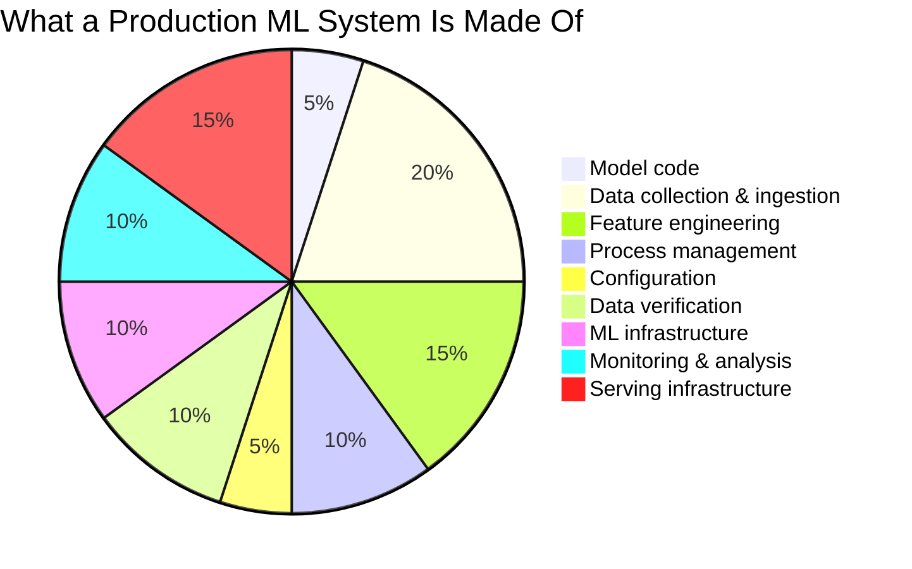
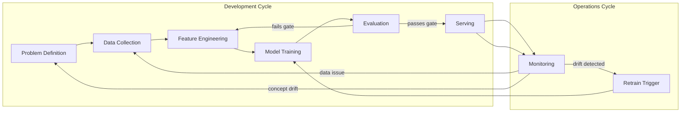
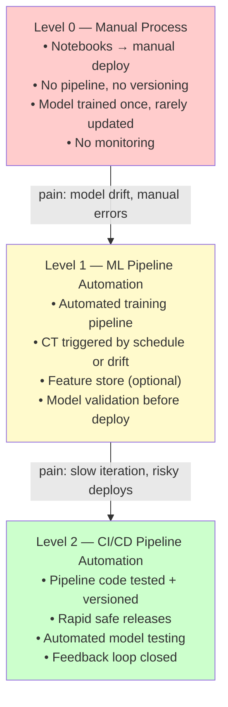
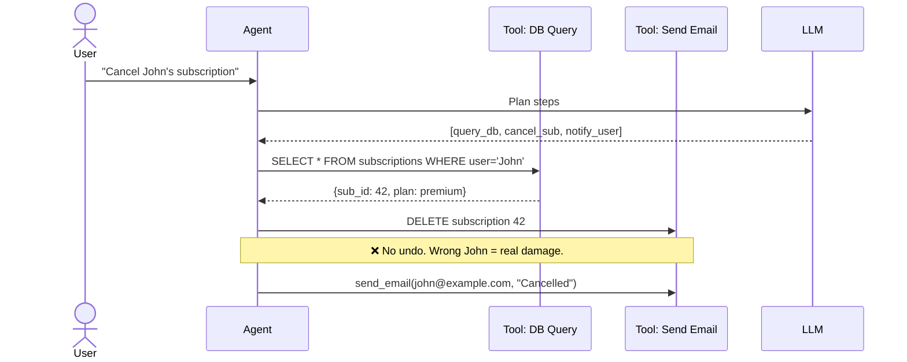
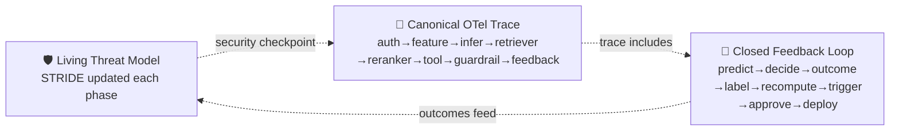

# Day 1 — Why ML Systems Rot

> Tags: `[T]` theory · `[S]` security  
> Deliverable: understanding of ML technical debt + **Threat Model v0 started** (see [threat_model_v0.md](threat_model_v0.md))

---

## 1. The Hidden Technical Debt Problem

In 2015, Google engineers published *"Hidden Technical Debt in Machine Learning Systems"* — arguably the most influential MLOps paper. The core insight:

> **Only a tiny fraction of real-world ML systems is the model code. The rest is plumbing — and that plumbing is where systems rot.**

### 1.1 Types of ML Technical Debt

| Debt Type | Description | Example |
|---|---|---|
| **Entanglement** | Changing one feature changes everything | Adding a column shifts all feature importances |
| **Undeclared consumers** | Model outputs consumed silently downstream | A rule engine reads scores with no contract |
| **Pipeline jungles** | Scrappy glue code that no one owns | Shell scripts chaining Jupyter notebooks |
| **Dead experimental code** | Old experiments baked into prod | Unused feature columns still computed |
| **Abstraction debt** | No stable ML API between components | Serving code imports from training module |
| **Configuration debt** | Magic numbers everywhere | Threshold `0.43` with no rationale |
| **Feedback loops** | Model predictions change training data | Recommender system creates filter bubbles |
| **Data dependency debt** | Upstream schema changes break silently | Vendor renames a column |

---

## 2. The ML System Lifecycle

Unlike traditional software, an ML system has two interleaved development cycles:

### Why This Is Different From Software

1. **Code + Data + Model** must all be versioned — not just code.
2. **Correctness is statistical**, not boolean. Tests pass but the model degrades.
3. **The environment (data distribution) changes** even when the code doesn't.
4. **Feedback loops** mean the model influences the data it will be trained on next.

---

## 3. ML Maturity Levels

Google's MLOps maturity model defines 3 levels. Most teams are stuck at Level 0.

### What Each Level Means for This Project

| Capability | L0 (start) | L1 (M1 gate) | L2 (M2 gate) |
|---|---|---|---|
| Training | Notebook, manual | Automated pipeline | CI-triggered, tested |
| Versioning | None | DVC + MLflow | Signed + SBOM |
| Deployment | Manual upload | Scripted deploy | GitOps + canary |
| Monitoring | None | Drift alerts | SLO + closed loop |
| Rollback | Manual | Aliased registry | Auto-revert on gate fail |

**Goal:** Reach L2 by the end of Milestone 2.

---

## 4. Why AgentOps Is Different

Classical MLOps manages a model that produces a **prediction**. AgentOps manages a model that produces **actions** — and actions have consequences that are hard to reverse.

### Key AgentOps Divergences

| Concern | Classical MLOps | AgentOps |
|---|---|---|
| **Output** | Score or label | Actions in the world |
| **Reversibility** | Prediction is cheap | Actions may be permanent |
| **Observability** | Log predictions | Trace every tool call + why |
| **Failure mode** | Wrong score | Agent loops, over-spends, harms |
| **Evaluation** | Offline metrics | Trajectory evaluation (did it achieve the goal safely?) |
| **Security** | Model poisoning | Prompt injection → unauthorized tool use |
| **Cost** | GPU time | LLM tokens + tool call latency + external API costs |
| **Permissions** | Model access control | Per-tool, per-user, per-session ACLs |

### The 6 AgentOps Questions (one per session replay)

1. Which tool was called?
2. Why (what reasoning led to it)?
3. With whose permission?
4. What did it cost?
5. Did the outcome match intent?
6. Could the agent have been manipulated (prompt injection)?

---

## 5. The Three Through-Lines (run across every phase)

This curriculum maintains three living artifacts from Day 1 to Day 148:

**Today:** Start the Threat Model v0 → see [threat_model_v0.md](threat_model_v0.md).

---

## 6. Key Takeaways for Day 1

- ML systems have **more glue than model code** — invest in the plumbing.
- **Three things need versioning**: code, data, model. Forget one and you lose reproducibility.
- **Maturity is a spectrum.** Level 0 is fine to start — but every day in production at L0 accrues compounding debt.
- **AgentOps raises the stakes**: wrong prediction → bad recommendation; wrong action → deleted data, sent emails, spent money.
- The **Threat Model starts now**, not at security day. Every system component is an attack surface.

---

## References

- Sculley et al., *Hidden Technical Debt in Machine Learning Systems*, NeurIPS 2015.
- Google, *MLOps: Continuous delivery and automation pipelines in ML*, 2020.
- Shankar et al., *Operationalizing Machine Learning: An Interview Study*, 2022.
- CISA, *AI System Threat Modeling*, 2024.
