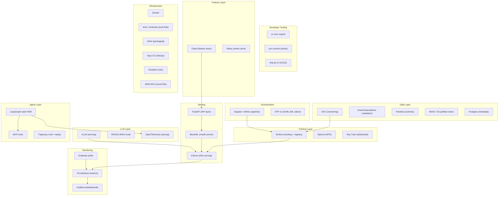
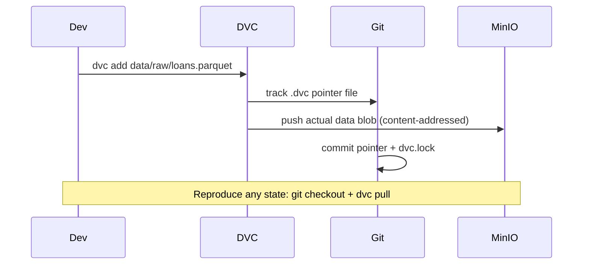
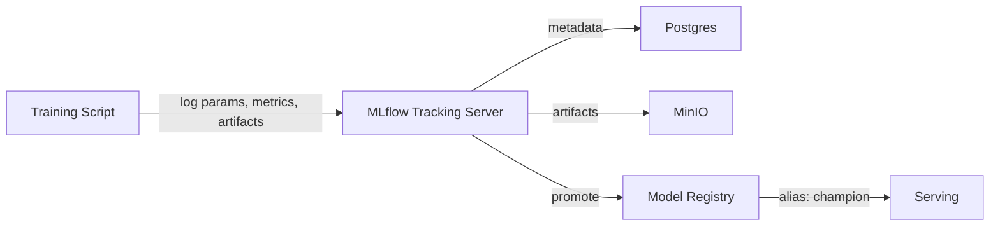
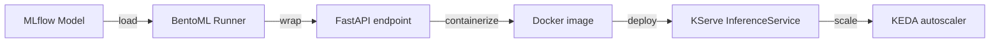
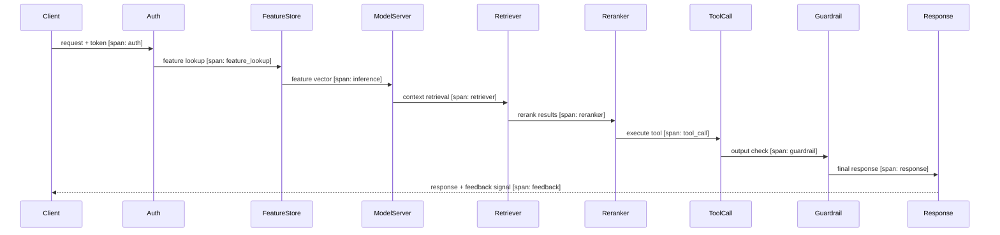

# Day 2 — 2026 Tooling Landscape & the Golden Path

> Tags: `[T]` theory  
> Deliverable: **Annotated stack map** (below) — your commitment to the golden path

---

## 1. Why Commit to a Stack?

The MLOps tooling space has exploded. Picking tools randomly leads to:
- Integration tax (glue code between incompatible systems)
- Context switching (different abstractions per tool)
- Shallow mastery (knowing 10 tools at 20% depth vs 3 tools at 90% depth)

**This curriculum picks one deep path.** Survey alternatives enough to compare — don't build them.

---

## 2. The Full Stack Map

---

## 3. Annotated Tool Decisions

### Environment Management: `uv` over `pip/conda/poetry`

| Tool | Pros | Cons | Verdict |
|---|---|---|---|
| `pip` | Universal | No lockfile, slow | Baseline only |
| `conda` | Env + packages | Slow, heavy | Skip |
| `poetry` | Lockfile, groups | Config-heavy | Good, but slow |
| **`uv`** | **10–100x faster than pip, lockfile, pyproject.toml** | Newer, less ecosystem | **Golden path** |

`uv` resolves and installs in seconds. At scale (Docker layer caching, CI) this compounds fast.

---

### Data Versioning: DVC + MinIO

**Why not lakeFS / Iceberg versioning?**
- lakeFS adds operational complexity (another service).
- Iceberg snapshots version table state but don't version raw files.
- DVC is simpler for small-to-medium artifact versioning with full MLflow integration.

Survey: lakeFS (branch-based data versioning), Delta Lake (ACID tables).

---

### Tracking + Registry: MLflow (self-hosted, Postgres + MinIO)

**Why not W&B/Neptune?**
- Both are excellent but cloud-hosted (cost, data egress, vendor lock).
- MLflow is the dominant open-source choice; matches SageMaker/Vertex API shape.
- Self-hosted = full control over artifact provenance (required for Security gate).

Survey: W&B (richer UI), Neptune (collaborative), Comet.

---

### Orchestration: Dagster (or Airflow) — one deep build

**Dagster** (primary choice):
- Asset-based model (what you produce, not what you run)
- Native data lineage, software-defined assets
- Better type safety, modern Python-first

**Airflow** (alternative): DAG-based, massive ecosystem, widely deployed.

Pick one and go deep. Survey the rest (Prefect, Metaflow, KFP, ZenML) conceptually.

---

### Serving Path: FastAPI → BentoML → KServe

- **FastAPI**: thin wrapper, full control, Pydantic schemas for API contracts.
- **BentoML**: adaptive batching, runner abstraction, production-grade serving.
- **KServe**: K8s-native, scale-to-zero, canary, shadow mode, transformer pipelines.

---

### Cloud: AWS deep, GCP 1:1 mapped

| Concern | AWS | GCP equivalent |
|---|---|---|
| Object store | S3 | GCS |
| Container registry | ECR | Artifact Registry |
| Managed K8s | EKS | GKE |
| ML training | SageMaker Training | Vertex AI Training |
| ML registry | SageMaker Model Registry | Vertex Model Registry |
| ML pipelines | SageMaker Pipelines | Vertex Pipelines (KFP) |
| Model monitoring | SageMaker Model Monitor | Vertex Model Monitoring |
| Serverless inference | SageMaker Serverless | Vertex Endpoints |
| LLM gateway | Bedrock | Vertex AI (Gemini) |
| IaC | Terraform on AWS | Same Terraform, GCP provider |

---

## 4. What We Are Not Building (and Why)

| Tool | Why we skip deep build |
|---|---|
| Seldon Core | Overlaps KServe; similar patterns |
| Triton Inference Server | Deep GPU serving — survey after vLLM |
| Metaflow | Netflix-specific ergonomics; Dagster covers ground |
| Tecton / Featureform | Cloud-managed Feast alternatives; understand Feast first |
| CrewAI / Autogen | Agent frameworks; survey after LangGraph deep build |
| AgentOps SDK / Galileo | Commercial; understand patterns first, then compare |
| llm-d | SOTA disaggregated serving — last chapter, after vLLM mastered |

---

## 5. The Canonical OTel Trace (starts Day 1, built incrementally)

Every phase adds a span to this trace:

We add one span per phase milestone. By Phase C, the full trace is live.

---

## 6. Deliverable: Your Stack Commitment

Complete this table for yourself:

| Area | My choice | Why |
|---|---|---|
| Env manager | `uv` | Speed, lockfile, pyproject.toml |
| Data versioning | DVC + MinIO | Simple, MLflow integrated |
| Experiment tracking | MLflow (self-hosted) | Open source, full control |
| Pipeline orchestration | Dagster | Asset model, lineage |
| Serving (local) | FastAPI + BentoML | Control → abstraction path |
| Serving (K8s) | KServe | Scale-to-zero, canary built-in |
| Monitoring | Evidently + Prometheus + Grafana | Drift + infra + dashboards |
| Cloud (deep) | AWS | EKS/SageMaker ecosystem |
| LLM serving | vLLM | PagedAttention, active community |
| Agent framework | LangGraph-style | State machine, deterministic |
| Tracing | OpenTelemetry | Vendor-neutral standard |

---

## Key Takeaways

- Depth beats breadth. Master 3 tools at 90% rather than 10 at 20%.
- The stack is chosen for **open-source + self-hosted** first — adds cloud later without lock-in.
- **MLflow + DVC + Feast** are the reproducibility backbone — every phase adds to them.
- AWS is deep; GCP is mapped 1:1 — you'll be able to port with minimal rework.
