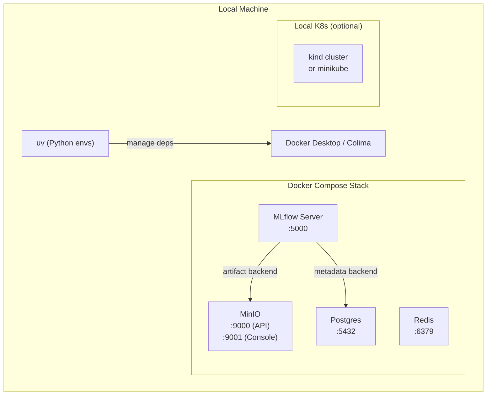
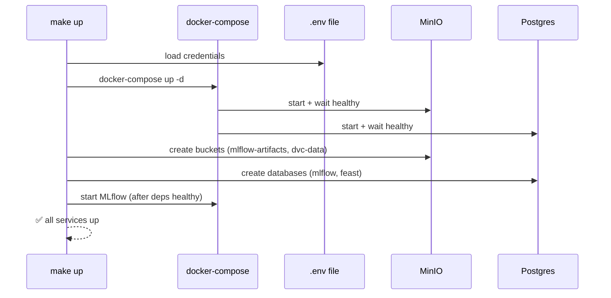

# Day 3 — Local Platform Setup

> Tags: `[L]` local  
> Deliverable: **one-command `make up` / `make down`** — all local services running

---

## 1. What We're Building

A local development platform that mirrors production as closely as possible:



**Ports summary:**

| Service | Port | Purpose |
|---|---|---|
| MinIO API | 9000 | S3-compatible artifact storage |
| MinIO Console | 9001 | Web UI for bucket management |
| Postgres | 5432 | MLflow metadata + feature store |
| MLflow | 5000 | Experiment tracking UI + API |
| Redis | 6379 | Feast online feature store |

---

## 2. Prerequisites

```bash
# macOS
brew install uv pyenv docker
# OR use Colima (lighter than Docker Desktop)
brew install colima
colima start --cpu 4 --memory 8

# kind (local K8s) — optional for Phase 0, required Phase 9
brew install kind kubectl helm
```

---

## 3. Project Layout (Platform Scaffold)

```
platform/
├── Makefile                  ← one-command up/down
├── docker-compose.yml        ← all local services
├── infra/
│   ├── local/
│   │   └── init-postgres.sql ← DB + user bootstrap
│   └── minio/
│       └── init-buckets.sh   ← bucket bootstrap
├── data/                     ← raw + processed datasets (DVC-tracked)
├── features/                 ← Feast feature definitions
├── training/                 ← training code
├── serving/                  ← FastAPI / BentoML server
├── pipelines/                ← Dagster pipeline definitions
├── monitoring/               ← Evidently + Prometheus config
├── llm/                      ← LLM serving (Phase B)
├── agent/                    ← Agent code (Phase C)
├── ci/                       ← CI/CD configs
└── notebooks/                ← EDA and exploration
```

---

## 4. Security Decisions (from Threat Model v0)

From [threat_model_v0.md](threat_model_v0.md):

- **E-02:** No plaintext credentials → use `.env` file (gitignored) + environment injection.
- **I-03:** MinIO buckets private by default → enforced in bucket init script.
- **E-01:** Separate service accounts per component → Postgres has per-service users.



---

## 5. Verification Checklist

After `make up`, verify:

```bash
make status           # shows all service health
make smoke-test       # runs connectivity checks
```

Expected output:
```
✅ MinIO      → http://localhost:9001  (healthy)
✅ Postgres   → localhost:5432         (healthy)
✅ MLflow     → http://localhost:5000  (healthy)
✅ Redis      → localhost:6379         (healthy)
```

---

## 6. Local K8s (kind) — for Phase 9 reference

```bash
make kind-up      # create kind cluster + load local images
make kind-down    # destroy cluster
```

The kind setup is wired but not required until Phase 9 (Kubernetes for ML).

---

## 7. Teardown

```bash
make down           # stop all services, keep volumes
make clean          # stop + delete all volumes (destructive!)
```

> `make clean` destroys all MLflow runs and MinIO data. Use only to reset.

---

## Key Takeaways

- **Local ≈ Production shape.** MinIO ≈ S3, Postgres ≈ RDS, Redis ≈ ElastiCache. Same APIs, same config.
- **Credentials in `.env`, never in code.** The Makefile reads `.env` and passes to Docker Compose.
- **`make up` is the single entry point.** No manual steps, no order-of-operations bugs.
- **Health checks before proceed.** Makefile waits for service health before starting MLflow.

---

See [platform/Makefile](../../platform/Makefile) and [platform/docker-compose.yml](../../platform/docker-compose.yml) for the implementation.
