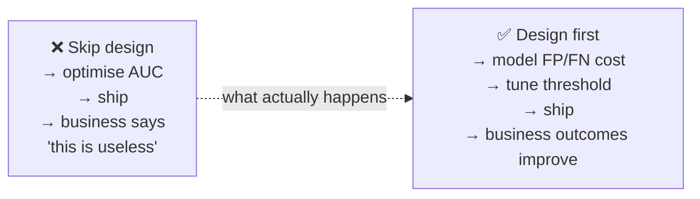
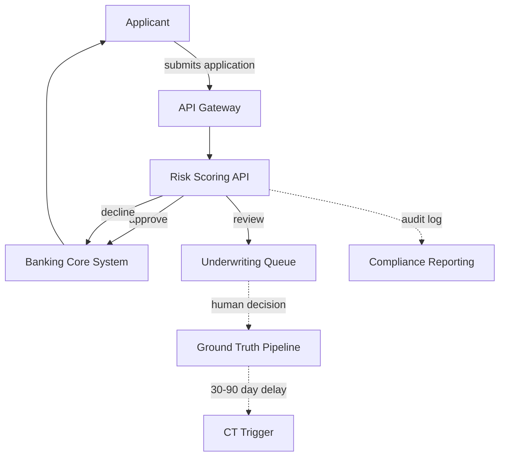
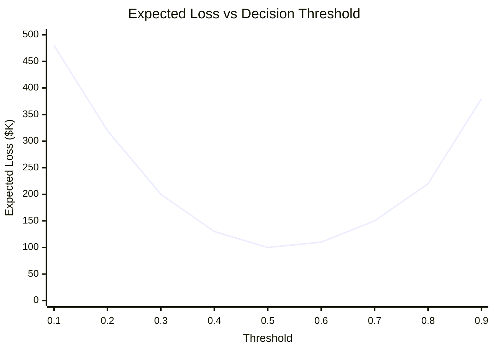
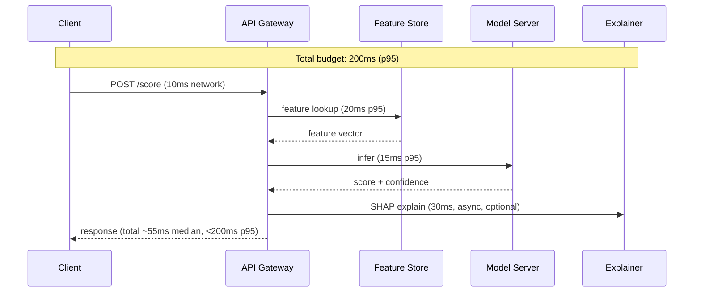
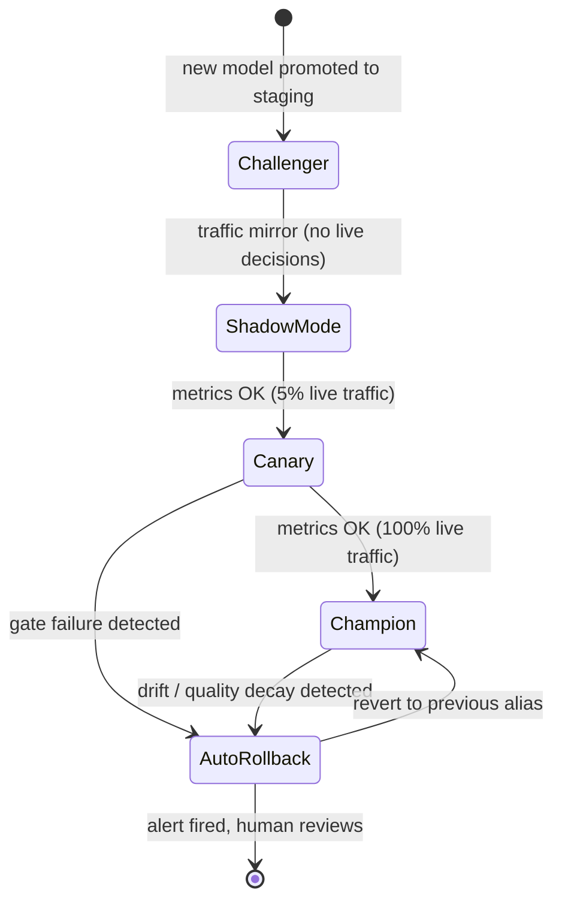
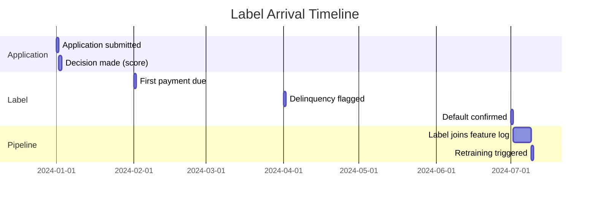
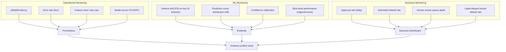
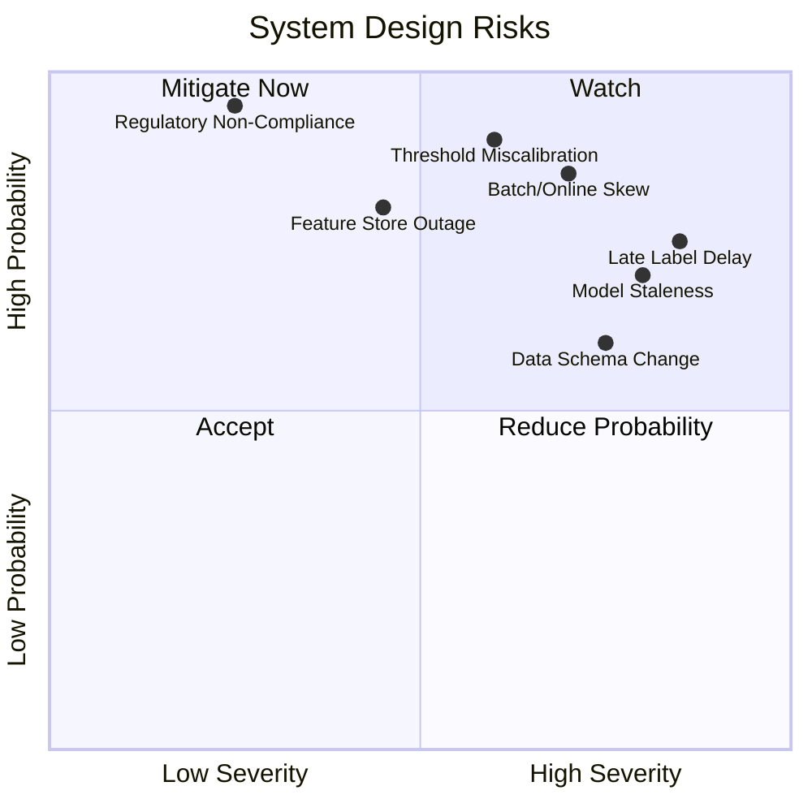

# Day 4 — ML System & Product Design

> Tags: `[T]` theory · `[NEW]`  
> Deliverable: **Completed system design doc** for the credit-risk platform (fills the project charter table)

---

## 1. Why Product Design Comes Before Code

ML engineers who skip this step build technically correct systems that answer the wrong question.

**The question to answer before any model:** _What decision does this system support, and what is the cost of each type of error?_

---

## 2. System Overview: Credit-Risk Platform

### 2.1 Decision Supported

> **Approve / Review / Decline** a credit card application in real-time.

- **Approve:** System is confident the applicant will repay.
- **Review:** System is uncertain → route to human underwriter.
- **Decline:** System predicts high default probability.

### 2.2 Users and Consumers

| Consumer | What they need | SLA |
|---|---|---|
| Banking Core System | Binary approve/decline + score | p95 < 200 ms |
| Underwriting team | Score + top feature explanations | p95 < 500 ms |
| Compliance team | Audit trail per decision | T+1 batch |
| Monitoring system | Per-prediction log with features | Real-time |

---

## 3. FP vs FN Cost Analysis

This is the most important design decision for a credit model. **AUC alone does not drive a business decision — cost does.**

| Error Type | What Happens | Financial Impact |
|---|---|---|
| **False Positive (FP)** | Good customer declined | Lost revenue (LTV ~$2,000/year) + customer churn |
| **False Negative (FN)** | Bad customer approved | Default loss (~$8,000 average) + regulatory risk |

**FN cost ≫ FP cost** → the model should be conservative (higher precision, lower recall on approvals).

The optimal threshold minimises **total expected loss = (FP_count × FP_cost) + (FN_count × FN_cost)**.

We will compute this empirically in **Day 16** (Phase 2: Calibration & Thresholds).

---

## 4. Latency Budget

| Component | Budget (p95) | Notes |
|---|---|---|
| Feature store lookup | 20 ms | Redis online store |
| Model inference | 15 ms | Tabular model, fast |
| SHAP explanation | 30 ms | Only for "review" decisions |
| Network + GW | 10 ms | Local; 30ms on cloud |
| **Total** | **< 200 ms** | Hard SLO for online serving |

Batch inference: nightly, no latency SLO, throughput-optimised.

---

## 5. Rollback Behavior

**MLflow alias strategy:**
- `champion` → current production model
- `challenger` → staging candidate
- `shadow` → shadow-mode candidate

Auto-revert fires when: approval rate drops >5%, default rate rises >2%, or p95 latency breaches 200ms SLO.

---

## 6. Late Labels & Ground Truth Timeline

Credit decisions have **delayed ground truth** — default/repayment signal arrives 30–90 days after the decision.

**Implications:**
- We cannot retrain daily on recent data — labels don't exist yet.
- Need **label contracts** (Day 20) defining arrival expectations.
- Retraining is triggered on a cadence + label-coverage threshold.
- Must handle **label corrections** (delinquency that later recovered).

---

## 7. Minimum Viable Monitoring

From the Monitoring gate requirement: detect **operational, ML quality, and business outcomes separately**.

**Alerting thresholds (initial):**

| Metric | Alert threshold | Severity |
|---|---|---|
| p95 latency | > 200 ms | Critical |
| Feature drift (PSI) | > 0.2 on any top-10 feature | Warning |
| Approval rate delta | > ±5% vs 7-day average | Warning |
| Score distribution shift | KS statistic > 0.1 | Warning |
| 5xx error rate | > 1% over 5 minutes | Critical |

---

## 8. Risk Matrix (System Design Perspective)

---

## 9. Summary: System Design Decision Table

| Field | Decision |
|---|---|
| **Decision supported** | Approve / Review / Decline a credit application |
| **Primary consumers** | Banking core, underwriting queue, compliance |
| **FP cost** | ~$2,000 (lost LTV) — bad but recoverable |
| **FN cost** | ~$8,000 average default + regulatory risk — dominant |
| **Threshold strategy** | Minimise total expected loss; human review band |
| **Latency budget** | p95 < 200 ms online; batch nightly |
| **Rollback behavior** | Auto-revert to previous registry alias on gate failure |
| **Late labels** | Default signal arrives 30–90 days after decision |
| **Label correction** | Handle delinquency recoveries; versioned ground truth |
| **Minimum monitoring** | Drift on top-10 features + p95 latency + approval rate |

---

## Key Takeaways

- **AUC is not a business metric.** Cost-sensitive evaluation (Day 16) produces the real threshold.
- **FN >> FP** for credit risk → conservative model is the right default.
- **Late labels are not an edge case** — they define your retraining cadence.
- **Rollback must be automatic.** A human reviewing a gate failure at 3 AM will be slow.
- **Monitor business outcomes separately** from ML metrics and infra metrics — they have different owners and different alert paths.
