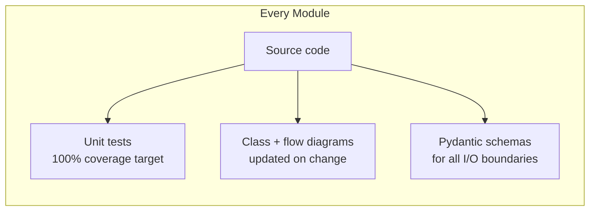

# Day 5 — Project Charter & Backbone Scaffold

> Tags: `[L]` local · `[NEW]`  
> Deliverable: **`PROGRESS.md` created + backbone repo scaffold committed**

---

## 1. Project Charter

The charter is a living document. Update it when decisions change — don't let it drift from reality.

| Field | Value |
|---|---|
| **System name** | Credit Risk ML Platform |
| **Decision supported** | Approve / Review / Decline a credit card application |
| **Primary users** | Banking core (automated), underwriting team (human review) |
| **Secondary consumers** | Compliance/audit, monitoring team |
| **FP cost** | ~$2,000 lost LTV per declined good customer |
| **FN cost** | ~$8,000 average default loss + regulatory risk |
| **FN >> FP?** | Yes — model must be conservative |
| **Latency budget** | p95 < 200 ms online; nightly batch |
| **Throughput** | 500 req/s peak (burst 1,000) |
| **Rollback behavior** | Auto-revert to `champion` alias on gate failure |
| **Late labels** | Default signal arrives 30–90 days post-decision |
| **Label correction policy** | Versioned ground truth; corrections backfill |
| **Minimum viable monitoring** | Drift on top-10 features + p95 latency + approval rate |
| **Current milestone** | M0 — Phase 0 complete |
| **Gate status** | ☐ Reproducibility ☐ Serving ☐ Pipeline ☐ Monitoring ☐ Security ☐ AgentOps |

---

## 2. Milestone Roadmap

```mermaid
gantt
    title MLOps Platform — Milestone Roadmap
    dateFormat  D
    axisFormat  Day %d

    section Milestone 1 — Classical MLOps
    Phase 0 Orientation         :p0, 1, 6d
    Phase 1 Reproducibility     :p1, 7, 8d
    Phase 2 Calibration         :p2, 15, 4d
    Phase 3 Data Contracts      :p3, 19, 3d
    Phase 4 Serving             :p4, 22, 9d
    Phase 5 Orchestration       :p5, 31, 7d
    Phase 6 Feature Store       :p6, 38, 8d
    Phase 7 Monitoring          :p7, 46, 8d
    Phase 8 CI/CD               :p8, 54, 5d
    M1 Gate                     :milestone, m1, 58, 0d

    section Milestone 2 — K8s + Cloud
    Phase 9 Kubernetes          :p9, 59, 12d
    Phase 10 Chaos Lab          :p10, 71, 3d
    Phase 11 GitOps + CT        :p11, 74, 4d
    Phase 12 Cloud              :p12, 78, 13d
    M2 Gate                     :milestone, m2, 90, 0d

    section Milestone 3 — LLMOps
    Phase 13-17 LLM             :p13, 91, 25d
    M3 Gate                     :milestone, m3, 115, 0d

    section Milestone 4 — AgentOps
    Phase 18-20 Agent           :p18, 116, 20d
    M4 Gate                     :milestone, m4, 135, 0d

    section Milestone 5 — Governance
    Phase 21 Governance         :p21, 136, 12d
    M5 Gate                     :milestone, m5, 148, 0d
```



---

## 3. Backbone Repository Structure

```mermaid
flowchart TD
    ROOT[platform/]

    ROOT --> DATA[data/\nRaw + processed datasets\nDVC-tracked]
    ROOT --> FEAT[features/\nFeast feature views\nentities, data sources]
    ROOT --> TRAIN[training/\nModel training scripts\nHPO configs]
    ROOT --> SERVE[serving/\nFastAPI + BentoML\nrequest/response schemas]
    ROOT --> PIPE[pipelines/\nDagster assets\nDVC pipeline YAML]
    ROOT --> INFRA[infra/\nDocker Compose\nHelm charts\nTerraform modules]
    ROOT --> MON[monitoring/\nEvidently reports\nPrometheus configs\nGrafana dashboards]
    ROOT --> LLM[llm/\nRAG pipeline\nvLLM serving config]
    ROOT --> AGT[agent/\nLangGraph FSM\nMCP tools\ntrajectory evaluator]
    ROOT --> CI[ci/\nGitLab CI config\nArgo CD apps]
    ROOT --> NB[notebooks/\nEDA\nexploration only\nnot for prod]
    ROOT --> MK[Makefile\none-command ops]
```



**Module ownership rules:**
- Each module directory is **self-contained** — no cross-module imports in production code.
- `training/` imports from `features/` via Feast SDK, not file paths.
- `serving/` loads models from MLflow registry, not from `training/` directly.
- `pipelines/` orchestrates — it imports from all modules but modules don't import from `pipelines/`.

---

## 4. Coding Conventions



### Naming Conventions

| Component | Convention | Example |
|---|---|---|
| Python files | `snake_case.py` | `feature_pipeline.py` |
| Classes | `PascalCase` | `CreditRiskModel` |
| Functions | `snake_case` | `compute_psi` |
| Constants | `UPPER_SNAKE` | `DEFAULT_THRESHOLD` |
| Pydantic models | `PascalCase + Schema/Request/Response` | `ScoringRequest`, `ScoringResponse` |
| MLflow experiments | `{phase}-{component}` | `m1-credit-risk-training` |
| DVC pipeline stages | `snake_case` | `feature_engineering` |

### Pre-commit Hooks

```yaml
# .pre-commit-config.yaml
repos:
  - repo: https://github.com/astral-sh/ruff-pre-commit
    hooks:
      - id: ruff          # lint
      - id: ruff-format   # format
  - repo: https://github.com/pre-commit/mirrors-mypy
    hooks:
      - id: mypy          # type check
  - repo: https://github.com/pre-commit/pre-commit-hooks
    hooks:
      - id: detect-private-key
      - id: check-yaml
      - id: end-of-file-fixer
```

---

## 5. Definition of Done (per day)

A day's work is **done** when:

1. ☐ Deliverable artifact exists (code, markdown, config).
2. ☐ Unit tests written and passing.
3. ☐ Diagram updated if code structure changed.
4. ☐ `PROGRESS.md` entry marked complete.
5. ☐ No plaintext secrets committed.
6. ☐ Pre-commit hooks pass.

---

## 6. Key Takeaways

- The charter is a **contract with yourself** — when scope creeps or a tool changes, update it.
- **Backbone structure is the investment that pays for 148 days.** Don't skip it.
- **Module boundaries from Day 1.** Retrofitting them is 10x harder.
- **No notebooks in production.** Notebooks go in `notebooks/` and never get imported.

---

See [PROGRESS.md](../../PROGRESS.md) for the daily tracker.
