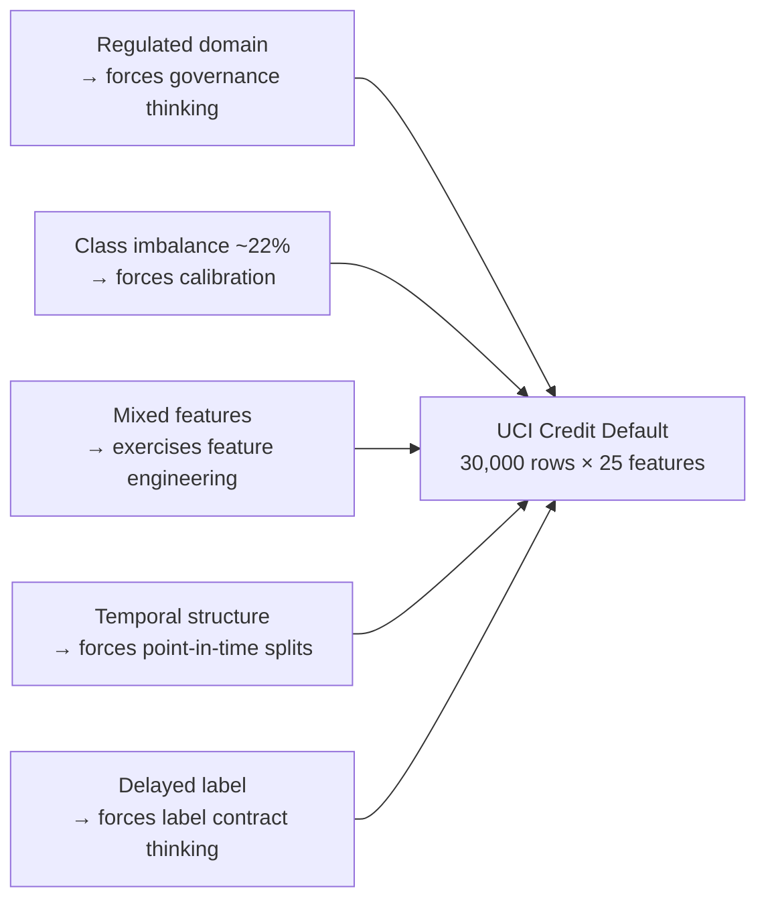
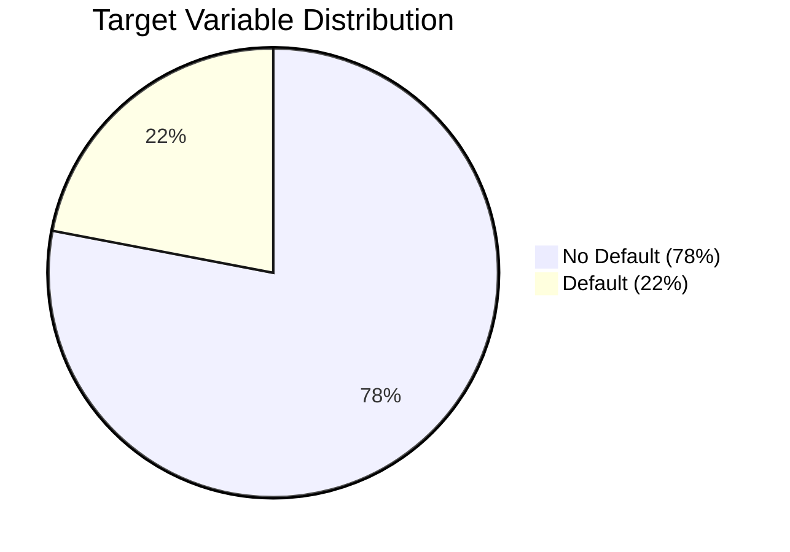
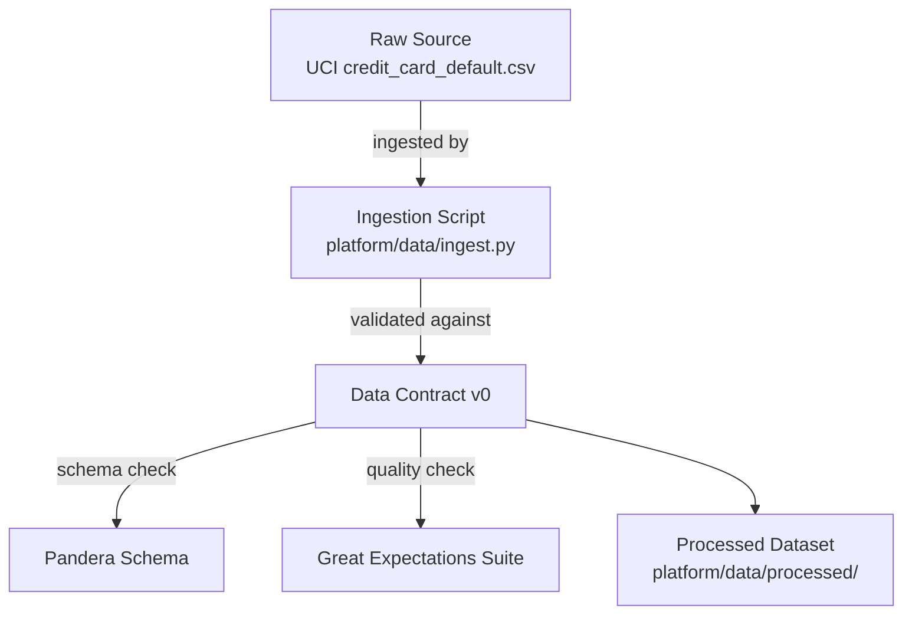

# Day 6 — Dataset Selection, EDA & First Data Contract

> Tags: `[L]` local  
> Deliverable: **Dataset chosen + EDA notebook + data contract draft v0**

---

## 1. Dataset: UCI Credit Card Default

**Source:** UCI Machine Learning Repository — "Default of Credit Card Clients"  
**Also on:** Kaggle (`mlg-ulb/creditcardfraud` is fraud; we use `UCI credit card default`)  
**Direct link:** [archive.ics.uci.edu/dataset/350](https://archive.ics.uci.edu/dataset/350/default+of+credit+card+clients)

### Why This Dataset?



### Dataset Overview

| Property | Value |
|---|---|
| Rows | 30,000 |
| Features | 24 input + 1 target |
| Target | `default_payment_next_month` (binary: 1 = default) |
| Class balance | ~22% positive (default), ~78% negative |
| Time period | April–September 2005 |
| Geography | Taiwan |

### Feature Groups

| Group | Features | Type |
|---|---|---|
| **Demographics** | `LIMIT_BAL`, `SEX`, `EDUCATION`, `MARRIAGE`, `AGE` | Categorical + numeric |
| **Payment status** | `PAY_0`–`PAY_6` (Apr–Sep repayment status) | Ordinal (-2 to 8) |
| **Bill amounts** | `BILL_AMT1`–`BILL_AMT6` | Continuous (NTD) |
| **Payment amounts** | `PAY_AMT1`–`PAY_AMT6` | Continuous (NTD) |

---

## 2. EDA Summary

> Full EDA is in [notebooks/eda_credit_default.ipynb](../../notebooks/eda_credit_default.ipynb)

### 2.1 Target Distribution



**Implication:** Raw accuracy is misleading — a model that always predicts "no default" gets 78% accuracy. Use **precision/recall/F1/AUC** and **calibrated probabilities**.

### 2.2 Key EDA Findings

| Finding | Implication |
|---|---|
| `PAY_0` (most recent payment status) is strongest predictor | Feature importance concentrated in payment recency |
| Extreme outliers in `BILL_AMT*` (up to 1M NTD) | Needs clipping or log transform |
| `EDUCATION` has undocumented values (0, 5, 6) | Data quality issue — needs contract enforcement |
| `MARRIAGE` has undocumented value (0) | Same issue |
| `PAY_*` uses -2 (no consumption) vs -1 (paid in full) inconsistently | Needs ordinal encoding with explicit category map |
| `BILL_AMT` and `PAY_AMT` series are correlated | Consider payment ratio feature engineering |

### 2.3 Temporal Structure

```mermaid
gantt
    title Feature Temporal Layout (6 months)
    dateFormat  MM
    axisFormat  %B

    section Bill Amounts
    BILL_AMT6 (oldest)  :04, 1M
    BILL_AMT5           :05, 1M
    BILL_AMT4           :06, 1M
    BILL_AMT3           :07, 1M
    BILL_AMT2           :08, 1M
    BILL_AMT1 (newest)  :09, 1M

    section Payment Status
    PAY_6 (oldest)      :04, 1M
    PAY_5               :05, 1M
    PAY_4               :06, 1M
    PAY_3               :07, 1M
    PAY_2               :08, 1M
    PAY_0 (newest)      :09, 1M
```



**Train/test split:** Time-based. Last 20% of records (sorted by any temporal proxy) go to test. No random shuffle — prevents data leakage.

---

## 3. Data Contract Draft — v0

This is the first draft. It will be formalized in **Day 19** (Pandera + Great Expectations).



### 3.1 Schema Contract

```python
# platform/data/contracts/raw_schema.py (to be built in Phase 3)

SCHEMA = {
    "ID":                  {"dtype": "int64",   "nullable": False, "unique": True},
    "LIMIT_BAL":           {"dtype": "float64", "nullable": False, "min": 10_000, "max": 1_000_000},
    "SEX":                 {"dtype": "int64",   "nullable": False, "values": [1, 2]},
    "EDUCATION":           {"dtype": "int64",   "nullable": False, "values": [1, 2, 3, 4]},  # 0,5,6 → clean
    "MARRIAGE":            {"dtype": "int64",   "nullable": False, "values": [1, 2, 3]},      # 0 → clean
    "AGE":                 {"dtype": "int64",   "nullable": False, "min": 18, "max": 100},
    # PAY_0 through PAY_6
    **{f"PAY_{i}": {"dtype": "int64", "nullable": False, "min": -2, "max": 8}
       for i in [0, 2, 3, 4, 5, 6]},
    # BILL_AMT1 through BILL_AMT6
    **{f"BILL_AMT{i}": {"dtype": "float64", "nullable": False} for i in range(1, 7)},
    # PAY_AMT1 through PAY_AMT6
    **{f"PAY_AMT{i}": {"dtype": "float64", "nullable": False, "min": 0} for i in range(1, 7)},
    "default_payment_next_month": {"dtype": "int64", "nullable": False, "values": [0, 1]},
}
```

### 3.2 Quality Expectations

| Expectation | Rule | Severity |
|---|---|---|
| Row count | 25,000–35,000 rows | Critical |
| No duplicate IDs | `ID` unique | Critical |
| Target not null | `default_payment_next_month` never null | Critical |
| `EDUCATION` clean | No values 0, 5, 6 (after cleaning) | Warning |
| `AGE` range | 18 ≤ AGE ≤ 100 | Warning |
| `PAY_AMT` non-negative | All payment amounts ≥ 0 | Critical |
| Class balance | Positive rate 15%–30% | Warning |
| `LIMIT_BAL` range | 10,000 ≤ LIMIT_BAL ≤ 1,000,000 | Warning |

### 3.3 Freshness & Ownership

| Property | Value |
|---|---|
| **Owner** | ML Platform team |
| **Source system** | UCI (static; no refresh) |
| **Update cadence** | N/A (historical dataset) |
| **Freshness SLA** | N/A |
| **PII** | None (anonymized IDs) |
| **Sensitivity** | Low — public dataset |
| **DVC remote** | `s3://dvc-data/credit-risk/raw/` |
| **Contract version** | v0 — initial draft |
| **Next review** | Day 19 (Phase 3: Data Contracts) |

---

## 4. Feature Engineering Preview

Features to engineer (built in Phase 1–6):

| Feature | Formula | Rationale |
|---|---|---|
| `utilization_rate` | `BILL_AMT1 / LIMIT_BAL` | How much credit is in use |
| `payment_ratio` | `PAY_AMT1 / BILL_AMT1` | Did they pay more or less than billed? |
| `avg_payment_delay` | `mean(PAY_0..PAY_6)` | Rolling delay trend |
| `max_delay` | `max(PAY_0..PAY_6)` | Worst single month |
| `bill_trend` | `(BILL_AMT1 - BILL_AMT6) / BILL_AMT6` | Increasing or decreasing debt? |
| `consecutive_delays` | count of PAY > 0 months | Sustained delinquency |

---

## 5. EDA Notebook Setup

```bash
# From platform/
uv run jupyter lab notebooks/eda_credit_default.ipynb
```

The notebook follows the structure:
1. Load raw data (DVC `dvc pull data/raw/`)
2. Schema validation (Pandera — quick check)
3. Distribution plots for each feature group
4. Correlation matrix (numeric features)
5. Target analysis (class balance, stratified splits)
6. Temporal structure confirmation
7. Data quality issues list → feeds into data contract

---

## 6. Downloading the Dataset

```bash
# From platform/
make data-download

# Which runs:
uv run python -m data.ingest --source uci --dataset credit-default
dvc add data/raw/credit_card_default.csv
dvc push
```

The dataset is ~5 MB. DVC tracks it; the actual file is in MinIO, not in git.

---

## Key Takeaways

- **Temporal splits, not random splits.** Credit data has time structure — random shuffle leaks future into training.
- **Class imbalance is a feature, not a bug.** Real credit portfolios look like this — handle it with calibration, not oversampling.
- **Data contracts start here.** The schema issues found in EDA (`EDUCATION` values 0/5/6) are the first contract violations — document them now.
- **DVC from day one.** Even though the source is static, DVC gives you the versioning habit before the data is dynamic.
