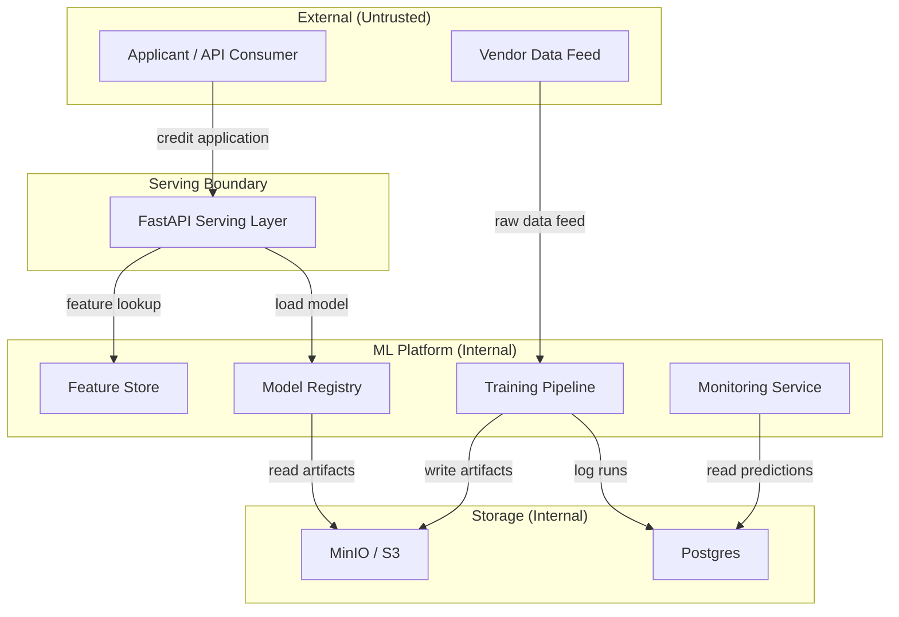
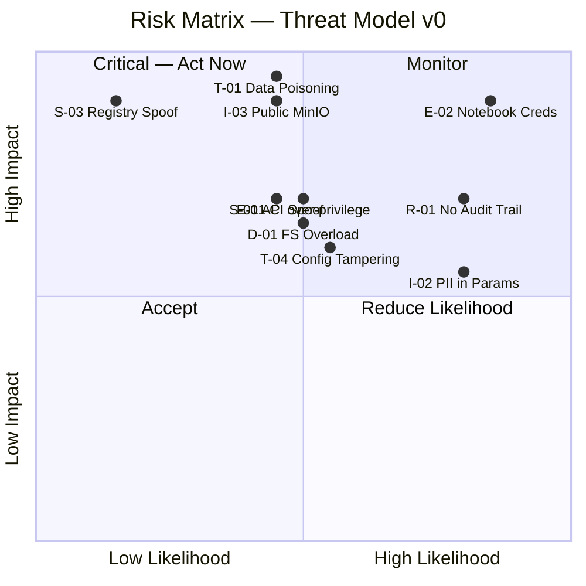

# Living Threat Model — v0

> **Status:** Initial draft, Day 1 of Phase 0  
> **Next update:** Phase 1 (Day 8 — data poisoning checkpoint)  
> **Owner:** [your name]  
> **System version:** Pre-build (orientation)

This document is updated at every security checkpoint throughout the curriculum. Never delete old entries — mark them resolved or migrated.

---

## System Description (v0 — pre-build)

A **credit-risk ML platform** that:
1. Ingests raw applicant data.
2. Engineers features and stores them in a feature store.
3. Trains and registers a credit-risk model.
4. Serves online predictions via an API.
5. Monitors predictions, detects drift, triggers retraining.
6. (Later) Hosts a RAG assistant and autonomous support agent.

---

## Trust Boundaries (v0)

---

## STRIDE Threat Analysis

### S — Spoofing

| ID | Threat | Component | Likelihood | Impact | Mitigation (planned) |
|---|---|---|---|---|---|
| S-01 | Attacker spoofs API consumer identity | Serving API | Medium | High | mTLS + API key auth (Phase 4) |
| S-02 | Fake vendor data injected as legit feed | Data ingestion | Low | Critical | Data contract + signature check (Phase 3) |
| S-03 | Model artifact replaced in registry | Model registry | Low | Critical | Artifact signing / Sigstore (Phase 8) |

### T — Tampering

| ID | Threat | Component | Likelihood | Impact | Mitigation (planned) |
|---|---|---|---|---|---|
| T-01 | Training data poisoned (label flipping) | Raw data / DVC | Medium | Critical | Data version hashing + access control (Phase 1) |
| T-02 | Feature values tampered in feature store | Feast online store | Low | High | Read-only serving path + audit log |
| T-03 | Model weights modified post-registry | Artifact store | Low | Critical | Immutable artifact IDs + checksums |
| T-04 | Config values changed to shift thresholds | Config store | Medium | High | GitOps config with PR review gate |

### R — Repudiation

| ID | Threat | Component | Likelihood | Impact | Mitigation (planned) |
|---|---|---|---|---|---|
| R-01 | No audit trail for who approved model | Registry | High | High | MLflow approval workflow + signed transitions |
| R-02 | Prediction not logged — denial of decision | Serving | Medium | High | Append-only prediction log (Phase 7) |

### I — Information Disclosure

| ID | Threat | Component | Likelihood | Impact | Mitigation (planned) |
|---|---|---|---|---|---|
| I-01 | Model inversion: raw features leaked via scores | API | Low | High | Differential privacy / output rounding |
| I-02 | Training data PII in MLflow run params | MLflow | High | Medium | Param filtering + secrets scanning in CI |
| I-03 | MinIO bucket publicly accessible | Storage | Medium | Critical | Bucket ACL + VPC endpoint (Phase 3) |

### D — Denial of Service

| ID | Threat | Component | Likelihood | Impact | Mitigation (planned) |
|---|---|---|---|---|---|
| D-01 | Feature store overwhelmed by serving requests | Feast online | Medium | High | KEDA autoscaling + rate limiting |
| D-02 | Training pipeline monopolizes GPU | Compute | Medium | Medium | Resource quotas + Kueue fair sharing |
| D-03 | Expensive agent tool calls drain budget | Agent (Phase C) | High | High | Per-session cost limits + circuit breakers |

### E — Elevation of Privilege

| ID | Threat | Component | Likelihood | Impact | Mitigation (planned) |
|---|---|---|---|---|---|
| E-01 | Training job writes to production registry | CI runner | Medium | High | Separate IAM roles per environment |
| E-02 | Notebook has prod DB credentials | Notebooks | High | Critical | Secrets manager; no plaintext creds anywhere |
| E-03 | Agent tool granted excess permissions | Agent (Phase C) | High | Critical | Per-tool, per-user ACL + approval gates |

---

## AgentOps-Specific Threats (Phase C preview)

| ID | Threat | Impact |
|---|---|---|
| A-01 | Prompt injection via user input → unauthorized tool call | Critical |
| A-02 | Agent in infinite loop → runaway API costs | High |
| A-03 | Tool result fabricated by malicious upstream service | High |
| A-04 | No permission check before destructive tool call | Critical |
| A-05 | Session not replayable — cannot audit what happened | High |

---

## Risk Matrix (v0)

---

## Highest-Priority Actions (before first line of prod code)

1. **No plaintext credentials anywhere** — use `.env` + secrets manager from Day 3.
2. **MinIO/S3 buckets private by default** — set ACLs in Makefile.
3. **Separate IAM roles** for training, serving, monitoring.
4. **Append-only prediction log** — required for R-01 and for AgentOps replay.
5. **Git-signed commits + protected main branch** — baseline for artifact provenance.

---

## Checkpoint History

| Version | Date | Phase | Changes |
|---|---|---|---|
| v0 | Day 1 | Phase 0 | Initial STRIDE analysis, all components pre-build |
| v1 | Day 14 | Phase 1 | TBD — after DVC + MLflow wired |
| v2 | Day 90 | Phase 12 | TBD — after K8s + cloud |
