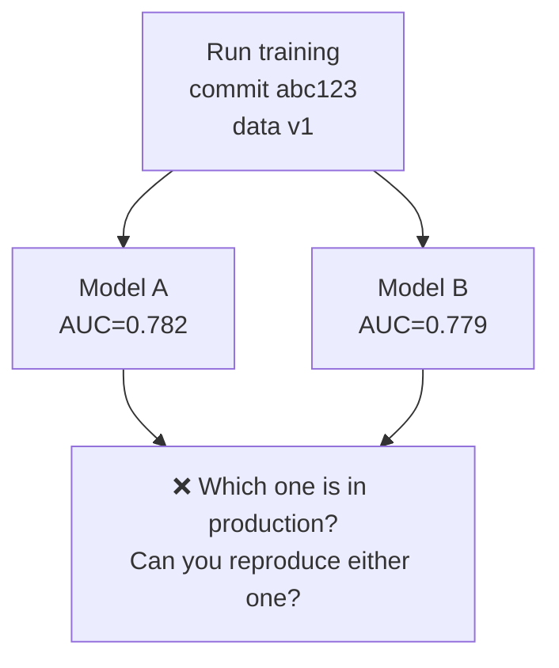
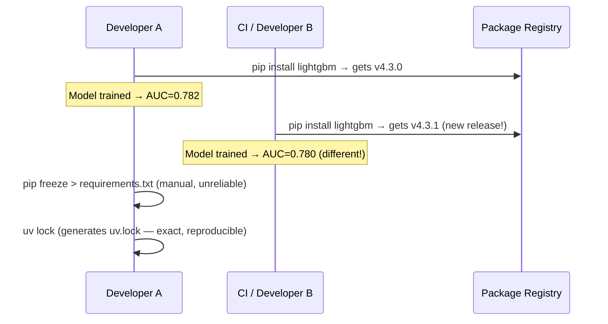
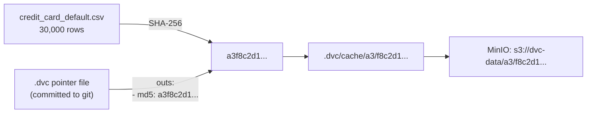

# Day 7 — Non-determinism, Seeds, Lockfiles, Hashing

> Tags: `[T]` theory · `[L]` local  
> Deliverable: **Deterministic training script** → [platform/training/train.py](../../platform/training/train.py)

---

## 1. The Problem: ML Non-determinism

Running the same training code twice and getting different models is the first reproducibility failure. It breaks the Reproducibility Gate before you even start.



The scary part: the difference is often invisible in metrics but very visible in production edge cases.

---

## 2. Every Source of Non-determinism

```mermaid
mindmap
  root((Non-determinism))
    Python
      random.random()
      dict ordering pre-3.7
      hash randomization PYTHONHASHSEED
    NumPy
      np.random functions
      array allocation order
    LightGBM / XGBoost
      tree split tie-breaking
      parallel thread ordering
      histogram approximation
    PyTorch / TF
      CUDA ops are non-deterministic
      cuDNN autotuner
      DataLoader worker ordering
    Data
      Pandas sort_values stable=False
      File system glob ordering
      Database query ORDER BY missing
    System
      Floating point precision differences
      CPU instruction reordering
      OS thread scheduling
```

### What Each Seed Controls

| Source | Fix | Covers |
|---|---|---|
| `random.seed(n)` | Python `random` module | Dropout simulation, some sklearn |
| `np.random.seed(n)` | NumPy global RNG | Most sklearn, scipy |
| `PYTHONHASHSEED=n` (env) | Python hash randomisation | dict/set ordering, feature name hashing |
| `random_state=n` in model | LightGBM/sklearn internal RNG | Tree construction |
| `torch.manual_seed(n)` | PyTorch CPU ops | Neural networks |
| `torch.cuda.manual_seed(n)` | PyTorch GPU ops | Neural networks on GPU |
| `torch.use_deterministic_algorithms(True)` | CUDA determinism | Forces slower but exact GPU ops |

> **Critical:** `PYTHONHASHSEED` must be set **before** the Python process starts. Setting `os.environ["PYTHONHASHSEED"]` inside running code has no effect.

---

## 3. How `train.py` Controls Non-determinism

```python
# From training/train.py — set_all_seeds()
def set_all_seeds(seed: int) -> None:
    random.seed(seed)           # Python random
    np.random.seed(seed)        # NumPy
    # LightGBM: random_state=seed passed to LGBMClassifier constructor
    # PYTHONHASHSEED: must be set before process starts (DVC stage cmd handles this)
```

The DVC stage command sets `PYTHONHASHSEED` before Python starts:
```yaml
# dvc.yaml
train:
  cmd: PYTHONHASHSEED=42 python -m training.train --params params.yaml
```

---

## 4. Lockfiles: Reproducible Environments

Seeding the model is not enough. If the library versions change, the model changes.



### `uv lock` — the right way

```bash
cd platform

# Install dependencies from pyproject.toml + write lockfile
uv sync

# This generates uv.lock — commit this file!
# Anyone who runs 'uv sync' gets exact same package versions

# To add a new dependency:
uv add pandera>=0.19.0
# uv.lock is automatically updated
```

The `uv.lock` file contains exact hashes of every package, not just version ranges. This means:
- Exact same package even if the registry is compromised (hash mismatch = failure)
- No "works on my machine" — the lock guarantees the same install

---

## 5. Content Hashing: the DVC Foundation

DVC tracks data not by name but by content hash (SHA-256). This is why changing a file's name doesn't lose tracking, and why two identical files share one cache entry.



The `.dvc` pointer file is what goes in git. The actual data stays in MinIO. This means:
- `git checkout` + `dvc pull` = exact byte-for-byte reproduction of the data
- The same hash for the same bytes means deduplication is free

---

## 6. Verifying Determinism

**Manual check:** Run training twice, compare metrics.
```bash
cd platform

PYTHONHASHSEED=42 python -m training.train
cp metrics/train_metrics.json /tmp/run1.json

PYTHONHASHSEED=42 python -m training.train
diff /tmp/run1.json metrics/train_metrics.json
# → no output = deterministic ✅
```

**What to do if metrics differ:**
1. Check `PYTHONHASHSEED` is set in both runs.
2. Check `uv.lock` is committed and used.
3. Check for any global state in custom feature functions (none in our code).
4. If using GPU: `torch.use_deterministic_algorithms(True)` (not needed for tabular/LightGBM).

---

## 7. How to Run

```bash
cd platform

# 1. Set up environment (first time only)
cp .env.example .env          # fill in passwords
uv sync                        # install deps from lockfile

# 2. Ingest data (if not already done)
python -m data.ingest

# 3. Featurize
python -m training.features \
  --input data/raw/credit_card_default.csv \
  --output data/processed/features.parquet \
  --params params.yaml

# 4. Train deterministically
PYTHONHASHSEED=42 python -m training.train --params params.yaml

# 5. Check metrics
cat metrics/train_metrics.json

# 6. Verify determinism
make train && cp metrics/train_metrics.json /tmp/r1.json
make train && diff /tmp/r1.json metrics/train_metrics.json
```

Expected output:
```
Training LightGBM: 30 features, n_estimators=300
Metrics — AUC: 0.7821 | AP: 0.5234 | Brier: 0.1342 | ECE: 0.0421
Model saved → models/credit_risk_model.pkl
Metrics saved → metrics/train_metrics.json
```

---

## 8. Makefile Targets (Day 7 additions)

```bash
make train         # PYTHONHASHSEED=42, runs train.py
make featurize     # runs features.py
make test-unit     # pytest tests/unit/
make determinism   # run training twice, diff outputs
```

---

## Key Takeaways

- **There are 5+ sources of non-determinism.** Fixing only Python random is not enough.
- **`PYTHONHASHSEED` must be an env var, not set inside Python.** Put it in DVC stage `cmd:`.
- **Lockfiles lock the environment, not just the seeds.** Both are required for full reproducibility.
- **DVC hashes data content.** The hash in the pointer file is your data version.
- **Test determinism explicitly.** Run training twice and diff the outputs — add this to CI.
