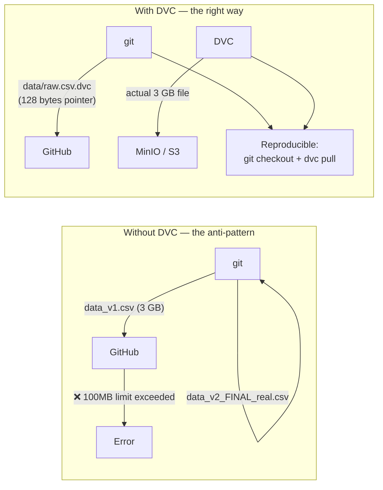
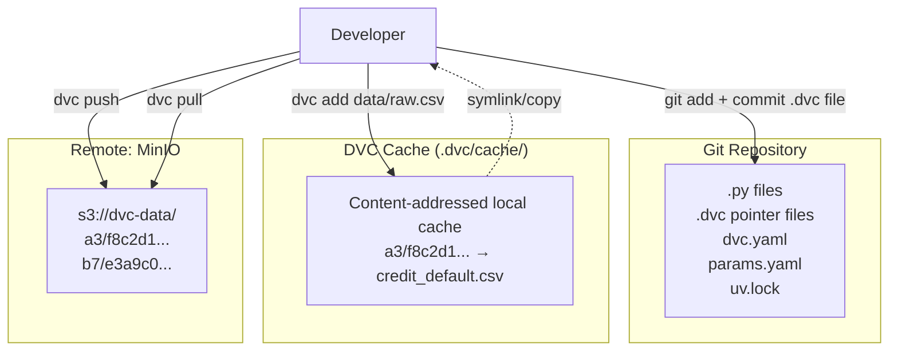
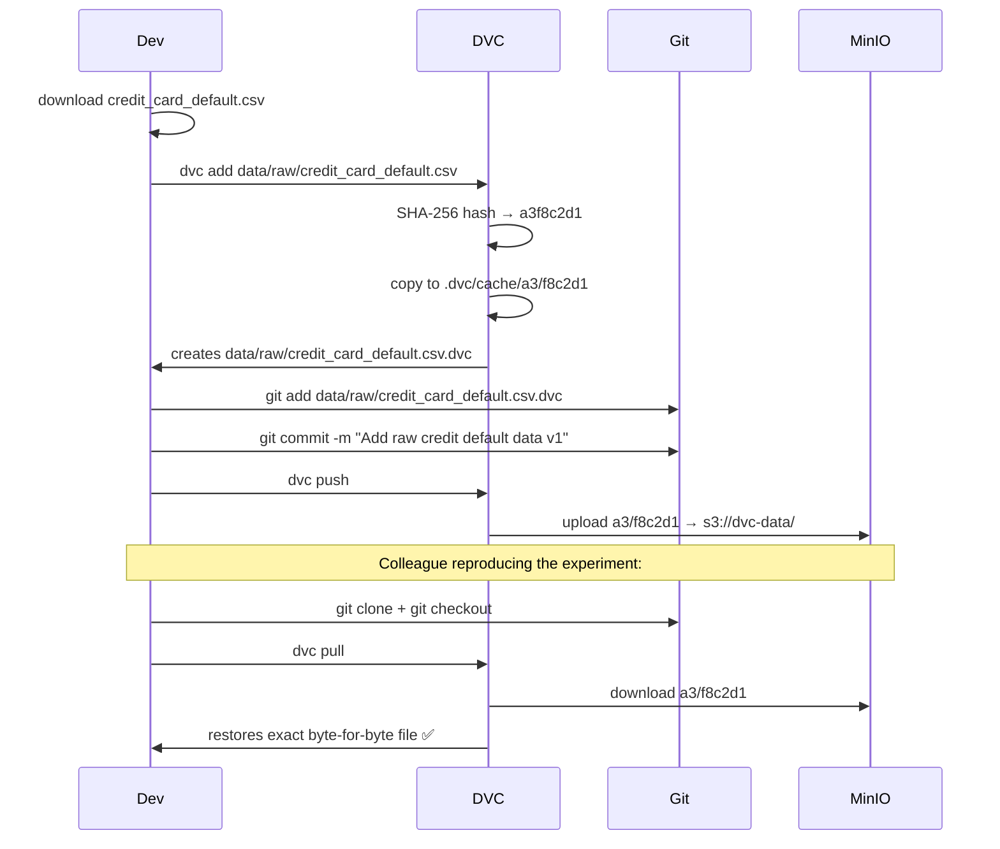
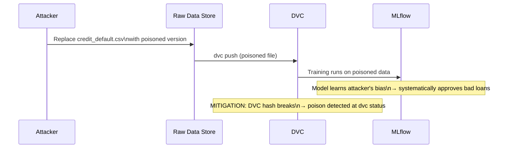

# Day 8 — DVC + MinIO: Data Versioning

> Tags: `[L]` local · `[S]` security  
> Deliverable: **Dataset tracked with DVC, pushed to MinIO**  
> Threat checkpoint: **data poisoning + access control** (update [threat_model_v0.md](../phase0/threat_model_v0.md))

---

## 1. The Problem DVC Solves

Git was designed for code — small text files that diff well. ML data is:
- Large (GBs, TBs)
- Binary (parquet, pkl, ONNX)
- Needs version association with code commits



---

## 2. DVC Architecture



### Key Commands

| Command | What it does |
|---|---|
| `dvc init` | Initialise DVC in the repo (creates `.dvc/`) |
| `dvc add <file>` | Hash file → add to local cache → create `.dvc` pointer |
| `dvc push` | Upload cached files to remote (MinIO) |
| `dvc pull` | Download files from remote into local cache |
| `dvc status` | Show what's changed vs the last committed state |
| `dvc checkout` | Restore working directory files from local cache |
| `dvc diff` | Show diff of data files between git commits |

---

## 3. Data Version Lifecycle



---

## 4. Setting Up DVC with MinIO

```bash
cd platform

# Step 1: Initialize DVC (one-time per project)
dvc init
git add .dvc .dvcignore
git commit -m "Initialize DVC"

# Step 2: Configure MinIO as the DVC remote
# MinIO credentials come from .env (MINIO_ROOT_USER / MINIO_ROOT_PASSWORD)
dvc remote add -d minio s3://dvc-data
dvc remote modify minio endpointurl http://localhost:9000
dvc remote modify minio access_key_id $MINIO_ROOT_USER
dvc remote modify minio secret_access_key $MINIO_ROOT_PASSWORD

# Step 3: Track the raw dataset
python -m data.ingest   # downloads to data/raw/credit_card_default.csv
dvc add data/raw/credit_card_default.csv
git add data/raw/credit_card_default.csv.dvc
git commit -m "Track raw credit default dataset v1"

# Step 4: Push to MinIO
dvc push

# Step 5: Verify (simulate a fresh checkout)
dvc checkout  # removes local file, restores from cache
dvc pull      # downloads from MinIO
```

**Verify MinIO received the data:**
- Open MinIO console: http://localhost:9001
- Login with `MINIO_ROOT_USER` / `MINIO_ROOT_PASSWORD`
- Navigate to `dvc-data` bucket — should see content-addressed files

---

## 5. How `.dvc` Pointer Files Work

After `dvc add`, inspect the pointer:
```yaml
# data/raw/credit_card_default.csv.dvc
outs:
- md5: a3f8c2d1e4b78f90123456789abcdef0
  size: 5231485
  path: credit_card_default.csv
```

This tiny file is what git tracks. The hash (`md5` here) is the content address.

---

## 6. DVC vs Iceberg Snapshots (Survey)

| Concern | DVC | Apache Iceberg |
|---|---|---|
| Target | Files (CSV, Parquet, pkl) | Tables (SQL semantics) |
| Versioning unit | File hash | Table snapshot ID |
| Best for | ML training datasets, models | Analytics / large-scale OLAP |
| Branching | Via git branches | Via Iceberg branches (Nessie) |
| Rollback | `dvc checkout <hash>` | `ALTER TABLE ROLLBACK TO SNAPSHOT` |
| Point-in-time query | Not built-in | Native (hidden partition evolution) |
| Integration | MLflow, Dagster, Airflow | Trino, Spark, Flink |

**Bottom line:** DVC and Iceberg solve different problems. DVC for ML file versioning, Iceberg for production data warehouse. Our feature store will use Iceberg-format offline storage (Phase 6).

---

## 7. Threat Checkpoint — Day 8

From [threat_model_v0.md](../phase0/threat_model_v0.md):

### T-01: Data Poisoning

An attacker modifies the raw training data before the model trains on it.



**Mitigation implemented today:**
1. `dvc add` creates a hash at ingestion time.
2. `dvc status` detects any subsequent modification.
3. MinIO bucket policy is read-only for service accounts (not admin).

**Configure read-only DVC remote for CI (principle of least privilege):**
```bash
# Create a read-only MinIO user for the CI runner
# Only the data pipeline account can push new data
# CI can only pull
mc admin user add local ci-runner <password>
mc admin policy create local dvc-readonly dvc-readonly-policy.json
mc admin policy attach local dvc-readonly --user ci-runner
```

### I-03: Public MinIO Bucket

Already mitigated in Day 3 (`init-buckets.sh` creates private buckets). Verify:
```bash
# Should fail with access denied:
curl http://localhost:9000/dvc-data/
```

### Access Control Checklist

- ☑ DVC remote bucket: private (no public read/write)
- ☑ MinIO credentials in `.env`, not in code or `.dvc/config`
- ☑ CI runner has read-only access to DVC remote
- ☐ Rotate MinIO credentials every 90 days (add to ops runbook)

---

## 8. Debugging DVC Issues

| Problem | Cause | Fix |
|---|---|---|
| `dvc push` access denied | Wrong MinIO credentials | Check `.env`, re-export env vars |
| `dvc pull` file corrupt | Network interruption | `dvc pull --rerun-cache` |
| File unchanged but `dvc status` shows modified | Timestamps differ | `dvc checkout` to restore from cache |
| Remote not configured | Missing `dvc remote` setup | `dvc remote list` to verify |
| `.dvc` file not in git | Forgot `git add` | `git add *.dvc` |

```bash
# Diagnostic commands:
dvc status           # what changed?
dvc status --cloud   # what's different from remote?
dvc remote list      # which remotes are configured?
dvc config -l        # full DVC config
dvc doctor           # environment check
```

---

## Key Takeaways

- **DVC separates data from code** — pointers in git, bytes in object storage.
- **Content addressing** (SHA-256 hash) is the core mechanism: same bytes = same hash = same cached artifact.
- **`dvc push/pull`** works like `git push/pull` but for large files.
- **Data poisoning** is detectable with DVC because the hash changes — wire `dvc status` into CI.
- **Credentials never go in `.dvc/config`** — use env vars and `.env` (gitignored).
