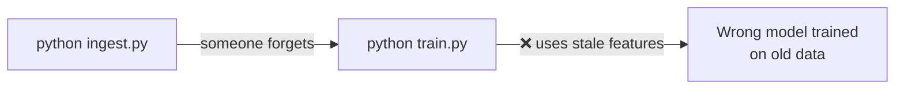
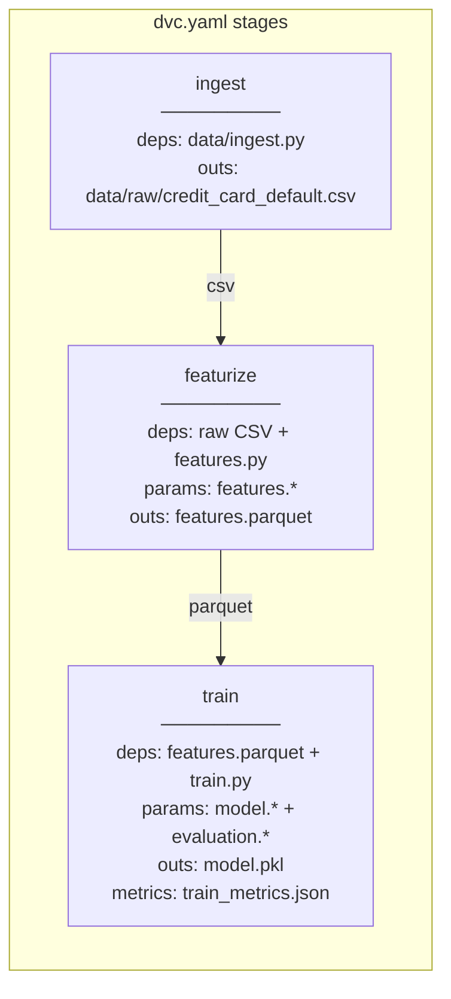
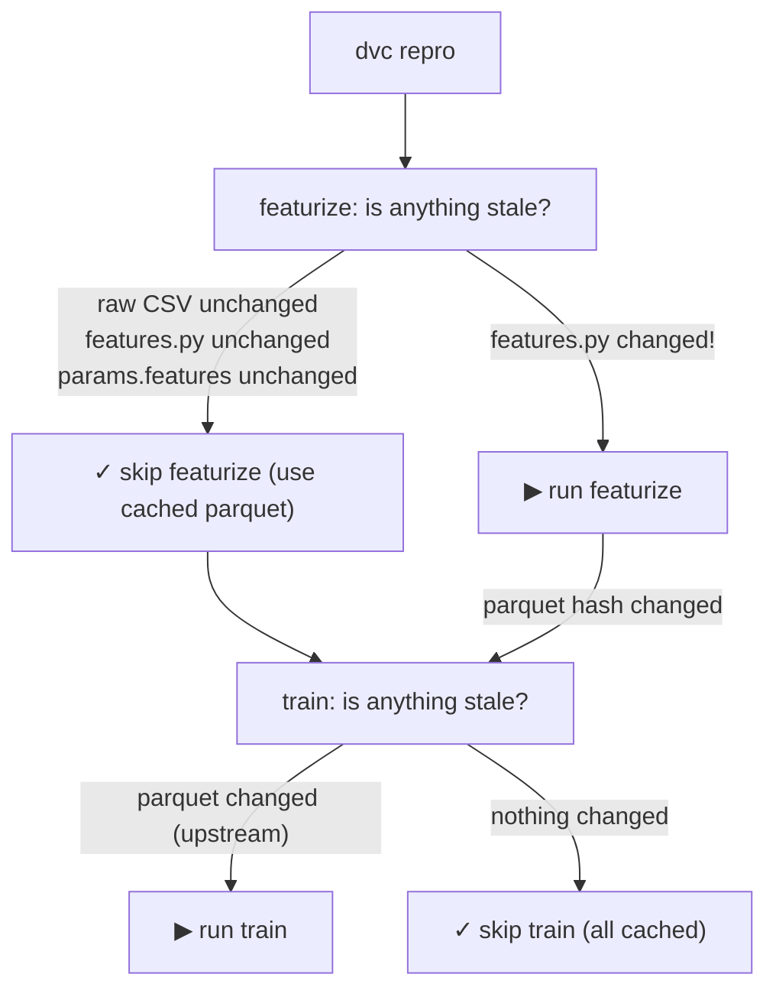
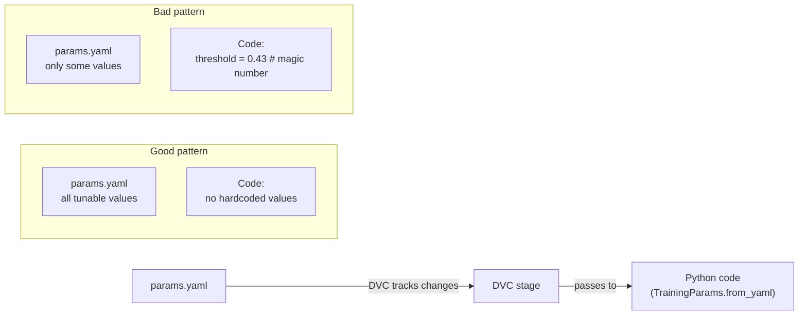

# Day 9 — DVC Pipelines: Reproducible DAGs

> Tags: `[L]` local  
> Deliverable: **`dvc.yaml` pipeline DAG** → [platform/dvc.yaml](../../platform/dvc.yaml)

---

## 1. The Problem: Scripts Run in the Wrong Order

Without a pipeline definition, training looks like this:



And there is no record of what was run, in what order, with what params.

---

## 2. DVC Pipeline Concepts

A DVC pipeline is a DAG (Directed Acyclic Graph) of **stages**. Each stage has:

| Component | Meaning |
|---|---|
| `cmd` | Shell command to run this stage |
| `deps` | Input files/scripts — if any change, stage is stale |
| `params` | Keys from `params.yaml` — if any change, stage is stale |
| `outs` | Output files — DVC caches these and tracks their hash |
| `metrics` | Output metrics files — shown in `dvc metrics show` |



---

## 3. `dvc.yaml` Deep Dive

```yaml
# Annotated version of platform/dvc.yaml

stages:
  featurize:
    cmd: >                         # multi-line command (> = fold)
      PYTHONHASHSEED=42
      python -m training.features
      --input data/raw/credit_card_default.csv
      --output data/processed/features.parquet
      --params params.yaml
    deps:
      - data/raw/credit_card_default.csv  # DVC-tracked input (upstream stage output)
      - training/features.py              # if this script changes, stage is stale
      - training/config.py                # if config model changes, stage is stale
    params:
      - params.yaml:
          - features                      # entire features section
          - data.random_seed
    outs:
      - data/processed/features.parquet   # DVC will cache this output

  train:
    cmd: >
      PYTHONHASHSEED=42
      python -m training.train
      --params params.yaml
    deps:
      - data/processed/features.parquet   # upstream stage output
      - training/train.py
      - training/evaluate.py
      - training/config.py
    params:
      - params.yaml:
          - model                          # any model param change → retrain
          - evaluation
    outs:
      - models/credit_risk_model.pkl
    metrics:
      - metrics/train_metrics.json:
          cache: false                     # metrics read by 'dvc metrics show'
```

---

## 4. `dvc repro` — Intelligent Re-execution

`dvc repro` compares the current state to the last successful execution and only reruns stages where something changed.



**This means:**
- Changing `model.learning_rate` in `params.yaml` → only `train` reruns (featurize is cached).
- Changing `features.py` → featurize reruns → parquet changes → train reruns automatically.
- Unchanged stages complete in milliseconds (just hash verification).

---

## 5. Running the Pipeline

```bash
cd platform

# Run the full pipeline end-to-end
dvc repro

# Run only a specific stage (and its deps if needed)
dvc repro featurize
dvc repro train

# Force re-run even if nothing changed
dvc repro --force

# Dry run — show what would be executed
dvc repro --dry

# Visualize the DAG
dvc dag
dvc dag --dot | dot -Tpng -o pipeline.png   # GraphViz rendering
```

**Expected `dvc dag` output:**
```
       +----------+
       | ingest   |
       +----------+
             *
             *
       +------------+
       | featurize  |
       +------------+
             *
             *
       +-------+
       | train |
       +-------+
```

---

## 6. Comparing Experiments

After multiple `dvc repro` runs with different params:

```bash
# Show all metrics from latest run
dvc metrics show

# Compare current run to git HEAD~1
dvc metrics diff HEAD~1

# Compare current run to a specific commit
dvc metrics diff abc1234

# Show parameter differences
dvc params diff HEAD~1
```

**Typical output of `dvc metrics diff`:**
```
Path                           Metric            HEAD    workspace    Change
metrics/train_metrics.json     roc_auc           0.779   0.782        0.003
metrics/train_metrics.json     brier_score       0.138   0.134       -0.004
metrics/train_metrics.json     calibration_error 0.051   0.045       -0.006
```

---

## 7. `dvc.lock` — the Reproducibility Record

After `dvc repro` succeeds, DVC writes `dvc.lock` — **commit this file**.

```yaml
# dvc.lock (auto-generated by dvc repro)
schema: '2.0'
stages:
  featurize:
    cmd: python -m training.features ...
    deps:
    - path: data/raw/credit_card_default.csv
      md5: a3f8c2d1e4b78f90123456789abcdef0
      size: 5231485
    - path: training/features.py
      md5: b7e3a9c0d1f2e3a4b5c6d7e8f9a0b1c2
    params:
      params.yaml:
        features.target_col: DEFAULT_PAYMENT_NEXT_MONTH
        features.payment_status_cols: [PAY_0, PAY_2, ...]
    outs:
    - path: data/processed/features.parquet
      md5: c9f4b3e2d1a0b9c8d7e6f5a4b3c2d1e0
      size: 2341234
```

`dvc.lock` is the audit trail: for any git commit, you can see exactly what data versions, code versions, and params produced the output.

---

## 8. Params File Best Practices



**Rules:**
- Every value that might change between experiments → in `params.yaml`
- Every value that's genuinely fixed (column name, data type) → in code or schema
- Never put secrets in `params.yaml` — it's committed to git

---

## 9. Debugging DVC Pipelines

| Problem | Diagnosis | Fix |
|---|---|---|
| Stage re-runs every time | Dep file changed (check timestamps) | `dvc status` to see which dep is stale |
| Stage skipped but output is stale | DVC thinks nothing changed | `dvc repro --force train` |
| `KeyError` in params | YAML path doesn't exist | Check spelling in `dvc.yaml` params section |
| Output not cached | `outs` path typo | Check path relative to where `dvc repro` is run |
| Pipeline runs in wrong order | Missing `deps` declaration | Add the upstream output as a `dep` |

```bash
# Useful diagnostics:
dvc status          # what's stale?
dvc status --cloud  # what's missing from remote?
dvc data status     # detailed per-file status
dvc diff            # data diff between commits
```

---

## Key Takeaways

- **`dvc.yaml` encodes the full pipeline as a DAG** — no more "run in this order" READMEs.
- **`dvc repro` is intelligent** — it skips stages whose inputs haven't changed.
- **`dvc.lock` is the audit trail** — commit it to capture exactly what produced each output.
- **Params in `params.yaml`** are first-class citizens — changing them triggers the right stages.
- **`dvc metrics diff`** makes experiment comparison trivial without MLflow (useful for quick iterations).
