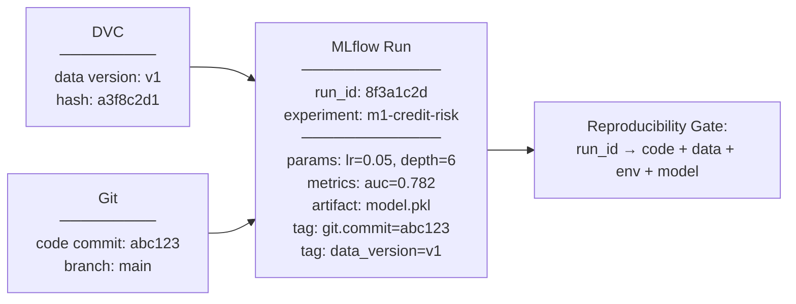
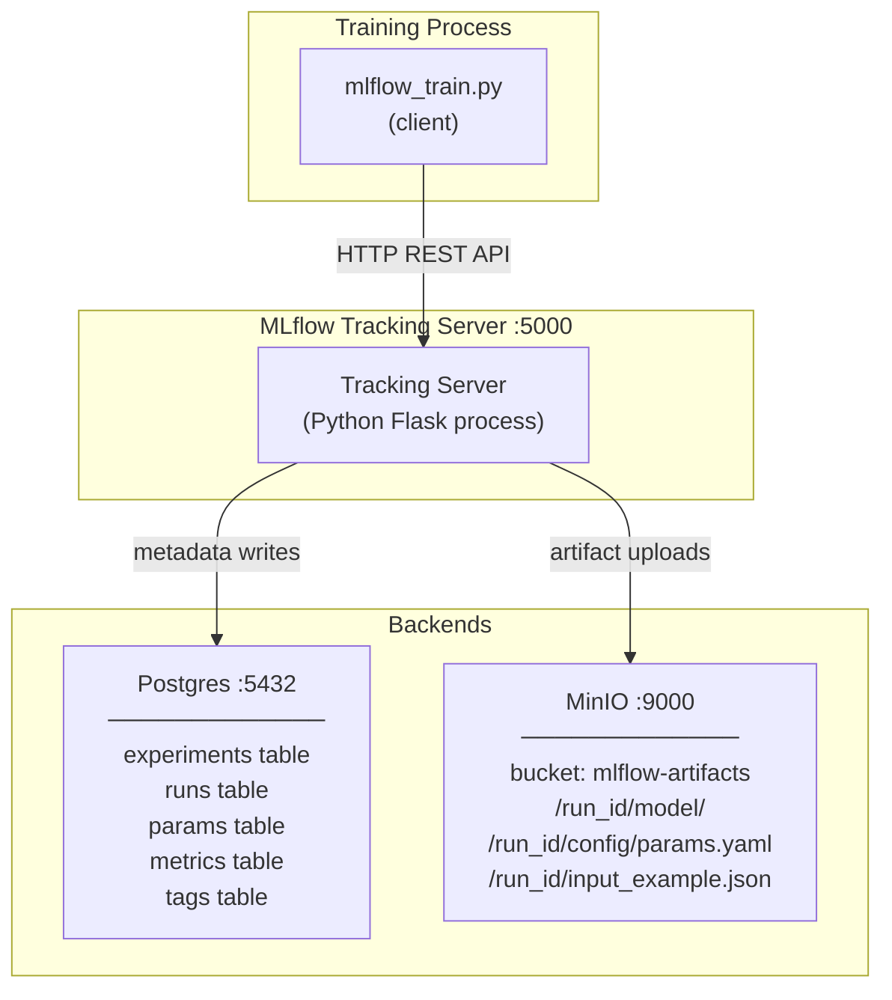
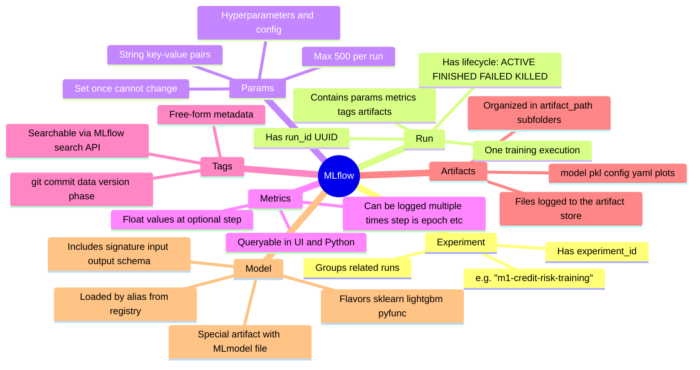
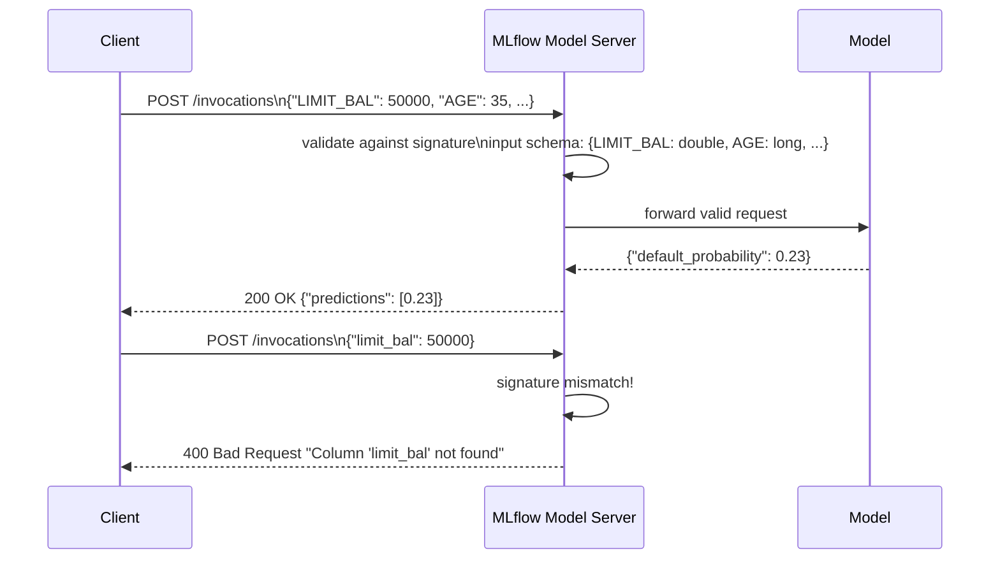

# Day 10 — MLflow Tracking

> Tags: `[L]` local  
> Deliverable: **MLflow runs logged to Postgres + MinIO** → [platform/training/mlflow_train.py](../../platform/training/mlflow_train.py)

---

## 1. Why MLflow?

DVC tracks **data versions**. MLflow tracks **experiment runs** — the combination of code + data + params + metrics + model artifact that constitutes one experiment.



---

## 2. MLflow Architecture (our setup)



**Key insight:** The tracking server is just a proxy. You can also write directly to Postgres + MinIO without the tracking server (useful in tests), but the server provides the UI.

---

## 3. MLflow Concepts



---

## 4. Code Walkthrough: `mlflow_train.py`

### 4.1 Setup

```python
# From mlflow_train.py

def configure_mlflow(cfg: TrainingParams) -> None:
    tracking_uri = os.getenv("MLFLOW_TRACKING_URI", "http://localhost:5000")
    mlflow.set_tracking_uri(tracking_uri)
    mlflow.set_experiment(cfg.mlflow.experiment_name)
```

`set_tracking_uri` tells the MLflow client where to send data. `set_experiment` creates the experiment if it doesn't exist.

### 4.2 Logging Params

```python
with mlflow.start_run(run_name=run_name, tags=extra_tags) as run:
    run_id = run.info.run_id

    # Log all params at once (flat dict from TrainingParams)
    mlflow.log_params(cfg.flat_params())
    # → model.learning_rate=0.05, model.n_estimators=300, ...

    # Log the params file itself as an artifact
    mlflow.log_artifact(params_path, artifact_path="config")
```

### 4.3 Logging Metrics

```python
    y_prob = model.predict_proba(X_test)[:, 1]
    metrics = compute_metrics(y_test.to_numpy(), y_prob, cfg.evaluation.threshold)
    mlflow.log_metrics(metrics)
    # → roc_auc=0.782, brier_score=0.134, calibration_error=0.045
```

### 4.4 Logging the Model (with Signature)

```python
    signature = mlflow.models.infer_signature(
        model_input=X_train,
        model_output=pd.Series(
            model.predict_proba(X_train)[:, 1],
            name="default_probability"
        ),
    )
    mlflow.lightgbm.log_model(
        lgb_model=model,
        artifact_path="model",      # subfolder in run's artifact dir
        signature=signature,         # enforced at serving time
        input_example=X_train.iloc[:5],  # sample input for UI
    )
```

**Why signature matters:** When the model is deployed (Phase 4), MLflow validates every request against the signature. Wrong column names or wrong types → rejected before reaching the model.

---

## 5. Model Signature in Practice



---

## 6. Running MLflow Training

```bash
cd platform

# 1. Start local platform (MLflow + MinIO + Postgres)
make up   # from platform/ directory

# 2. Verify MLflow is running
curl http://localhost:5000/health
# → {"status": "OK"}

# 3. Run training with MLflow tracking
PYTHONHASHSEED=42 python -m training.mlflow_train --params params.yaml

# Output:
# Started MLflow run: 8f3a1c2d9e0b1a2c
# Metrics — AUC: 0.7821 | AP: 0.5234 | Brier: 0.1342 | ECE: 0.0421
# Run complete: run_id=8f3a1c2d | AUC=0.7821
# MLflow run_id: 8f3a1c2d9e0b1a2c
# View at: http://localhost:5000

# 4. Open MLflow UI
open http://localhost:5000
# → Select experiment "m1-credit-risk-training"
# → Click the run to see params, metrics, artifacts
```

---

## 7. Querying Runs Programmatically

```python
import mlflow

mlflow.set_tracking_uri("http://localhost:5000")

# Find the best run by AUC
runs = mlflow.search_runs(
    experiment_names=["m1-credit-risk-training"],
    filter_string="metrics.roc_auc > 0.75",
    order_by=["metrics.roc_auc DESC"],
    max_results=10,
)
print(runs[["run_id", "metrics.roc_auc", "params.model.learning_rate"]])

# Load the best model directly from a run
best_run_id = runs.iloc[0]["run_id"]
model = mlflow.lightgbm.load_model(f"runs:/{best_run_id}/model")
```

---

## 8. Autolog vs Manual Logging

| Aspect | `mlflow.lightgbm.autolog()` | Manual logging |
|---|---|---|
| Setup | One line | More code |
| Control | Less — logs everything | You choose what's logged |
| Param naming | Framework-dependent | You define key names |
| Custom metrics | Not included | Full control |
| Signatures | Auto-inferred | You control schema |
| Learning curve | Low | Medium |

**Recommendation:** Use autolog for quick exploration. Switch to manual when:
- You have custom metrics (ECE, cost-based metrics)
- You need specific param naming conventions (for `filter_string` queries)
- You're logging non-standard artifacts (data contracts, feature importance plots)

---

## 9. Debugging MLflow

| Problem | Cause | Fix |
|---|---|---|
| `Connection refused :5000` | Server not running | `make up` |
| `RESOURCE_ALREADY_EXISTS` on experiment | Name collision | Use unique experiment names or `set_experiment` |
| Artifacts not in MinIO | Wrong `AWS_*` env vars | Check `.env`, verify `MLFLOW_S3_ENDPOINT_URL` |
| Params truncated | >500 params per run | Use nested params or log fewer |
| Model load fails after upgrade | MLflow version changed pickle format | Pin MLflow version in `uv.lock` |

```bash
# Check server logs:
docker logs mlops-mlflow -f

# Test artifact upload manually:
python -c "
import mlflow, os
mlflow.set_tracking_uri('http://localhost:5000')
with mlflow.start_run():
    mlflow.log_param('test', 'value')
    mlflow.log_metric('x', 1.0)
print('MLflow OK')
"
```

---

## Key Takeaways

- **MLflow tracks the combination** of code + data + params + metrics + model — DVC tracks data, git tracks code, MLflow ties them together.
- **`run_id` is the reproducibility handle.** Everything needed to reproduce a run is reachable from the run_id.
- **Model signature is an API contract.** It enforces correct input at serve time.
- **Use flat param keys** (`model.learning_rate` not `lr`) to make MLflow queries predictable.
- **Autolog is a shortcut, manual is correct.** For production use, log only what you need.
