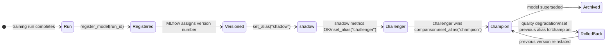
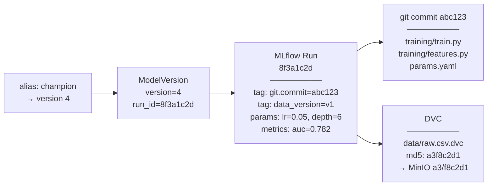

# Day 11 — MLflow Model Registry: Versions, Aliases, Signatures

> Tags: `[L]` local · `[S]` security  
> Deliverable: **Model registered with champion alias** → [platform/training/registry.py](../../platform/training/registry.py)  
> Threat checkpoint: **artifact provenance** (T-03, S-03 in [threat_model_v0.md](../phase0/threat_model_v0.md))

---

## 1. The Gap Between Training and Serving

After `mlflow_train.py` runs, the model is an artifact inside a run. The serving layer needs a **stable, versioned reference** that survives:
- Multiple training runs (which version is in production?)
- Model upgrades (how do I swap without redeployment?)
- Rollbacks (how do I revert to the previous version?)

The Model Registry answers all three.

---

## 2. Registry Lifecycle



---

## 3. Versions vs Aliases vs Stages

| Concept | Description | Mutable? |
|---|---|---|
| **Version number** | Auto-incremented integer (1, 2, 3...) | No — permanent identifier |
| **Stage** (deprecated) | Staging / Production / Archived | Yes — but deprecated in MLflow 2.x |
| **Alias** | User-defined name pointing to a version | Yes — can be moved atomically |

**Always use aliases, not stages.** Aliases are atomic pointer swaps:

```python
# BEFORE: champion = version 3
registry.set_alias("credit-risk-model", version="4", alias="champion")
# AFTER: champion = version 4 (atomic — no intermediate state)
```

The serving layer loads `models:/credit-risk-model@champion` — it never needs to know the version number.

---

## 4. Provenance Chain

The Registry connects every alias to a complete audit trail:



**Given `run_id=8f3a1c2d`, you can recover:**
1. The exact model artifact (in MinIO)
2. The exact params used (logged to MLflow)
3. The git commit of the training code
4. The data version (DVC hash in the tag)

This is the Reproducibility Gate audit trail.

---

## 5. Code Walkthrough: `registry.py`

### 5.1 Registering a Model

```python
# From registry.py

def register_model(run_id: str, model_name: str, artifact_path: str = "model") -> ModelVersion:
    model_uri = f"runs:/{run_id}/{artifact_path}"
    mv = mlflow.register_model(model_uri=model_uri, name=model_name)
    # MLflow copies the artifact from the run to the registry store
    # Assigns the next version number automatically
    return mv
```

### 5.2 Setting Aliases

```python
def set_alias(model_name: str, version: str | int, alias: str) -> None:
    _client().set_registered_model_alias(
        name=model_name, alias=alias, version=str(version)
    )
```

### 5.3 Loading by Alias (in serving code)

```python
def load_model_by_alias(model_name: str, alias: str):
    uri = f"models:/{model_name}@{alias}"
    return mlflow.pyfunc.load_model(uri)

# In serving code (Phase 4):
model = load_model_by_alias("credit-risk-model", "champion")
# → always loads whatever is currently "champion" — transparent to serving code
```

### 5.4 Comparing Champion vs Challenger

```python
result = compare_champion_challenger("credit-risk-model", metric="roc_auc")
# ComparisonResult(
#     champion_version="3", challenger_version="4",
#     champion_auc=0.779, challenger_auc=0.782,
#     winner="challenger", delta=0.003
# )

if result.winner == "challenger":
    set_alias("credit-risk-model", result.challenger_version, "champion")
```

---

## 6. Running Registry Operations

```bash
cd platform

# 1. Train a model (get run_id)
PYTHONHASHSEED=42 python -m training.mlflow_train --params params.yaml
# → MLflow run_id: 8f3a1c2d9e0b1a2c

# 2. Register the model
python -c "
from training.registry import register_model, set_alias
mv = register_model('8f3a1c2d9e0b1a2c', 'credit-risk-model')
print(f'Registered version {mv.version}')
set_alias('credit-risk-model', mv.version, 'champion')
print('Set as champion')
"

# 3. List all versions
python -m training.registry --list credit-risk-model

# 4. Get champion run_id (for audit)
python -m training.registry --get-run-id credit-risk-model champion

# 5. Train a second model (challenger)
# change params.yaml: model.learning_rate = 0.1
PYTHONHASHSEED=42 python -m training.mlflow_train --params params.yaml
# → MLflow run_id: 9a2b3c4d5e6f7a8b

python -c "
from training.registry import register_model, set_alias, compare_champion_challenger
mv = register_model('9a2b3c4d5e6f7a8b', 'credit-risk-model')
set_alias('credit-risk-model', mv.version, 'challenger')
result = compare_champion_challenger('credit-risk-model')
print(result)
"
```

**Expected registry table:**
```
Version    Aliases          Run ID       State
  v1       champion         8f3a1c2d     READY
  v2       challenger       9a2b3c4d     READY
```

---

## 7. Threat Checkpoint — Day 11

### T-03 / S-03: Artifact Provenance

**The threat:** A model artifact is replaced in the registry (e.g. attacker swaps `model.pkl` with a backdoored version). The serving layer loads it without knowing.

**Mitigations in our implementation:**

1. **MLflow artifact hash:** Every artifact logged to MLflow gets an MD5 hash stored in Postgres. Tampering changes the hash → detectable.

2. **Run ID traces to git commit:** The `git.commit` tag on the run links the model to the code that produced it. Verify:
   ```bash
   python -c "
   import mlflow
   mlflow.set_tracking_uri('http://localhost:5000')
   run = mlflow.get_run('8f3a1c2d9e0b1a2c')
   print(run.data.tags.get('git.commit'))  # abc123
   "
   # Cross-check:
   git show abc123 --name-only
   ```

3. **Registry access control (planned Phase 8):** Only the CI pipeline should be able to call `register_model`. Human access should be read-only.

4. **Artifact signing (Phase 8):** Sigstore / cosign will sign each model artifact. Serving layer verifies signature before loading.

**Current state:** T-03 and S-03 are partially mitigated. Full mitigation at Phase 8 (Sigstore). Update threat model:

| Threat | Status | Notes |
|---|---|---|
| T-03 Artifact replacement | ⚠️ Partial | Hash in Postgres; signing in Phase 8 |
| S-03 Registry spoofing | ⚠️ Partial | Auth required; mTLS in Phase 4 |
| R-01 No audit trail | ✅ Mitigated | run_id → run → git commit → DVC hash |

---

## 8. Debugging Registry Issues

| Problem | Fix |
|---|---|
| `RESOURCE_DOES_NOT_EXIST` when setting alias | Model not registered yet — run `register_model` first |
| Version keeps incrementing | Normal — each `register_model` creates a new version |
| Alias not found in serving | Check model name spelling (case-sensitive) |
| Registry state inconsistent | Check Postgres `model_versions` table directly |

```bash
# Direct Postgres inspection (debug only):
docker exec mlops-postgres psql -U mlops -d mlflow -c "
SELECT name, version, current_stage, aliases
FROM model_versions
WHERE name='credit-risk-model'
ORDER BY version DESC;
"
```

---

## Key Takeaways

- **Aliases are stable identifiers.** Serving code never hardcodes version numbers.
- **Registry = training ↔ serving bridge.** The run_id is the provenance link.
- **`champion` → current production, `challenger` → candidate, `shadow` → silent eval.**
- **Rollback = alias pointer swap.** One API call, zero redeployment.
- **Artifact tampering is detectable** via hash stored in Postgres — wire a hash check into CI (Phase 8).
