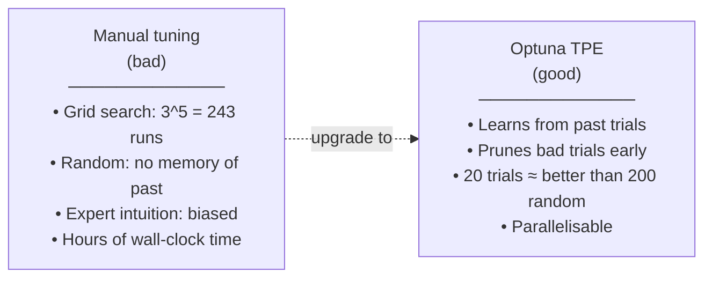
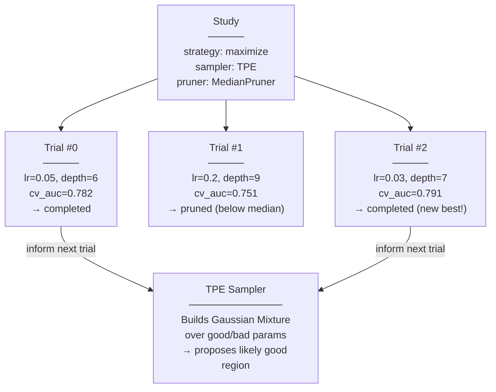
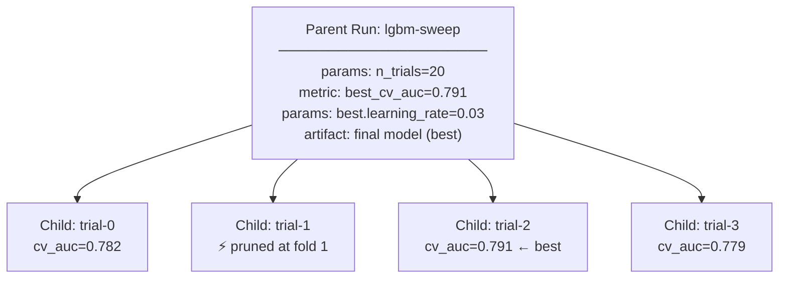

# Day 12 — Optuna: Hyperparameter Optimization + MLflow Leaderboard

> Tags: `[L]` local · `[P]` performance  
> Deliverable: **HPO sweep with MLflow leaderboard** → [platform/training/hpo.py](../../platform/training/hpo.py)

---

## 1. Why HPO? The Danger of Manual Tuning



For credit risk: improving AUC from 0.78 to 0.82 reduces expected default losses significantly. HPO is where that 4% often comes from.

---

## 2. Optuna Core Concepts



### Sampler: TPE (Tree-structured Parzen Estimator)

TPE models the search space as two probability distributions:
- `l(x)` — probability of params given good trial
- `g(x)` — probability of params given bad trial

It samples from regions where `l(x)/g(x)` is high (likely good params). After ~10 trials, it's smarter than random.

### Pruner: MedianPruner

After each CV fold, the trial reports its intermediate AUC. MedianPruner checks: is this trial's current AUC below the median of completed trials at this step? If yes → prune (kill the trial early, save compute).

```
Trial #5: fold 1 auc=0.74
MedianPruner: median at fold 1 = 0.77 → 0.74 < 0.77 → PRUNE
(saves running 2 more folds)
```

---

## 3. MLflow Nested Runs Structure



In the MLflow UI: click the parent run → expand "child runs" tab → see all trials ranked by `cv_auc`.

---

## 4. Code Walkthrough: `hpo.py`

### 4.1 Search Space

```python
def _define_search_space(trial: optuna.Trial) -> dict[str, Any]:
    return {
        "n_estimators": trial.suggest_int("n_estimators", 100, 600),
        "learning_rate": trial.suggest_float("learning_rate", 0.005, 0.3, log=True),
        # log=True: sample 0.005, 0.01, 0.02, 0.05 more than 0.15, 0.2, 0.25
        "max_depth": trial.suggest_int("max_depth", 3, 10),
        ...
    }
```

**Why log-scale for `learning_rate`?** Small values have disproportionate impact. The difference between 0.01 and 0.02 is much larger than between 0.20 and 0.21. Log scale gives uniform coverage of the interesting range.

### 4.2 Objective with Pruning

```python
def objective(trial, X_train, y_train, n_splits=3):
    params = _define_search_space(trial)
    cv = StratifiedKFold(n_splits=3, shuffle=True, random_state=42)

    for fold, (idx_tr, idx_val) in enumerate(cv.split(X_train, y_train)):
        model = lgb.LGBMClassifier(**params)
        model.fit(X_train[idx_tr], y_train[idx_tr])
        auc = roc_auc_score(y_train[idx_val], model.predict_proba(X_train[idx_val])[:, 1])
        fold_aucs.append(auc)

        trial.report(np.mean(fold_aucs), step=fold)  # intermediate value
        if trial.should_prune():                       # check with pruner
            raise optuna.TrialPruned()                 # stops this trial early

    return float(np.mean(fold_aucs))
```

`StratifiedKFold` preserves the 22%/78% class ratio in each fold — important for credit data.

### 4.3 MLflow Integration

```python
# MLflowCallback creates a child run for each trial
from optuna.integration.mlflow import MLflowCallback
mlflow_cb = MLflowCallback(
    tracking_uri=tracking_uri,
    metric_name="cv_auc",
    mlflow_kwargs={"nested": True},  # creates child runs under parent
)

study.optimize(
    lambda trial: objective(trial, X_train_arr, y_train_arr),
    n_trials=n_trials,
    callbacks=[mlflow_cb],
)
```

---

## 5. Running the Sweep

```bash
cd platform

# Short smoke test (3 trials):
PYTHONHASHSEED=42 python -m training.hpo --n-trials 3

# Full sweep (20 trials, ~10-15 minutes):
PYTHONHASHSEED=42 python -m training.hpo --n-trials 20

# Expected output:
# Starting Optuna sweep: 20 trials
# [I 2026-06-29] Trial 0 finished with value: 0.7821
# [I 2026-06-29] Trial 1 pruned.
# [I 2026-06-29] Trial 2 finished with value: 0.7913
# ...
# Best trial #2: cv_auc=0.7913
# Sweep complete. Final AUC=0.7942

# View leaderboard in MLflow UI:
open http://localhost:5000
# → Select experiment "m1-credit-risk-training"
# → Filter: run_name contains "sweep"
# → Click parent run → Runs tab to see child trials ranked
```

---

## 6. Leaderboard: Comparing Sweeps

```bash
import mlflow
import pandas as pd

mlflow.set_tracking_uri("http://localhost:5000")

# Get all trial runs (child runs) from a sweep
runs = mlflow.search_runs(
    experiment_names=["m1-credit-risk-training"],
    filter_string="tags.mlflow.parentRunId = '<parent_run_id>'",
    order_by=["metrics.cv_auc DESC"],
)
print(runs[["run_id", "metrics.cv_auc",
            "params.learning_rate", "params.max_depth",
            "params.num_leaves"]].head(10))
```

---

## 7. Registering the Best Model from a Sweep

```bash
python -c "
import mlflow
from training.registry import register_model, set_alias

# Get the best trial's run_id from the sweep parent run
mlflow.set_tracking_uri('http://localhost:5000')

# The parent run logged the best model
parent_run_id = 'PASTE_FROM_hpo_output'
mv = register_model(parent_run_id, 'credit-risk-model', artifact_path='model')
set_alias('credit-risk-model', mv.version, 'challenger')
print(f'Registered sweep-best as challenger: v{mv.version}')
"
```

---

## 8. Performance Tips

| Tip | Impact |
|---|---|
| Use `n_jobs=-1` in LightGBM | 2-4x faster per trial on multicore |
| Start with 10 trials, inspect, then add 10 more | Avoids wasting time on bad search space |
| Set `n_startup_trials=5` in TPE | TPE random-searches first 5, then learns |
| Widen search space if best = boundary | If best `lr=0.3` (max), extend range |
| Use `optuna-dashboard` for live monitoring | `pip install optuna-dashboard` |

---

## 9. Debugging Optuna

| Problem | Fix |
|---|---|
| All trials pruned | Increase `n_warmup_steps` in MedianPruner |
| AUC not improving after 10 trials | Widen search space or check data |
| Memory OOM | Reduce `n_splits` in CV; reduce dataset size |
| `MLflowCallback` errors | Ensure MLflow server is up before starting |
| Trials not reproducible | TPE is stochastic; set `sampler=TPESampler(seed=42)` |

---

## Key Takeaways

- **TPE is not random search.** It models the search space based on past trials — better than grid search with fewer evaluations.
- **Pruning saves compute.** MedianPruner can eliminate 30–50% of trials early.
- **Nested MLflow runs** give you a leaderboard for free — parent = sweep, children = trials.
- **Always retrain final model on full training set** after HPO — CV uses only 2/3 of training data.
- **Register the HPO best, not the CV best.** The parent run's final model is trained on 100% of training data.
