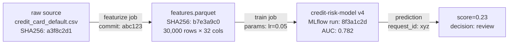
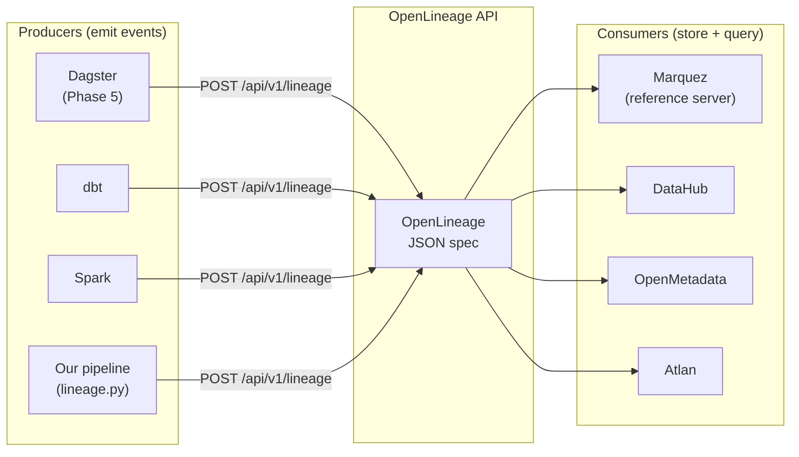

# Day 13 — Data Lineage & Metadata (OpenLineage)

> Tags: `[T]` theory  
> Deliverable: **OpenLineage emitter** → [platform/pipelines/lineage.py](../../platform/pipelines/lineage.py)

---

## 1. What is Data Lineage?

Data lineage answers: **"where did this data come from, and what happened to it?"**

For the Reproducibility Gate, lineage is the data half of the audit trail:



Given a prediction `score=0.23` at 2:15 PM, you can trace back to:
- Feature values → features.parquet (SHA256: b7e3a9c0)
- Feature code → git commit abc123
- Raw data → credit_card_default.csv (SHA256: a3f8c2d1)
- Params → MLflow run 8f3a1c2d

---

## 2. OpenLineage Standard

OpenLineage is an open specification for data lineage events. It defines a JSON format that any tool can emit and any backend can consume.



**Why OpenLineage instead of vendor-specific?** Lock-in. If you emit Airflow-specific lineage, switching to Dagster loses all history. OpenLineage is tool-neutral.

---

## 3. OpenLineage Event Structure

```json
{
  "eventType": "COMPLETE",          // START | COMPLETE | FAIL | ABORT
  "eventTime": "2026-06-29T10:00:00Z",
  "producer": "featurize-stage",
  "run": {
    "runId": "550e8400-e29b-41d4-a716-446655440000",
    "facets": {
      "mlflow": {
        "run_id": "8f3a1c2d9e0b1a2c",  // custom facet linking to MLflow
        "tracking_uri": "http://localhost:5000"
      }
    }
  },
  "job": {
    "namespace": "credit-risk",
    "name": "featurize",
    "facets": {
      "documentation": {
        "description": "Credit risk platform — featurize"
      }
    }
  },
  "inputs": [{
    "namespace": "local",
    "name": "data/raw/credit_card_default.csv",
    "facets": {
      "schema": {
        "fields": [
          {"name": "ID", "type": "INT"},
          {"name": "LIMIT_BAL", "type": "DOUBLE"}
        ]
      },
      "dataQuality": {
        "rowCount": 30000,
        "columnMetrics": {"ID": {"nullCount": 0}}
      }
    }
  }],
  "outputs": [{
    "namespace": "local",
    "name": "data/processed/features.parquet",
    "facets": {
      "dataQuality": {"rowCount": 30000}
    }
  }]
}
```

---

## 4. Facets: Structured Metadata

Facets are typed metadata objects attached to Jobs, Runs, or Datasets.

| Facet | Attached to | Contains |
|---|---|---|
| `SchemaDatasetFacet` | Dataset | Column names and types |
| `DataQualityDatasetFacet` | Dataset | Row count, null counts, per-column stats |
| `DocumentationJobFacet` | Job | Human-readable description, owner |
| `ErrorMessageRunFacet` | Run | Error type, stack trace |
| `SQLJobFacet` | Job | SQL query that produced this dataset |
| Custom facets | Any | Anything — we use `mlflow.run_id` |

---

## 5. Code Walkthrough: `lineage.py`

### 5.1 The `LineageEmitter` Context Manager

```python
emitter = LineageEmitter(
    producer="featurize-stage",
    namespace="credit-risk",
    backend="console",             # prints to stdout (dev mode)
    mlflow_run_id="8f3a1c2d",     # cross-link to MLflow
)

with emitter.run("featurize"):
    # ... actual featurization work ...
    emitter.emit_complete(
        inputs=[LineageDataset(
            name="data/raw/credit_card_default.csv",
            row_count=30_000,
        )],
        outputs=[LineageDataset(
            name="data/processed/features.parquet",
            row_count=30_000,
            n_cols=32,
        )],
    )
```

The context manager automatically emits a `START` event on entry and `FAIL` on exception. `emit_complete` sends the `COMPLETE` event with input/output datasets.

### 5.2 Backends

| Backend | Config | Use case |
|---|---|---|
| `console` | Default (no config) | Development, testing |
| `http` | `OPENLINEAGE_URL=http://localhost:5001` | Marquez or other server |

Switch to HTTP backend when Marquez is running (Phase 5: Dagster integration will add Marquez).

### 5.3 Custom MLflow Facet

```python
def _run_facets(self, error=None):
    facets = {}
    if self.mlflow_run_id:
        facets["mlflow"] = {
            "_producer": "mlops-platform",
            "run_id": self.mlflow_run_id,
            "tracking_uri": os.getenv("MLFLOW_TRACKING_URI"),
        }
    return facets
```

This custom facet is not in the OpenLineage spec — that's fine. Custom facets are allowed. Any consumer that doesn't know this facet ignores it gracefully.

---

## 6. Integrating Lineage with the Training Pipeline

```python
# In mlflow_train.py (after Day 13):
from pipelines.lineage import emit_featurize_lineage, emit_train_lineage

# After featurize stage:
emit_featurize_lineage(
    input_path="data/raw/credit_card_default.csv",
    output_path="data/processed/features.parquet",
    row_count=len(df),
    n_features=X_train.shape[1],
    mlflow_run_id=run_id,
)

# After train stage:
emit_train_lineage(
    input_path="data/processed/features.parquet",
    model_path="models/credit_risk_model.pkl",
    metrics_path="metrics/train_metrics.json",
    mlflow_run_id=run_id,
)
```

---

## 7. Lineage vs Your Data Platform Experience

You have experience with data lineage in data engineering (Iceberg, Flink, Trino). The concepts map:

| Data Engineering | ML Lineage | Difference |
|---|---|---|
| Table → transformation → table | Dataset → job → dataset | Same graph model |
| SQL queries (SQLJobFacet) | Python scripts | Different job facets |
| Column-level lineage | Feature-level lineage | Granularity |
| Data catalog (Glue, DataHub) | ML feature store lineage | Different storage |
| dbt lineage | DVC pipeline lineage | Different tools, same DAG |

The key addition in ML: **model artifacts as output datasets.** The model is a dataset that flows into the serving layer, so it also needs lineage.

---

## 8. Running the Lineage Emitter

```bash
cd platform

# Console backend (dev mode — prints JSON):
OPENLINEAGE_BACKEND=console python -c "
from pipelines.lineage import emit_featurize_lineage
emit_featurize_lineage(
    input_path='data/raw/credit_card_default.csv',
    output_path='data/processed/features.parquet',
    row_count=30000,
    n_features=32,
    mlflow_run_id='test-run-id',
)
"
# Prints a COMPLETE event JSON to stdout

# To use with Marquez (Phase 5 — Dagster integration):
# docker run -p 5001:5001 marquezproject/marquez
# export OPENLINEAGE_URL=http://localhost:5001/api/v1/lineage
# export OPENLINEAGE_BACKEND=http
# python -m pipelines.lineage  # runs example
```

---

## Key Takeaways

- **Lineage = data provenance for the ML pipeline.** Answers "where did this model's training data come from?"
- **OpenLineage is a standard, not a tool.** Emit once, consume in any compatible backend.
- **START/COMPLETE/FAIL event pattern** mirrors structured logging — every job execution emits events.
- **Custom facets extend the spec.** Our `mlflow.run_id` facet cross-links lineage to tracking.
- **Lineage integration deepens in Phase 5** (Dagster) — Dagster has native OpenLineage support.
