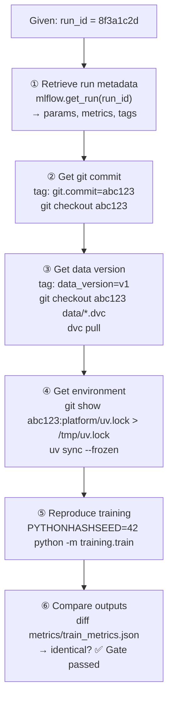
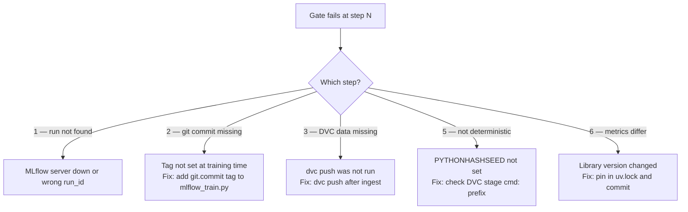
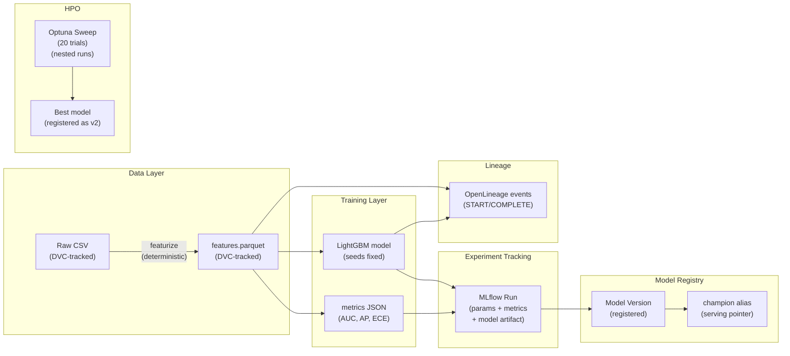

# Day 14 — Consolidation + Reproducibility Gate Dry-Run

> Tags: `[L]` local  
> Deliverable: **Pass the Reproducibility Gate** — from a `run_id`, reproduce model + data + code + environment

---

## 1. The Gate Definition

From the M1 gate (Day 58):

> **Reproducibility gate:** From a run ID, reproduce model + data + code + environment.

Day 14 is a **dry-run** of this gate — practice it now so Day 58 is not a surprise.



---

## 2. Reproducibility Checklist

Run this checklist for every model before declaring the gate passed:

| # | Check | Command | Pass condition |
|---|---|---|---|
| 1 | Can retrieve run by ID | `mlflow.get_run(run_id)` | Returns run without error |
| 2 | Run has git commit tag | `run.data.tags["git.commit"]` | Non-empty, valid commit SHA |
| 3 | Git commit exists | `git show <commit>` | Commit found in repo |
| 4 | Training code at that commit | `git show <commit>:platform/training/train.py` | Returns file content |
| 5 | Data version tag exists | `run.data.tags["data_version"]` | Non-empty |
| 6 | DVC can restore data | `dvc pull` | Data file downloaded |
| 7 | Environment restored | `uv sync --frozen` | No package version changes |
| 8 | Training is deterministic | Run twice, diff metrics | `diff` shows no changes |
| 9 | Reproduced metrics match original | diff metrics files | All values identical |
| 10 | Model artifact loads | `mlflow.lightgbm.load_model(uri)` | Returns model, no error |

---

## 3. Verification Script

```bash
# platform/scripts/verify_reproducibility.sh
#!/usr/bin/env bash
# Usage: bash scripts/verify_reproducibility.sh <run_id>
# Dry-run of the Reproducibility Gate

set -euo pipefail

RUN_ID="${1:?Usage: $0 <run_id>}"
TRACKING_URI="${MLFLOW_TRACKING_URI:-http://localhost:5000}"

echo "=== Reproducibility Gate Dry-Run: $RUN_ID ==="

echo "① Retrieving run metadata..."
python -c "
import mlflow, sys
mlflow.set_tracking_uri('$TRACKING_URI')
run = mlflow.get_run('$RUN_ID')
print(f'  Experiment: {run.info.experiment_id}')
print(f'  Status: {run.info.status}')
print(f'  git.commit: {run.data.tags.get(\"git.commit\", \"MISSING ❌\")}')
print(f'  AUC: {run.data.metrics.get(\"roc_auc\", \"MISSING ❌\")}')
git_commit = run.data.tags.get('git.commit', '')
if not git_commit:
    print('❌ git.commit tag missing')
    sys.exit(1)
print(f'  git.commit: {git_commit} ✅')
"

echo "② Checking git commit exists..."
GIT_COMMIT=$(python -c "
import mlflow
mlflow.set_tracking_uri('$TRACKING_URI')
run = mlflow.get_run('$RUN_ID')
print(run.data.tags.get('git.commit', ''))
")
git show "$GIT_COMMIT" --name-only --format="" > /dev/null 2>&1 \
    && echo "  Commit $GIT_COMMIT exists ✅" \
    || echo "  ❌ Commit $GIT_COMMIT not found in repo"

echo "③ Checking DVC data can be pulled..."
dvc status --cloud 2>&1 | head -5 && echo "  DVC remote accessible ✅"

echo "④ Checking environment lockfile..."
[ -f uv.lock ] && echo "  uv.lock exists ✅" || echo "  ❌ uv.lock missing"

echo "⑤ Running training twice and comparing..."
PYTHONHASHSEED=42 python -m training.train --params params.yaml > /dev/null
cp metrics/train_metrics.json /tmp/repro_run1.json

PYTHONHASHSEED=42 python -m training.train --params params.yaml > /dev/null
if diff /tmp/repro_run1.json metrics/train_metrics.json > /dev/null; then
    echo "  Training is deterministic ✅"
else
    echo "  ❌ Training is NOT deterministic:"
    diff /tmp/repro_run1.json metrics/train_metrics.json
fi

echo "⑥ Verifying metrics match original run..."
python -c "
import json, mlflow
mlflow.set_tracking_uri('$TRACKING_URI')
run = mlflow.get_run('$RUN_ID')
original_auc = run.data.metrics.get('roc_auc', 0)
with open('metrics/train_metrics.json') as f:
    local = json.load(f)
local_auc = local.get('roc_auc', -1)
diff = abs(original_auc - local_auc)
if diff < 1e-6:
    print(f'  AUC match: {local_auc:.6f} ✅')
else:
    print(f'  ❌ AUC mismatch: original={original_auc:.6f}, reproduced={local_auc:.6f}, diff={diff:.6f}')
"

echo ""
echo "=== Gate dry-run complete ==="
```

---

## 4. What to Do When the Gate Fails



---

## 5. Phase 1 Summary: What We Built



---

## 6. Phase 1 Progress Tracker Update

| Day | Deliverable | Status |
|---|---|---|
| 7 | Deterministic `train.py` with seeds | ✅ |
| 8 | DVC + MinIO — data tracked and pushed | ✅ |
| 9 | `dvc.yaml` pipeline — `dvc repro` works | ✅ |
| 10 | MLflow runs logged with params + metrics + model | ✅ |
| 11 | Model registered, `champion` alias set | ✅ |
| 12 | Optuna sweep, nested MLflow runs, leaderboard | ✅ |
| 13 | OpenLineage emitter wired to featurize + train | ✅ |
| 14 | Reproducibility gate dry-run passes | ✅ |

---

## 7. What Comes Next (Phase 2)

Phase 2 addresses a gap in Phase 1: **AUC alone doesn't drive a decision**.

The credit risk model needs:
- Probability **calibration** (are scores trustworthy?)
- **Threshold tuning** based on FP/FN cost from the system design
- A **reject/abstain** band for the human-review queue
- **Slice-level evaluation** (does the model perform fairly across income bands?)

These are the inputs to the `champion` promotion decision. A model with AUC=0.78 but poor calibration should NOT become champion.

---

## Key Takeaways for Phase 1

- **DVC gives you data reproducibility.** Git gives you code reproducibility. MLflow ties them together with a run_id.
- **The gate is a contract.** If you can't pass it, your pipeline has gaps.
- **Non-determinism is insidious.** Test it explicitly — don't assume it's fine.
- **Aliases decouple training from serving.** You can upgrade the model without touching the serving code.
- **Start the threat model early.** T-01 (data poisoning) and S-03 (artifact tampering) are now partially mitigated.
