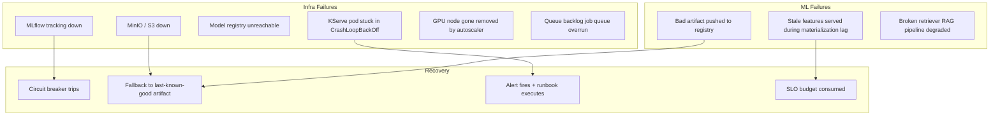
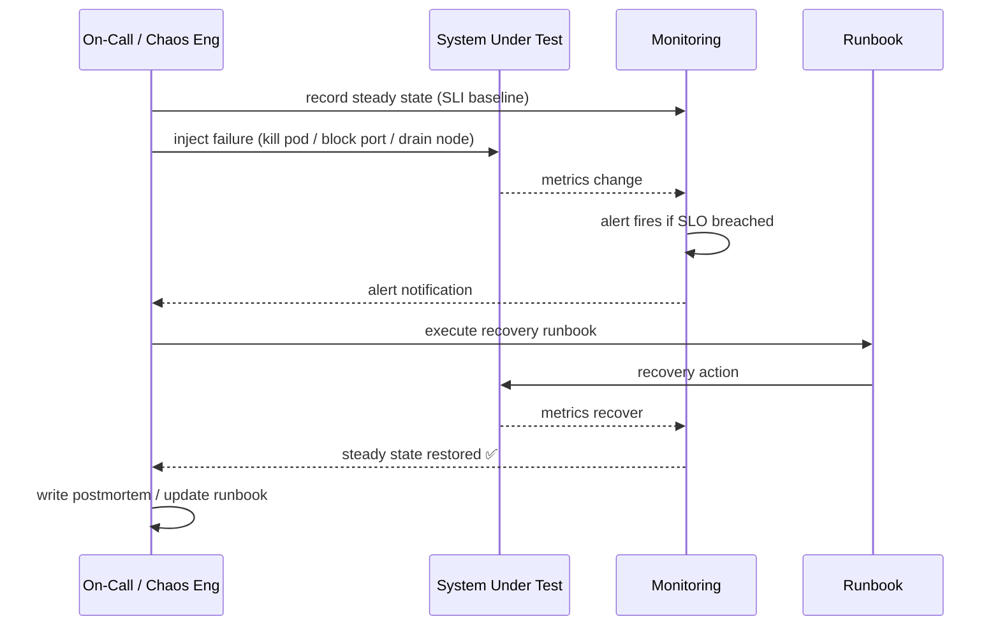
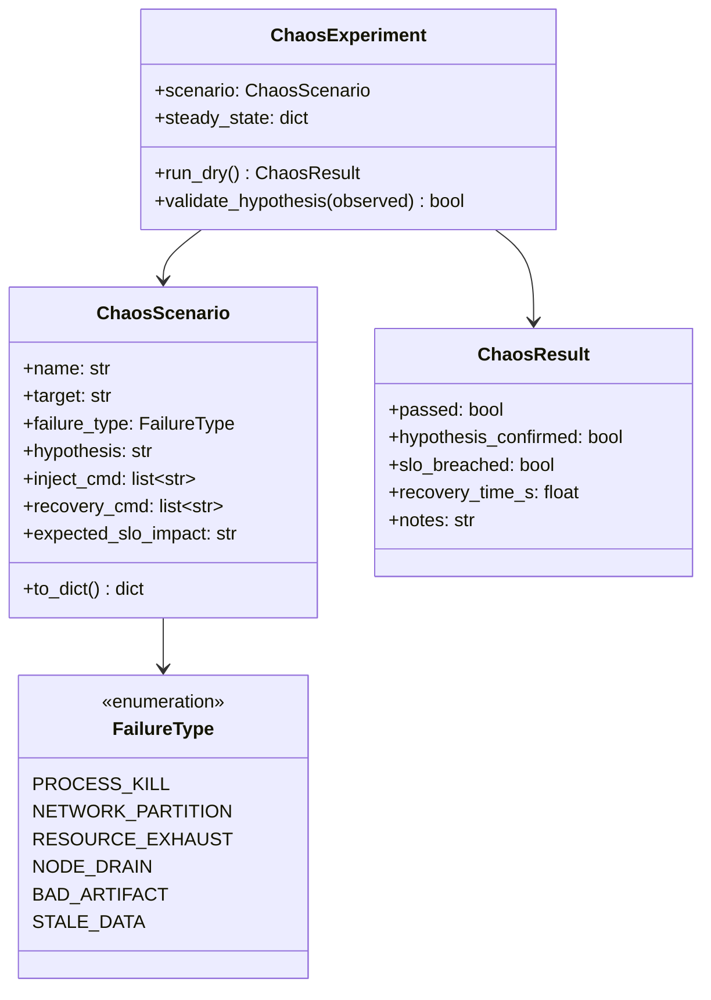

# Day 71 — Chaos Fundamentals + Infra Failure Injection

## What is Chaos Engineering?

**Chaos engineering** is the discipline of injecting controlled failures into a system
to verify that it survives them gracefully. The Principles of Chaos (Netflix, 2014):

1. **Define steady state** — what does "normal" look like (SLI metrics)?
2. **Hypothesize** — what do you *expect* to happen when X fails?
3. **Inject failure** — break X in a controlled way
4. **Observe** — did the system behave as hypothesised?
5. **Fix or document** — if not, fix the gap; if yes, document resilience

> "The goal is not to find bugs. It's to build confidence in a system's ability to withstand turbulent conditions." — Principles of Chaos Engineering

---

## ML-Specific Failure Taxonomy

ML systems have failure modes that pure software doesn't:

---

## Six Infra Chaos Scenarios

### Scenario 1 — MLflow Tracking Server Down

| | Detail |
|---|---|
| **Inject** | Kill MLflow pod: `kubectl delete pod -l app=mlflow -n mlops-infra` |
| **Hypothesis** | Training continues (fire-and-forget logging); serving is unaffected |
| **Expected** | `mlflow.log_metric()` raises but training doesn't crash; experiment not logged |
| **Steady state** | AUC metric logged for every run |
| **Recovery** | MLflow restarts via Deployment; resume with `mlflow.set_tracking_uri()` |
| **Prevention** | `--experiment-name` fallback to local file store; retry with backoff |

### Scenario 2 — MinIO / S3 Down

| | Detail |
|---|---|
| **Inject** | Stop MinIO: `docker stop mlops-minio` or block S3 endpoint in security group |
| **Hypothesis** | Model serving continues (model already loaded in memory); new deployments fail |
| **Expected** | `GET /predict` still works; `helm upgrade` (new pod start) fails at init-container |
| **Steady state** | 100% of predictions served successfully |
| **Recovery** | MinIO restarts; new pods re-download model artifact |
| **Prevention** | ReadOnlyMany PVC pre-loads model; serving not coupled to S3 at inference time |

### Scenario 3 — Model Registry Unreachable

| | Detail |
|---|---|
| **Inject** | Block registry port: `kubectl patch svc mlflow -p '{"spec":{"ports":[{"port":9999}]}}'` |
| **Hypothesis** | Promotion gate fails with clear error; no bad model promoted |
| **Expected** | `RegistryError` in CI pipeline; gate blocks; Slack alert fires |
| **Recovery** | Restore port; retry promotion |
| **Prevention** | Registry health check as a pre-condition in pipeline gate |

### Scenario 4 — KServe Pod CrashLoopBackOff

| | Detail |
|---|---|
| **Inject** | Deploy broken image tag: `helm upgrade --set image.tag=broken` |
| **Hypothesis** | Rolling update keeps 2/3 old pods running; SLO not breached |
| **Expected** | Readiness probe fails → pod never receives traffic → old pods keep serving |
| **Steady state** | Error rate < 1% |
| **Recovery** | `helm rollback credit-risk 1` |
| **Prevention** | Readiness probe + `maxUnavailable: 1` in rolling update strategy |

### Scenario 5 — GPU Node Gone

| | Detail |
|---|---|
| **Inject** | Cordon + drain GPU node: `kubectl drain gpu-node-1 --ignore-daemonsets --delete-emptydir-data` |
| **Hypothesis** | Training Job enters Pending state; Karpenter provisions new GPU node in < 90s |
| **Expected** | Job queued in Kueue; no data loss; GPU SLO degrades temporarily |
| **Recovery** | New node joins; Kueue admits waiting jobs |
| **Prevention** | Karpenter provisioner with spot fallback + on-demand |

### Scenario 6 — Queue Backlog (Job Overrun)

| | Detail |
|---|---|
| **Inject** | Submit 20 GPU training jobs simultaneously when quota = 8 GPUs |
| **Hypothesis** | Kueue queues 12 jobs; admits 8; fair-share between teams respected |
| **Expected** | No job crashes; BestEffortFIFO ordering; alert fires if queue depth > threshold |
| **Recovery** | Jobs drain as GPUs free up |
| **Prevention** | KEDA + SQS queue monitor; KEDA alerts on queue depth spike |

---

## Chaos Experiment Structure

---

## Class Diagram

