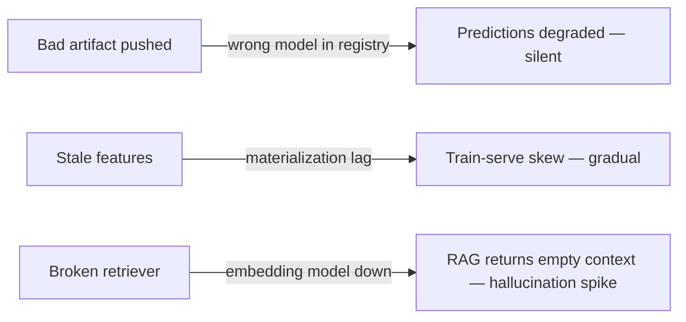
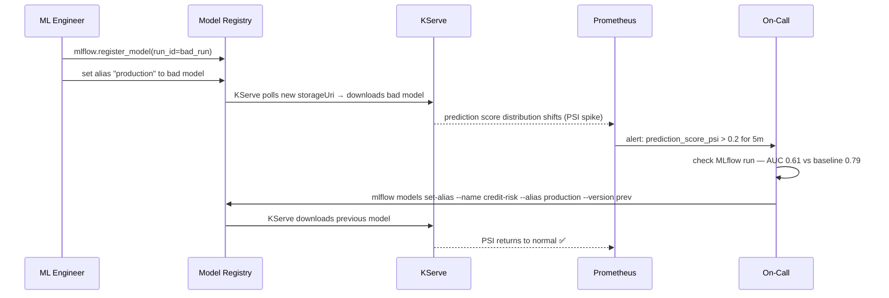
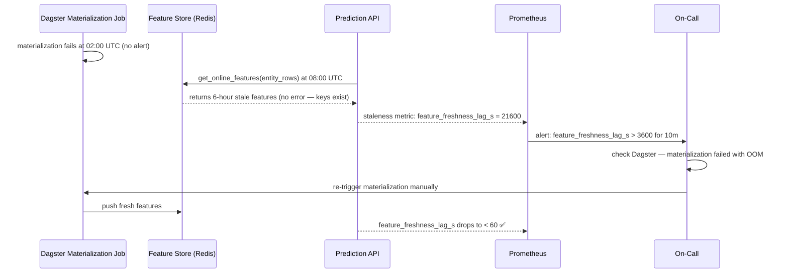
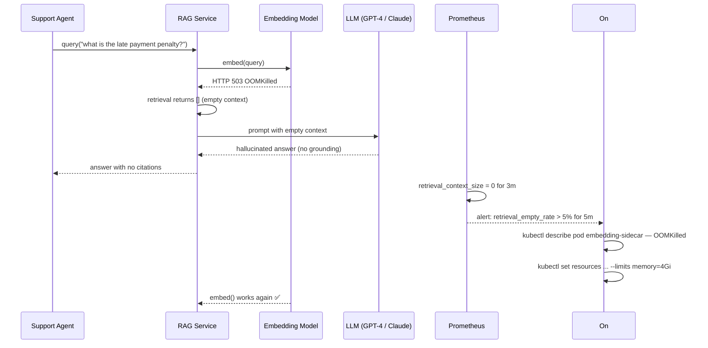
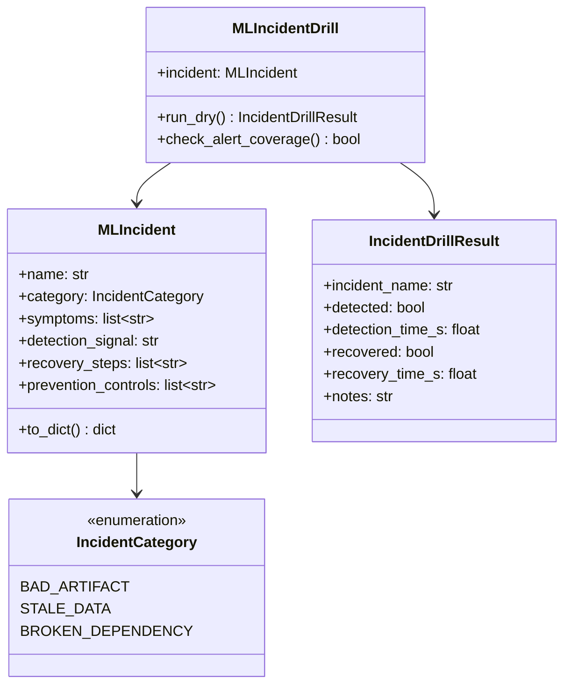

# Day 72 — ML-Specific Incident Drills

Software incidents (service down, timeout spike) follow well-known patterns.
ML incidents are subtler: the service stays up, requests return 200 OK, but
the *model* is silently wrong.

---

## The Three ML-Specific Incidents



---

## Incident 1 — Bad Artifact Pushed

### What happens

A model trained on mislabeled data or with a bug in the preprocessing
pipeline is registered and promoted to production without catching the
AUC regression.

### Sequence



### Expected behavior
- **Prediction PSI alert** fires before users notice
- AUC guard in CI should have caught this at promotion time

### Recovery steps
```bash
# 1. Find last good model version
mlflow models search-model-versions --filter "name='credit-risk'" \
    | jq '.[] | select(.tags.gate_passed=="true") | {version, run_id}'

# 2. Roll back alias
mlflow models set-alias \
    --name credit-risk --alias production --version <LAST_GOOD_VERSION>

# 3. Verify KServe picked up new version
kubectl get inferenceservice credit-risk -n ml-serving -o jsonpath='{.status.modelStatus}'

# 4. Confirm PSI drops
# Grafana: model_prediction_psi_score{alias="production"} < 0.1
```

### Prevention
| Layer | Control |
|---|---|
| CI gate | `AUCGuard.check()` blocks promotion if AUC regression > 1% |
| Data validation | `DataContractChecker.check_label_dist()` before training |
| Canary deploy | Route 10% traffic first; check PSI over 30 min before full promotion |
| Monitoring | PSI alert + approve gate before auto-promote |

---

## Incident 2 — Stale Features

### What happens

The feature materialization job fails silently (no alert wired up).
The feature store returns values from 6 hours ago. The model's credit risk
scores are based on outdated account balances and transaction counts.

### Sequence



### Expected behavior
- Staleness alert fires within 10 min of lag exceeding 1 hour
- Prediction API continues serving (with a warning header `X-Feature-Age-Seconds`)

### Recovery steps
```bash
# 1. Check materialization job status
dagster job status --location credit-risk --job materialize_credit_features

# 2. Re-trigger materialization
dagster job launch --location credit-risk --job materialize_credit_features

# 3. Verify freshness
redis-cli hgetall credit_risk:features:entity_001 | grep -A1 timestamp

# 4. Check prediction API staleness header
curl -i http://credit-risk-api/predict -d '{"entity_id":"001"}' \
    | grep X-Feature-Age
```

### Prevention
| Layer | Control |
|---|---|
| Alerting | `feature_freshness_lag_s` Prometheus metric + alert at 1 h |
| Pipeline | Dagster sensor: if materialization fails → Slack alert immediately |
| Validation | `FeatureMonitor.check_freshness()` called on every prediction batch |
| Serving | `X-Feature-Age-Seconds` header; soft cap at 2 h = raise `StaleFeatureWarning` |

---

## Incident 3 — Broken Retriever (RAG Pipeline)

### What happens

The embedding model sidecar (used by the RAG retrieval step) runs out of
memory and crashes. Retrieval returns no context. The LLM generates
plausible-sounding but hallucinated policy text.

### Sequence



### Expected behavior
- `retrieval_empty_rate` alert fires when > 5% requests return no context
- RAG service should refuse to answer (or flag with low-confidence) when context is empty

### Recovery steps
```bash
# 1. Identify OOM pod
kubectl get events -n llm-serving --field-selector reason=OOMKilling --sort-by='.lastTimestamp'

# 2. Increase embedding model memory limit
kubectl set resources deployment/embedding-sidecar \
    --containers=embedding --limits=memory=4Gi -n llm-serving

# 3. Verify embedding sidecar healthy
kubectl rollout status deployment/embedding-sidecar -n llm-serving

# 4. Re-test retrieval
curl http://rag-service/retrieve -d '{"query": "late payment penalty"}'
# should return at least 3 chunks
```

### Prevention
| Layer | Control |
|---|---|
| Resource limits | Set embedding pod `limits.memory` = 2× observed peak via DCGM |
| Fallback | RAG service: if retrieval returns 0 chunks → return `{"answer": null, "reason": "retrieval_unavailable"}` |
| Health check | Embedding sidecar liveness probe: `POST /embed` with probe token |
| Alert | `retrieval_context_size_avg` < 1 for 5 min → page on-call |

---

## ML Incident Taxonomy

| Incident | Signal | Time-to-detect | Recovery time |
|---|---|---|---|
| Bad artifact pushed | PSI spike, AUC regression | < 15 min (if PSI alert active) | < 10 min (alias rollback) |
| Stale features | `feature_freshness_lag_s` | < 10 min (if alert active) | 5–30 min (re-materialize) |
| Broken retriever | `retrieval_empty_rate` | < 5 min | 5–10 min (OOM fix + restart) |

---

## Class Diagram


