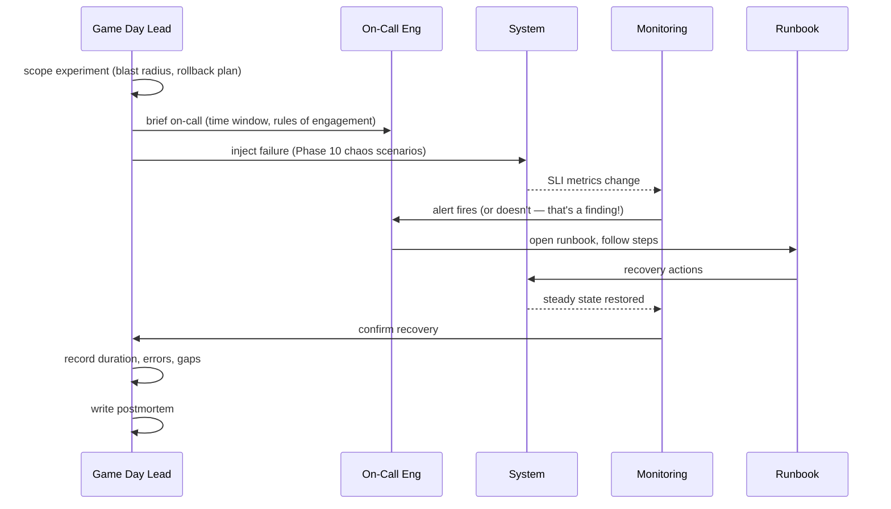
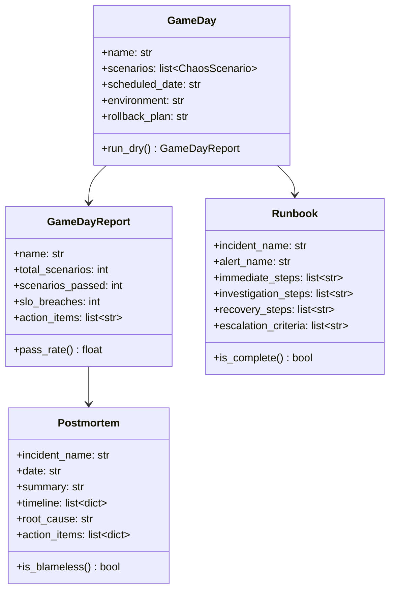

# Day 73 — Game Day + Runbooks + Postmortems

## What is a Game Day?

A **game day** is a scheduled, controlled chaos exercise where the team:

1. Announces the exercise (or keeps it surprise)
2. Injects real or simulated failures into production or staging
3. Observes response: did alerts fire, did on-call follow the runbook?
4. Debrief: what worked, what didn't, what needs updating

Game days validate the **entire sociotechnical system**: monitoring, runbooks, on-call
rotation, communication channels, and escalation paths — not just the code.

---

## Game Day Flow



---

## Runbook Template

Every ML system incident needs a runbook at `docs/runbooks/<incident-name>.md`:

```
# Runbook: <incident-name>

## Alert
<Alert name> fires when <condition> for <duration>.

## Immediate Steps (first 5 minutes)
1. Acknowledge alert in PagerDuty / Slack
2. Check dashboard: <Grafana link>
3. Confirm symptom: <specific kubectl / curl command>

## Root Cause (investigate)
- [ ] Check <subsystem A>: <command>
- [ ] Check <subsystem B>: <command>

## Recovery
1. <Step 1 with exact command>
2. <Step 2>
3. Verify: <command to confirm recovery>

## Escalate if
- Recovery > 30 min
- Multiple SLOs breached simultaneously
- Data loss suspected

## Postmortem trigger
Any SLO breach, or if detection took > 15 min.
```

---

## Postmortem Template

A blameless postmortem focuses on **system improvements**, not people.

```
# Postmortem: <incident name> — <date>

## Summary
One paragraph: what happened, impact, duration.

## Timeline (UTC)
| Time | Event |
|---|---|
| 08:00 | Materialization job fails (no alert) |
| 14:00 | On-call notices predictions look odd |
| 14:10 | Root cause identified: stale features |
| 14:30 | Re-materialization complete; SLO restored |

## Impact
- Error budget consumed: X%
- Affected users / predictions: N
- Business impact: approval rate off by ±Y%

## Root Cause
<Technical description of what failed and why>

## Contributing Factors
- No alert on materialization failure
- Feature freshness not checked at inference time

## Action Items
| Action | Owner | Due |
|---|---|---|
| Add materialization failure alert | Data Eng | 2026-07-06 |
| FeatureMonitor.check_freshness() in serving path | ML Eng | 2026-07-06 |

## What went well
- Recovery runbook existed and was accurate
- P50 latency unaffected (silent degradation caught within 6h)
```

---

## Phase 10 Game Day Checklist

### Before the exercise

```
☐ Experiment scope documented (which scenarios, which environment)
☐ Rollback plan written and tested
☐ Monitoring dashboards accessible
☐ Runbooks exist for each scenario
☐ On-call briefed on time window
☐ Executive stakeholders informed (if prod)
```

### During the exercise

```
☐ Start timer at failure injection
☐ Note exact time alerts fire
☐ Note which runbook steps were unclear or wrong
☐ Do NOT help on-call — observe only (game day lead role)
☐ Abort if blast radius exceeds plan
```

### After the exercise

```
☐ Write postmortem within 48h
☐ File action items in Linear / Jira
☐ Update runbooks with corrections
☐ Re-schedule game day in 6 weeks to verify fixes
```

---

## Class Diagram


