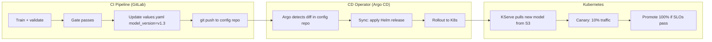
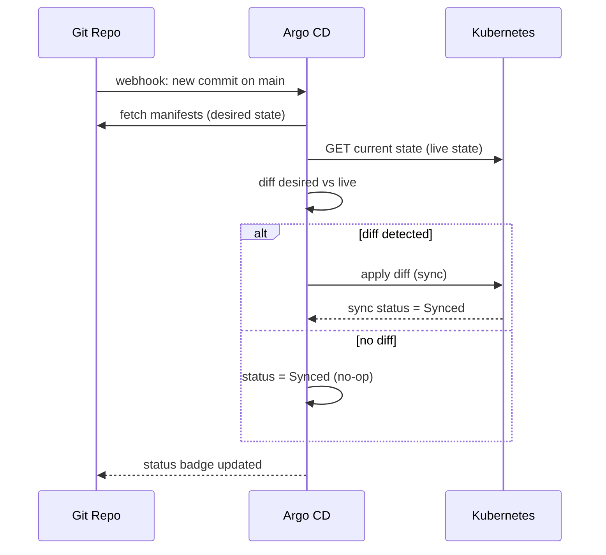
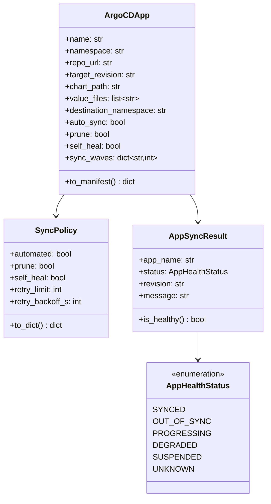

# Day 74 — GitOps: Argo CD / Flux

## What is GitOps?

**GitOps** is the practice of using Git as the single source of truth for
infrastructure and application state. A GitOps operator continuously reconciles
the cluster to match what's declared in Git.

| Imperative (before GitOps) | GitOps |
|---|---|
| `kubectl apply -f manifest.yaml` | `git push` |
| State in your head / CI job | State in Git (auditable, revertable) |
| Drift undetected | Drift auto-corrected |
| Rollback = re-run old CI job | Rollback = `git revert` |
| No single source of truth | Git IS the source of truth |

> **GitOps = Continuous Reconciliation.** The operator watches Git; if cluster ≠ Git, it syncs.

---

## GitOps for ML Deployments

ML is a special case: the artifact that changes is a **model version**, not just an
image tag. The Git PR that triggers a deploy is not "we merged feature X" — it's
"Milestone gate passed, AUC ≥ 0.80, auto-promoting v1.3".



---

## Argo CD Core Concepts

### Application CRD

An `Application` tells Argo CD: *watch this Git path, sync it to this namespace*.

```yaml
apiVersion: argoproj.io/v1alpha1
kind: Application
metadata:
  name: credit-risk-serving
  namespace: argocd
spec:
  project: ml-platform

  source:
    repoURL: https://github.com/arbarikcp/mlops_agentops.git
    targetRevision: main
    path: platform/infra/helm/credit-risk        # Helm chart path in Git
    helm:
      valueFiles:
        - values.yaml
        - values-prod.yaml

  destination:
    server: https://kubernetes.default.svc
    namespace: ml-serving

  syncPolicy:
    automated:
      prune: true        # delete resources removed from Git
      selfHeal: true     # re-sync if someone kubectl-applies manually
    syncOptions:
      - CreateNamespace=true
    retry:
      limit: 3
      backoff:
        duration: 30s
        factor: 2
```

### Sync Phases



### Health States

| Status | Meaning |
|---|---|
| `Synced` | Cluster matches Git |
| `OutOfSync` | Drift detected; sync pending |
| `Progressing` | Rollout in progress |
| `Degraded` | Resource not healthy (pod crashing) |
| `Suspended` | Auto-sync paused |

---

## Argo CD vs Flux

| Feature | Argo CD | Flux v2 |
|---|---|---|
| UI | Rich web UI + CLI | CLI only (flux CLI) |
| Multi-tenancy | Projects + RBAC built-in | Namespace isolation via Kustomizations |
| Notification | Slack/webhook via `argocd-notifications` | `notification-controller` |
| Drift detection | Polling (3 min default) + webhooks | Polling + webhooks |
| Helm support | Native | Via HelmRelease CRD |
| Secret management | Vault / sealed-secrets plugin | SOPS via `.sops.yaml` |
| ML adoption | Wider (Kubeflow uses it) | Growing |

**Our choice: Argo CD** — richer UI is valuable for inspecting model rollout state.

---

## ML-Specific GitOps Patterns

### Pattern 1 — Image + Model Version Decoupled

The serving image (Python code) and the model artifact (S3 path) change
independently. Store both in `values.yaml`:

```yaml
# values-prod.yaml
image:
  repository: ghcr.io/arbarikcp/credit-risk-api
  tag: "v2.1.0"         # code version

model:
  storageUri: "s3://ml-models/credit-risk/v1.3/"
  version: "v1.3"
```

CI updates `model.storageUri` and `model.version` when a new model passes gates.
The code image only changes when Python code changes.

### Pattern 2 — Separate Config Repo (GitOps Monorepo anti-pattern fix)

```
ml-config-repo/             ← separate from source code
  environments/
    staging/
      values.yaml           ← staging model version
    production/
      values.yaml           ← production model version (PR-gated)
```

Staging auto-deploys on gate pass. Production requires a manual PR approval.

### Pattern 3 — Sync Waves for Ordered Rollout

```yaml
metadata:
  annotations:
    argocd.argoproj.io/sync-wave: "1"   # deploy secrets first
---
metadata:
  annotations:
    argocd.argoproj.io/sync-wave: "2"   # then configmaps
---
metadata:
  annotations:
    argocd.argoproj.io/sync-wave: "3"   # then the InferenceService last
```

---

## Class Diagram


