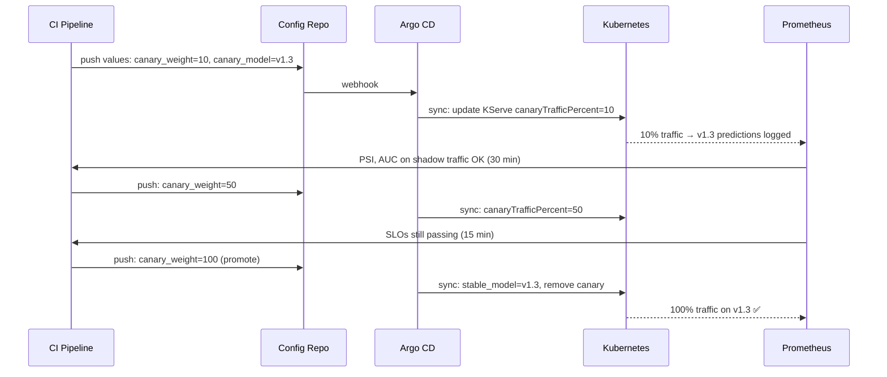
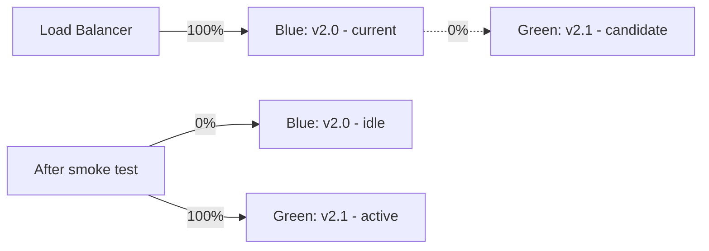
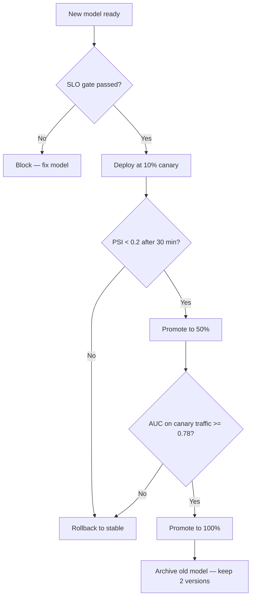
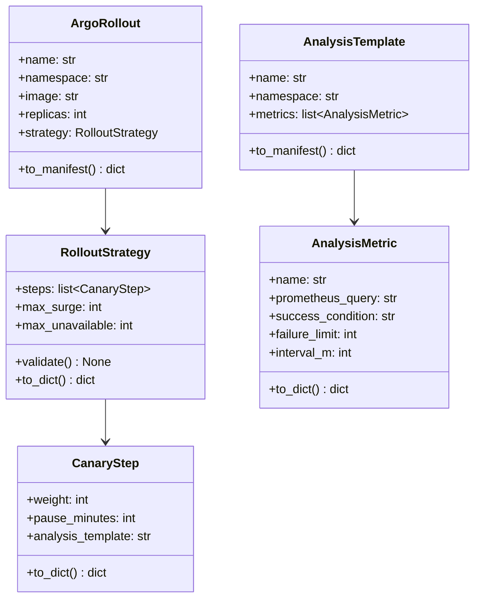

# Day 75 — Progressive Delivery for Models

## The Problem with Big-Bang Model Deploys

A "big-bang" model deploy routes 100% of traffic to the new model immediately.
If the new model has a silent regression (lower AUC on a specific slice), every
prediction is wrong before the alert fires.

Progressive delivery routes a small fraction of traffic to the new model first,
observes SLIs, and promotes or rolls back.

---

## Three Traffic Patterns

| Pattern | Description | Use case |
|---|---|---|
| **Blue-Green** | Two full deployments, instant switch | Zero-downtime code deploys; not great for ML (no gradual observation) |
| **Canary** | New version gets N% of live traffic | Model rollouts — real traffic, real distribution, controllable blast radius |
| **Shadow / Mirror** | Copy requests to new model; responses discarded | Validate before any real exposure; no latency impact on users |

---

## Canary Sequence



---

## Argo Rollouts (for non-KServe deployments)

For Deployments (not KServe), Argo Rollouts provides a `Rollout` CRD:

```yaml
apiVersion: argoproj.io/v1alpha1
kind: Rollout
metadata:
  name: credit-risk-api
  namespace: ml-serving
spec:
  replicas: 5
  strategy:
    canary:
      steps:
        - setWeight: 10
        - pause: {duration: 30m}       # observe for 30 min
        - analysis:
            templates:
              - templateName: auc-check
        - setWeight: 50
        - pause: {duration: 15m}
        - setWeight: 100
      canaryMetadata:
        labels:
          model-variant: canary
      stableMetadata:
        labels:
          model-variant: stable
      antiAffinity:
        preferredDuringSchedulingIgnoredDuringExecution:
          weight: 1
  selector:
    matchLabels:
      app: credit-risk-api
  template:
    metadata:
      labels:
        app: credit-risk-api
    spec:
      containers:
        - name: api
          image: ghcr.io/arbarikcp/credit-risk-api:v2.1.0
```

### AnalysisTemplate — AUC Guard as a Rollout Gate

```yaml
apiVersion: argoproj.io/v1alpha1
kind: AnalysisTemplate
metadata:
  name: auc-check
  namespace: ml-serving
spec:
  metrics:
    - name: model-auc
      interval: 5m
      successCondition: result >= 0.78
      failureLimit: 1
      provider:
        prometheus:
          address: http://prometheus.monitoring.svc:9090
          query: |
            avg_over_time(
              ml_model_auc{model_variant="canary"}[10m]
            )
    - name: psi-check
      interval: 5m
      successCondition: result < 0.2
      failureLimit: 1
      provider:
        prometheus:
          address: http://prometheus.monitoring.svc:9090
          query: |
            ml_prediction_psi_score{model_variant="canary"}
```

---

## Blue-Green for Code (not model) Changes

When the API code changes (new endpoint, breaking API contract), use
blue-green to validate the new version before switching:



---

## Rollout Decision Matrix



---

## Class Diagram


