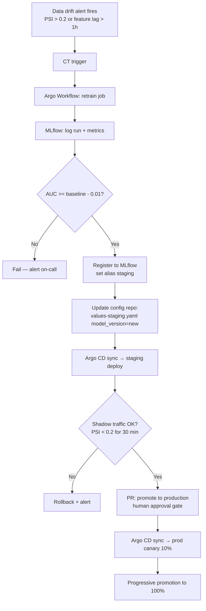
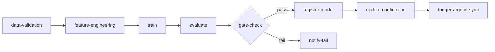
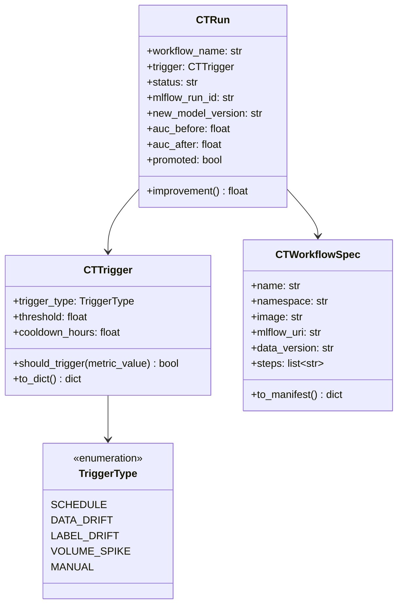

# Day 76 — CT Automation: Retrain → Registry → Deploy

## What is Continuous Training?

**Continuous Training (CT)** is the automated pipeline that re-trains the model
when data drift is detected, validates the new model, registers it in the model
registry, and deploys it — without human intervention (except for the gate).



---

## Argo Workflows for CT

Argo Workflows is a Kubernetes-native workflow engine — each step is a container.



### Full Workflow YAML

```yaml
apiVersion: argoproj.io/v1alpha1
kind: Workflow
metadata:
  name: ct-retrain
  namespace: ml-training
spec:
  entrypoint: retrain-pipeline
  serviceAccountName: ml-workflow-sa

  templates:
    - name: retrain-pipeline
      dag:
        tasks:
          - name: data-validation
            template: run-step
            arguments:
              parameters:
                - name: cmd
                  value: "python -m data.validate --output /tmp/validate.json"

          - name: feature-engineering
            template: run-step
            dependencies: [data-validation]
            arguments:
              parameters:
                - name: cmd
                  value: "python -m training.features"

          - name: train
            template: run-step
            dependencies: [feature-engineering]
            arguments:
              parameters:
                - name: cmd
                  value: "python -m training.mlflow_train --params params.yaml"

          - name: evaluate
            template: run-step
            dependencies: [train]
            arguments:
              parameters:
                - name: cmd
                  value: "python -m ci.ml_tests --check auc --threshold 0.78"

          - name: register-model
            template: run-step
            dependencies: [evaluate]
            arguments:
              parameters:
                - name: cmd
                  value: "python -m ci.milestone1_gate --promote-if-pass"

          - name: update-config
            template: run-step
            dependencies: [register-model]
            arguments:
              parameters:
                - name: cmd
                  value: "python -m infra.gitops --push-new-model-version"

    - name: run-step
      inputs:
        parameters:
          - name: cmd
      container:
        image: ghcr.io/arbarikcp/credit-risk-trainer:latest
        command: [sh, -c]
        args: ["{{inputs.parameters.cmd}}"]
        env:
          - name: MLFLOW_TRACKING_URI
            valueFrom:
              configMapKeyRef:
                name: ml-config
                key: MLFLOW_URI
        resources:
          requests:
            cpu: "2"
            memory: "4Gi"
          limits:
            cpu: "4"
            memory: "8Gi"
```

---

## CT Trigger Strategies

| Trigger | Signal | Latency | Risk |
|---|---|---|---|
| **Schedule** | Cron (daily/weekly) | High | Misses sudden drift |
| **Data drift** | PSI alert > threshold | Low | False positives possible |
| **Label drift** | Ground truth AUC regression | Low | Requires labeled feedback |
| **Volume spike** | New data > N rows since last train | Medium | May not mean distribution change |
| **Manual** | Human clicks button | N/A | Slowest but safest |

**Our strategy:** drift-triggered + weekly schedule fallback.

---

## CT Safety Properties

1. **Reproducibility** — every CT run logs `data_version`, `code_sha`, `seed`, `params` to MLflow
2. **Non-regression gate** — new AUC must be ≥ baseline AUC − tolerance
3. **Canary before full traffic** — never big-bang to production
4. **Rollback in < 10 min** — Git revert → Argo CD sync
5. **Audit trail** — every model promotion is a Git commit (who, when, which model)

---

## Class Diagram


