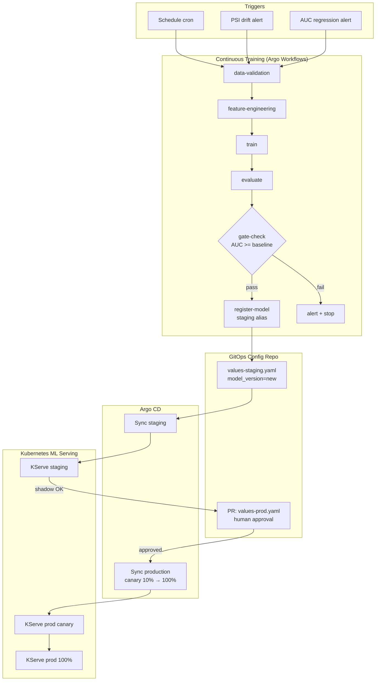

# Day 77 — Phase 11 Consolidation: GitOps + CT

## Phase 11 Architecture Map



---

## The Full Loop: Data → Production

| Stage | Tool | What changes |
|---|---|---|
| Drift detected | Prometheus alert | `feature_freshness_lag_s > 3600` or `psi > 0.2` |
| CT triggered | Argo Events → Argo Workflows | New Workflow CR created |
| Data validated | Pandera + Great Expectations | Schema + null rate + label dist |
| Features built | Dagster / Feast | Feature set materialized |
| Model trained | MLflow + training.train | Run logged with params + metrics |
| Gate passed | `Milestone1Gate` | AUC guard + SBOM + provenance |
| Model registered | MLflow registry | `staging` alias set |
| Config updated | Git commit | `values-staging.yaml` updated |
| Staging deploy | Argo CD sync | KServe InferenceService updated |
| Shadow traffic | Prometheus + RAGAS | PSI, AUC, latency validated |
| Prod PR | GitHub PR | Human review + auto-test |
| Prod canary | Argo CD + Argo Rollouts | 10% → 50% → 100% with AnalysisTemplate gate |
| Postmortem | `game_day.Postmortem` | If any SLO breached during rollout |

---

## GitOps Checklist (Phase 11 Gate)

```
☑ Argo CD Application manifest committed to config repo
☑ values.yaml splits image.tag (code) from model.storageUri (model)
☑ staging auto-deploys; production requires PR approval
☑ RolloutStrategy ends with weight=100 (required by validator)
☑ AnalysisTemplate gates on AUC >= 0.78 AND PSI < 0.2
☑ CTTrigger.cooldown_hours >= 6 (avoid retraining storms)
☑ CTRun.is_regression() blocks promotion if AUC drops > 1%
☑ Sync wave annotations ensure secrets deploy before InferenceService
☑ Argo Workflow ServiceAccount has least-privilege RBAC
☑ All CT runs logged to MLflow with data_version + code_sha
```

---

## What We Built vs What's Left

| Capability | Phase | Status |
|---|---|---|
| Model training + MLflow logging | 1–2 | ✅ |
| Data contracts | 3 | ✅ |
| FastAPI serving + load test | 4 | ✅ |
| Pipeline orchestration (Dagster) | 5 | ✅ |
| Feature store (Feast) + freshness | 6 | ✅ |
| Drift monitoring + SLOs | 7 | ✅ |
| CI gate + SBOM + provenance | 8 | ✅ |
| Kubernetes + KServe + KEDA | 9 | ✅ |
| Chaos engineering + runbooks | 10 | ✅ |
| GitOps (Argo CD) + CT pipeline | 11 | ✅ |
| LLM serving (vLLM) | 12–14 | pending |
| RAG pipeline + RAGAS eval | 15–16 | pending |
| AgentOps (LangGraph + MCP) | 17–19 | pending |
| Cloud deployment (EKS/SageMaker) | 20 | pending |
