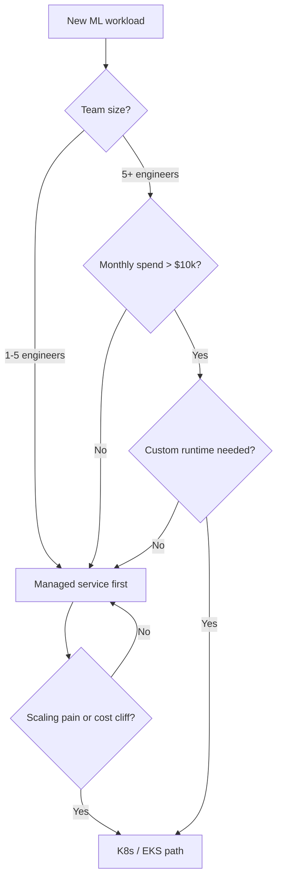
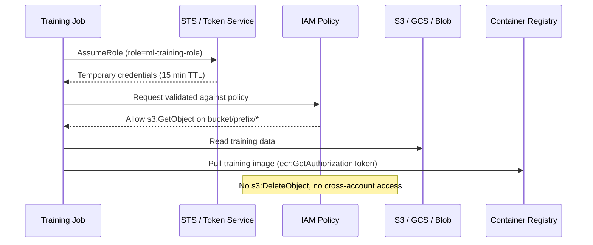
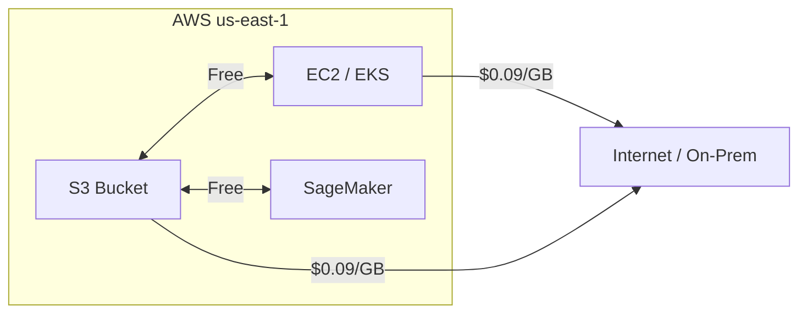
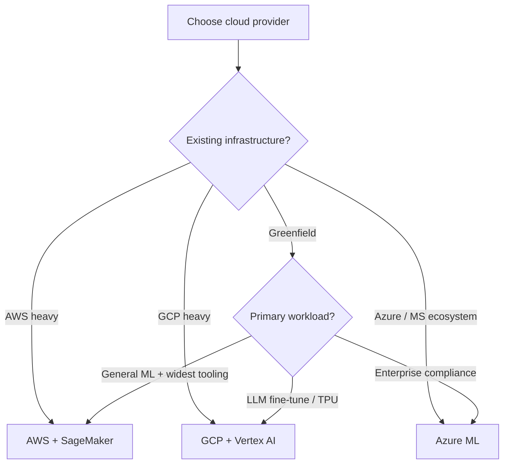
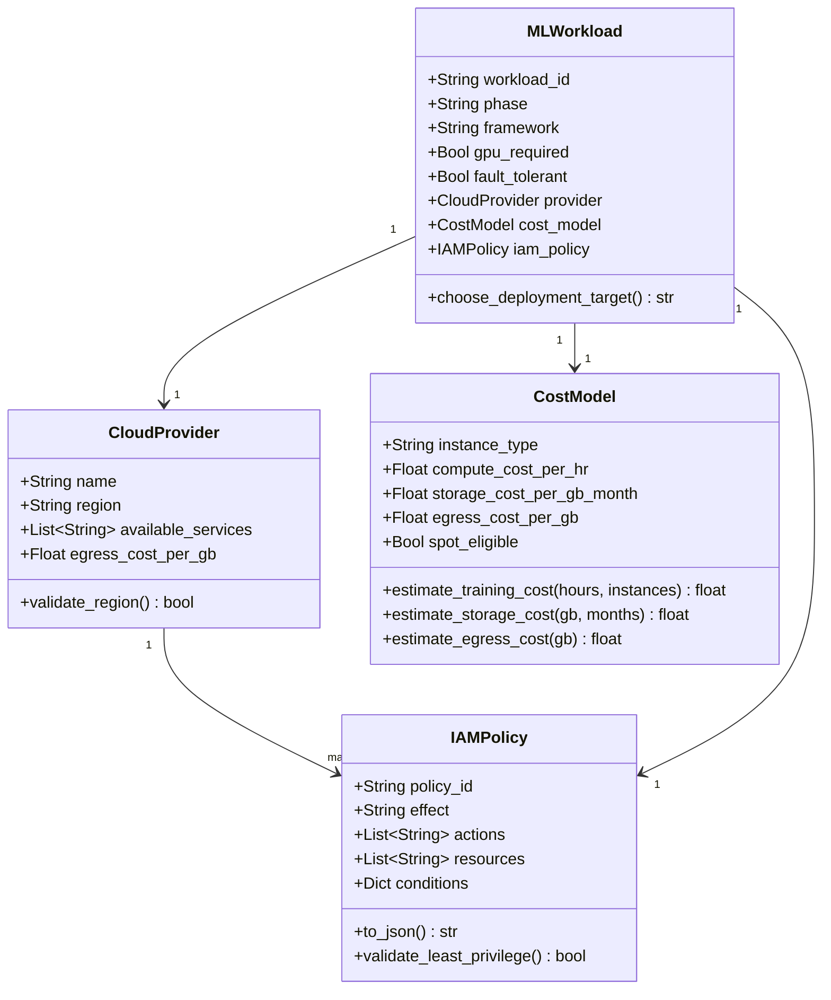

# Day 78 — Cloud Landscape for ML

## WHY — The Managed-vs-DIY Decision Matters

Every ML team eventually hits the same fork: **do we run everything on managed cloud
services, or do we build a self-managed Kubernetes cluster?** The answer is not
philosophical — it is a cost, control, and velocity trade-off that must be made
deliberately, per workload.

Getting this wrong is expensive:
- Going full DIY too early burns engineer time on plumbing instead of models.
- Going full managed too long locks you into vendor pricing with no egress escape.
- Mixing both without a decision matrix leads to zombie infrastructure.

> **IAM-first principle:** Before writing a single training job, design your
> identity and permissions model. Retrofitting least-privilege IAM is 10x harder
> than designing it upfront.

---

## HOW — The Decision Matrix

### Managed-for-Dev vs K8s-for-Prod

| Dimension | Managed Service (e.g., SageMaker) | Self-managed K8s (EKS/GKE/AKS) |
|---|---|---|
| **Setup time** | Hours | Days–weeks |
| **Operational burden** | Low (vendor manages infra) | High (you manage nodes, upgrades) |
| **Customisation** | Limited to service APIs | Full control (custom runtimes, GPU sharing) |
| **Cost at scale** | High (service premium ~30–60%) | Lower but unpredictable ops cost |
| **Spot/preemptible** | Managed spot with auto-retry | Manual spot node groups |
| **Multi-framework** | Framework-specific containers | Any container |
| **Compliance / VPC** | VPC endpoints, PrivateLink | Full network control |
| **Best for** | Experimentation, fast onboarding | Production, cost-sensitive, custom GPU |

### When to use each



---

## HOW — IAM-First Principle

IAM (Identity and Access Management) is the foundation. Every cloud resource
access must be authorised by an **identity** — not a shared key.

### Core IAM concepts across providers

| Concept | AWS | GCP | Azure |
|---|---|---|---|
| Human identity | IAM User / SSO | Google Account | Azure AD User |
| Machine identity | IAM Role (assumed) | Service Account | Managed Identity |
| Policy language | JSON policy doc | IAM Conditions | Azure RBAC JSON |
| Delegation | AssumeRole (STS) | Workload Identity | Federated Identity |
| Secrets | Secrets Manager | Secret Manager | Key Vault |

### Least-privilege pattern for ML



---

## HOW — Cost Model

Cloud ML cost has three axes:

### 1. Compute

```
Cost = (instance_type_$/hr) x (runtime_hrs) x (num_instances)
     + (spot_discount ~70%) if fault-tolerant
```

| Phase | Instance class | Typical choice |
|---|---|---|
| Experimentation | CPU general | m5.xlarge / n1-standard-4 |
| Training (small) | GPU single | p3.2xlarge / a2-highgpu-1g |
| Training (large) | GPU multi | p4d.24xlarge / a3-highgpu-8g |
| Serving (latency) | CPU optimised | c5.2xlarge / c2-standard-8 |
| Serving (GPU) | GPU inference | g4dn.xlarge / g2-standard-4 |

### 2. Storage

```
Cost = (GB_stored x $/GB/month)
     + (GET_requests x $/1000)
     + (PUT_requests x $/1000)
     + (data_transfer_out x $/GB)   <- egress
```

> Egress is the hidden cost. Pulling 1 TB of training data from S3 to an on-prem
> node costs ~$90. Always co-locate compute and storage in the same region.

### 3. Egress Triangle



---

## HOW — Provider Comparison for ML

### AWS for ML (most mature ecosystem)

| Service | Purpose |
|---|---|
| S3 | Training data, model artifacts |
| ECR | Container image registry |
| SageMaker | End-to-end ML platform |
| EKS | Custom K8s inference |
| Bedrock | Managed foundation models |
| Step Functions | ML pipeline orchestration alternative |

### GCP for ML (best TPU, tightest Vertex integration)

| Service | Purpose |
|---|---|
| GCS | Storage |
| Artifact Registry | Container images |
| Vertex AI | End-to-end ML (SageMaker equivalent) |
| GKE | K8s inference |
| Model Garden | Foundation models |
| TPU v4/v5 | Large-scale training |

### Azure for ML (enterprise / Microsoft shop)

| Service | Purpose |
|---|---|
| Azure Blob | Storage |
| ACR | Container registry |
| Azure ML | End-to-end ML |
| AKS | K8s inference |
| Azure OpenAI | Foundation models |

### Decision heuristic



---

## Data Structures — Class Diagram



---

## Key Takeaways

1. **Managed services first, K8s when justified** — start with SageMaker/Vertex, migrate to K8s only when cost, custom runtime, or GPU-sharing forces it.
2. **IAM-first is non-negotiable** — design identity and least-privilege policies before the first training job runs.
3. **Egress is the hidden cost** — always co-locate compute and storage; never pull training data cross-region.
4. **Three cost axes** — compute (instance type x runtime), storage (GB-month + requests), egress (outbound data). Model all three before committing.
5. **Provider choice is mostly ecosystem** — AWS for breadth, GCP for TPUs/LLMs, Azure for enterprise compliance.
6. **Spot/preemptible is free money** — if your training job checkpoints, using spot cuts compute cost by 60–70%.
