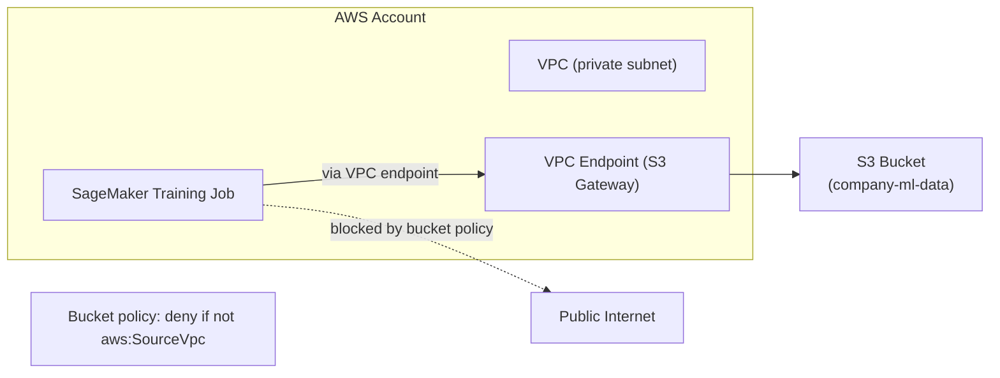
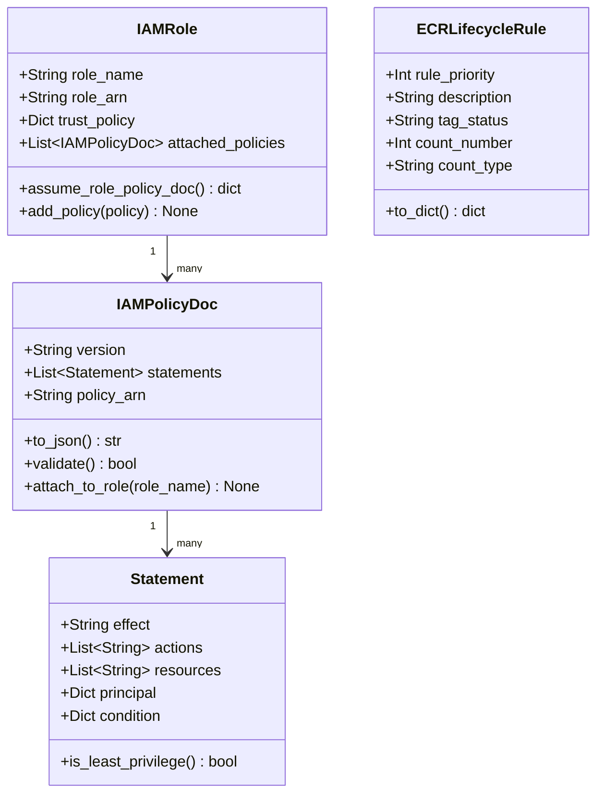
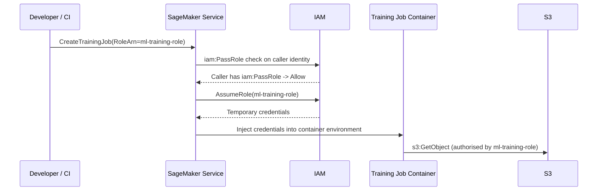
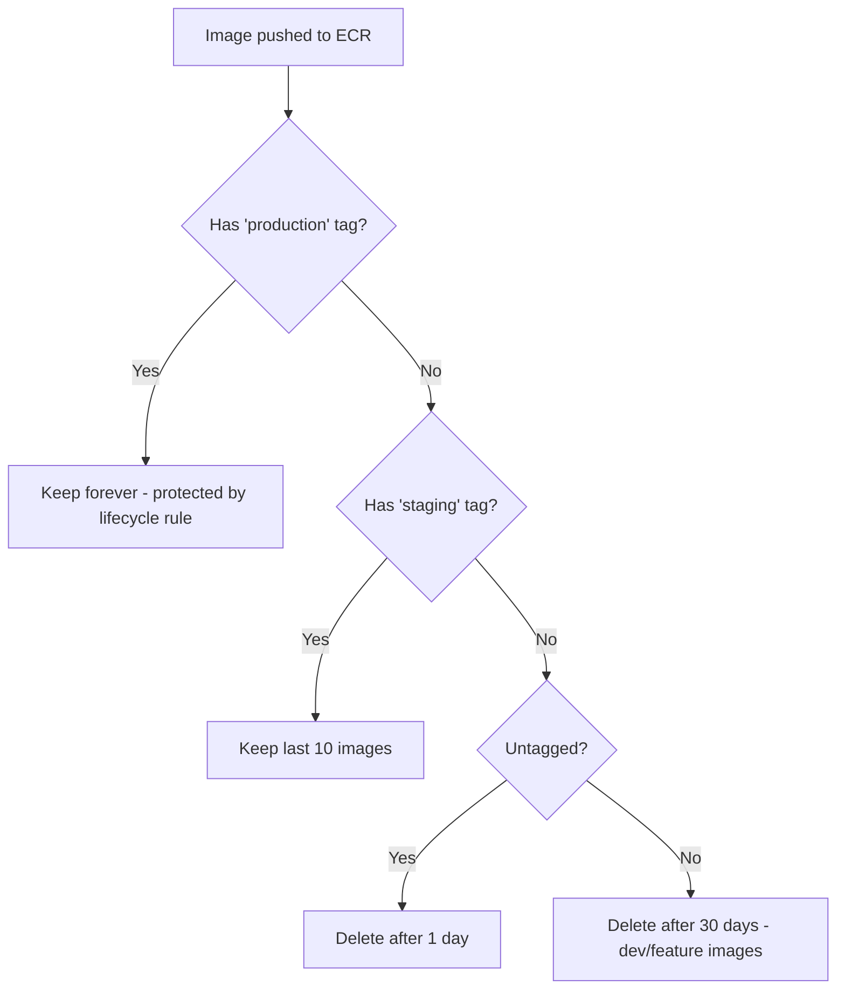
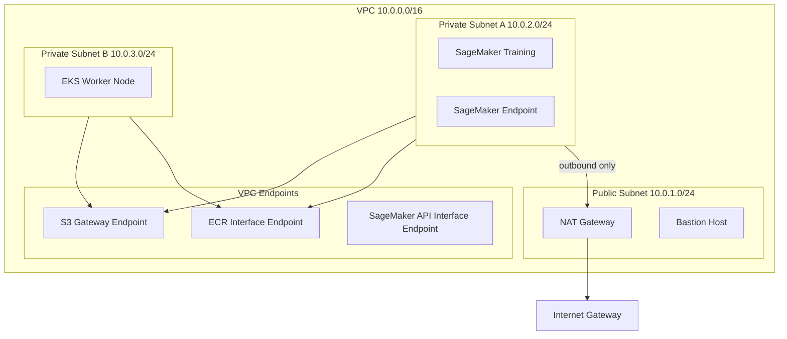
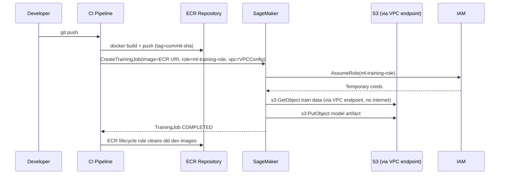

# Day 79 — AWS Foundations for ML

## WHY — Infrastructure Primitives Are the Load-Bearing Walls

SageMaker, EKS, and every other AWS ML service sit on top of three primitives:
**S3** (storage), **IAM** (identity), and **VPC** (network). Getting these wrong
means you will rebuild them mid-project under production pressure — the worst
possible time.

- **S3 bucket policy misconfiguration** is the #1 cause of ML data leaks.
- **Overly-permissive IAM roles** turn a compromised training container into a
  full account takeover.
- **Missing VPC endpoints** cause training jobs to route data over the public
  internet, triggering egress charges and violating compliance requirements.

> **Principle:** Design S3 + IAM + VPC as a trio. They are not independent.

---

## HOW — S3 Bucket Policies for ML

### Bucket layout for ML

```
s3://company-ml-data/
  raw/                   <- ingestion landing zone (write-once)
  processed/             <- feature engineering output
  train/                 <- partitioned training sets
  eval/                  <- hold-out evaluation sets

s3://company-ml-artifacts/
  models/<run_id>/       <- model binaries + metadata
  checkpoints/<job_id>/  <- spot training recovery
  pipelines/<pipeline>/  <- pipeline step outputs
```

### Key S3 policy patterns

| Pattern | Policy element | Why |
|---|---|---|
| Deny public access | `"Effect":"Deny","Principal":"*","Condition":{"Bool":{"aws:SecureTransport":"false"}}` | Enforce HTTPS |
| Restrict to VPC | `"Condition":{"StringEquals":{"aws:SourceVpc":"vpc-xxxxx"}}` | No internet access |
| Cross-account read | `"Principal":{"AWS":"arn:aws:iam::ACCOUNT_B:role/ModelConsumer"}` | Controlled sharing |
| Lifecycle to Glacier | `Transition after 90 days` | Cost: raw data cold storage |



---

## HOW — IAM Roles for ML (Least-Privilege)

### Role hierarchy for ML workloads



### Three roles every ML team needs

**1. ml-training-role** (assumed by SageMaker training jobs)
```json
{
  "Effect": "Allow",
  "Action": [
    "s3:GetObject",
    "s3:PutObject",
    "s3:ListBucket"
  ],
  "Resource": [
    "arn:aws:s3:::company-ml-data/train/*",
    "arn:aws:s3:::company-ml-artifacts/*"
  ]
}
```

**2. ml-serving-role** (assumed by SageMaker endpoints)
```json
{
  "Effect": "Allow",
  "Action": ["s3:GetObject"],
  "Resource": ["arn:aws:s3:::company-ml-artifacts/models/*"]
}
```

**3. ml-pipeline-role** (assumed by SageMaker Pipelines)
```json
{
  "Effect": "Allow",
  "Action": [
    "sagemaker:CreateTrainingJob",
    "sagemaker:DescribeTrainingJob",
    "sagemaker:CreateProcessingJob",
    "iam:PassRole"
  ],
  "Resource": "*",
  "Condition": {
    "StringEquals": {"sagemaker:RootAccess": "Disabled"}
  }
}
```

### IAM PassRole — the critical bridge



---

## HOW — ECR Image Lifecycle

Unmanaged ECR repositories fill up fast: every CI push produces a new image layer
set, and ECR charges per GB stored (~$0.10/GB/month).

### ECRLifecycleRule patterns



### Lifecycle policy JSON (CDK/Terraform pattern)

```python
class ECRLifecycleRule:
    """Single ECR lifecycle rule."""
    rule_priority: int          # lower = evaluated first
    description: str
    tag_status: str             # "tagged" | "untagged" | "any"
    tag_prefix_list: list[str]  # e.g. ["prod", "staging"]
    count_type: str             # "imageCountMoreThan" | "sinceImagePushed"
    count_number: int           # e.g. 10 images or 30 days
```

Example rules applied in order:
1. Priority 1: Keep all images tagged `prod-*` (count > 999 = never expire)
2. Priority 2: Keep last 5 images tagged `staging-*`
3. Priority 3: Expire untagged images after 1 day
4. Priority 4: Expire all other images after 30 days

---

## HOW — VPC for ML

### VPC topology for ML workloads



### VPCConfig class

```python
class VPCConfig:
    """VPC configuration for SageMaker training/serving jobs."""
    vpc_id: str
    subnet_ids: list[str]          # private subnets only
    security_group_ids: list[str]
    enable_network_isolation: bool  # blocks all outbound (for compliance)
    s3_vpc_endpoint_id: str        # Gateway endpoint - free
    ecr_vpc_endpoint_id: str       # Interface endpoint - $0.01/hr

    def validate(self) -> bool:
        """Ensure subnets are private (no route to IGW)."""
        ...

    def to_sagemaker_dict(self) -> dict:
        """Return VpcConfig dict for SageMaker API calls."""
        return {
            "Subnets": self.subnet_ids,
            "SecurityGroupIds": self.security_group_ids
        }
```

### VPC Endpoint types for ML

| Endpoint | Type | Cost | Why needed |
|---|---|---|---|
| S3 Gateway | Gateway (free) | $0 | Route S3 traffic inside VPC |
| ECR API | Interface | $0.01/hr | Pull images from private subnet |
| ECR DKR | Interface | $0.01/hr | Docker layer pull (separate from API) |
| SageMaker API | Interface | $0.01/hr | Jobs in private subnet call SM API |
| STS | Interface | $0.01/hr | AssumeRole inside VPC |

> S3 Gateway endpoint is always free — there is no reason not to create one.

---

## End-to-End Flow



---

## Key Takeaways

1. **S3 + IAM + VPC are a trio** — design them together; changing one affects the others.
2. **Deny public S3 access by default** — add bucket policies that require `aws:SecureTransport` and `aws:SourceVpc`.
3. **Three ML roles minimum** — training, serving, pipeline — each with scoped resource ARNs, not `"Resource": "*"`.
4. **iam:PassRole is the critical bridge** — the calling identity must have PassRole permission to delegate a role to SageMaker.
5. **S3 Gateway endpoint is always free** — create it in every VPC that runs ML jobs.
6. **ECR lifecycle rules prevent runaway storage costs** — expire untagged images in 1 day, dev images in 30 days; protect production tags.
7. **Private subnets + VPC endpoints = compliance-safe ML** — training data never traverses the public internet.
