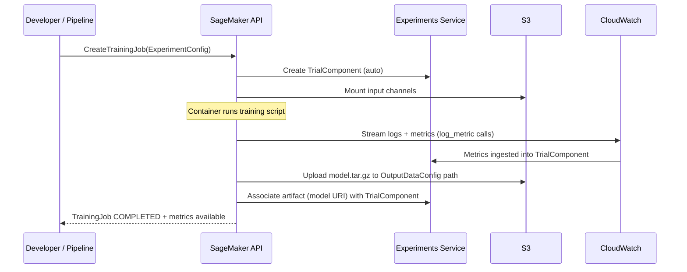
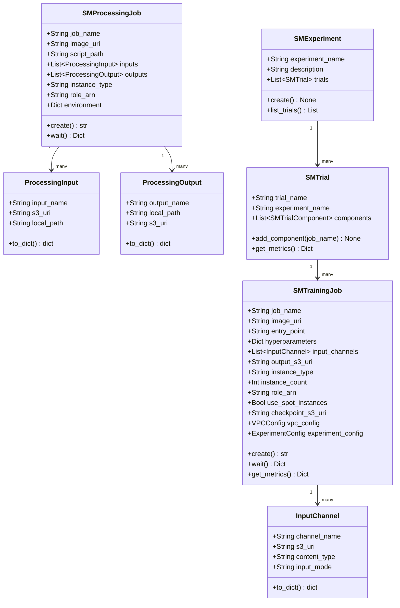
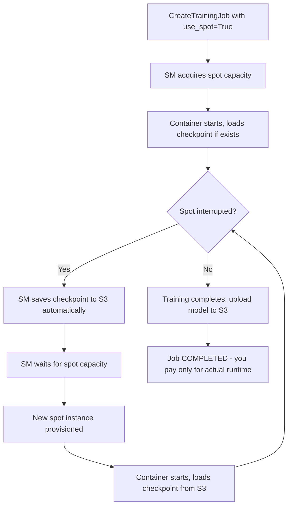

# Day 80 — SageMaker Training & Processing Jobs

## WHY — SageMaker vs DIY Kubernetes

Running training on raw Kubernetes is possible but expensive in engineering time.
The comparison is not just about features — it is about what your team should
**not** have to build.

| Concern | DIY K8s | SageMaker |
|---|---|---|
| Spot interruption handling | You build checkpointing + retry | Built-in managed spot with auto-resume |
| Cluster autoscaling for GPU | Configure Karpenter/KEDA | Fully managed — capacity on demand |
| Experiment tracking | Deploy MLflow yourself | Native SageMaker Experiments + Autopilot |
| Distributed training | Write MPI/Horovod manifests | `distribution={"mpi": {"enabled": True}}` |
| Storage mounting | PVC, EFS CSI driver | Automatic S3 channel mounting |
| Cost isolation | Namespace resource quotas | Per-job cost tagging out of the box |
| Compliance / audit | Build logging pipeline | CloudTrail + SageMaker logging built-in |

> **Decision rule:** Use SageMaker training when you want to ship models, not
> operate clusters. Switch to DIY K8s only when you need custom runtimes,
> GPU time-sharing, or the SageMaker premium exceeds your ops capacity.

---

## HOW — SageMaker Training Jobs

A **Training Job** is the SageMaker unit of compute for model fitting. SageMaker
provisions an instance (or cluster), mounts S3 channels, runs your container
entry-point, and tears everything down — you pay only for the runtime.

### Key components of a training job

```
TrainingJob
  ├── AlgorithmSpec      (image URI + entry point + hyperparameters)
  ├── InputDataConfig    (S3 channels → /opt/ml/input/data/<channel>/)
  ├── OutputDataConfig   (→ s3://artifacts/<run_id>/output/)
  ├── ResourceConfig     (instance type, count, volume size)
  ├── StoppingCondition  (max runtime, max wait for spot)
  ├── CheckpointConfig   (S3 path for spot recovery)
  └── ExperimentConfig   (trial name for lineage)
```

### S3 channel mounting

SageMaker copies (or streams) S3 data to local paths before the container starts:

```
s3://ml-data/train/ --> /opt/ml/input/data/train/
s3://ml-data/eval/  --> /opt/ml/input/data/validation/
```

Your training script reads from these paths — no boto3 required inside the
container.

---

## HOW — SageMaker Processing Jobs

A **Processing Job** is for everything that is not model training:
feature engineering, data validation, model evaluation, and post-processing.
It uses the same infrastructure as training but maps to a different mental model.

| Use case | Processing Job role |
|---|---|
| Feature engineering | Run Pandas/Spark transforms, write to S3 |
| Data validation | Run Great Expectations / Pandera, write report |
| Model evaluation | Load model + test set, compute metrics JSON |
| Batch inference | Score large dataset, write predictions |

### Container paths for processing

```
/opt/ml/processing/input/<name>/    <- mounted from S3
/opt/ml/processing/output/<name>/   <- uploaded to S3 on job completion
/opt/ml/processing/code/            <- your script (injected by SM)
```

---

## HOW — SageMaker Experiments

**Experiments** provide hierarchical tracking: Experiment > Trial > Trial Component.
Each training job automatically creates a Trial Component with metrics, parameters,
and artifact lineage.

```
Experiment: credit-risk-v2
  Trial: xgboost-baseline-2024-01
    TrialComponent: preprocessing-step
    TrialComponent: training-step
      Metrics: train:auc=0.91, val:auc=0.87
      Parameters: n_estimators=300, max_depth=6
      Artifacts: model.tar.gz -> s3://artifacts/...
  Trial: xgboost-tuned-2024-02
    ...
```

### Experiment flow



---

## Data Structures — Class Diagram



---

## HOW — Spot Training with Checkpointing

Spot instances are interrupted when AWS reclaims capacity. SageMaker handles
this transparently if you configure checkpointing.



### Cost savings from spot

```
On-demand p3.2xlarge: $3.06/hr
Spot p3.2xlarge:      $0.92/hr   (70% saving)

10-hour training run:
  On-demand: $30.60
  Spot:      $9.20  <- even with 2x interruptions
```

---

## HOW — Distributed Training

SageMaker supports multiple distributed frameworks via the `distribution` key:

| Strategy | When to use |
|---|---|
| Data parallel (SageMaker Distributed) | Identical model fits on 1 GPU, scale data |
| Model parallel (SageMaker Distributed) | Model too large for 1 GPU |
| MPI + Horovod | Legacy Horovod training scripts |
| PyTorch DDP (built-in) | Standard PyTorch multi-GPU |

```python
# Python SDK snippet (not SageMaker Python SDK — boto3 level)
estimator = {
    "AlgorithmSpecification": {
        "TrainingImage": "763104351884.dkr.ecr.us-east-1.amazonaws.com/pytorch-training:2.1-gpu-py310",
        "TrainingInputMode": "FastFile"
    },
    "ResourceConfig": {
        "InstanceType": "ml.p3.16xlarge",
        "InstanceCount": 4,           # 4-node cluster
        "VolumeSizeInGB": 100
    },
    "HyperParameters": {
        "distribution": '{"smdistributed": {"dataparallel": {"enabled": true}}}'
    }
}
```

---

## Key Takeaways

1. **SageMaker Training = managed compute unit** — provision, run, terminate. You pay only for runtime; no idle cluster cost.
2. **Spot + checkpointing = 70% training cost reduction** — implement epoch-level checkpointing to `/opt/ml/checkpoints/`.
3. **S3 channels decouple data from code** — the training script reads `/opt/ml/input/data/<channel>/` and never calls boto3 for data.
4. **Processing Jobs handle everything non-training** — feature engineering, validation, evaluation all use the same managed infra.
5. **Experiments give free lineage** — every training job auto-creates a TrialComponent with metrics, parameters, and artifact links.
6. **Distributed training is a single flag** — no custom MPI job YAML; SageMaker handles cluster networking and rank assignment.
