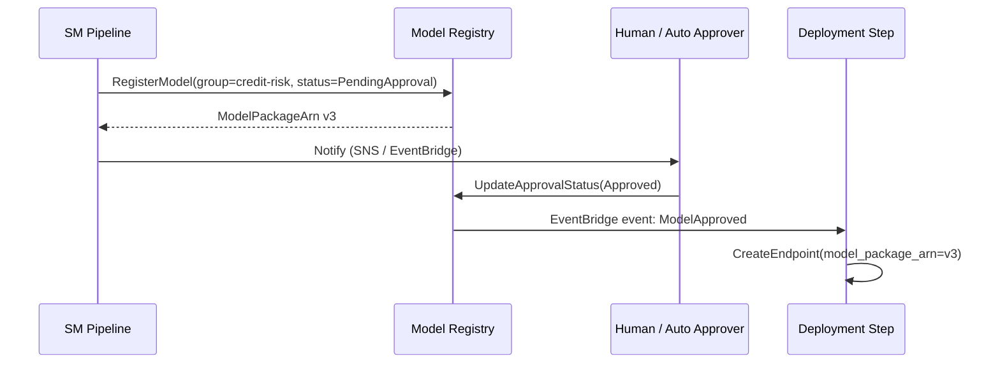
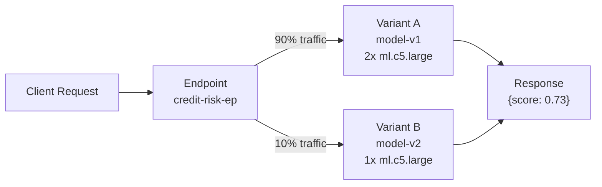
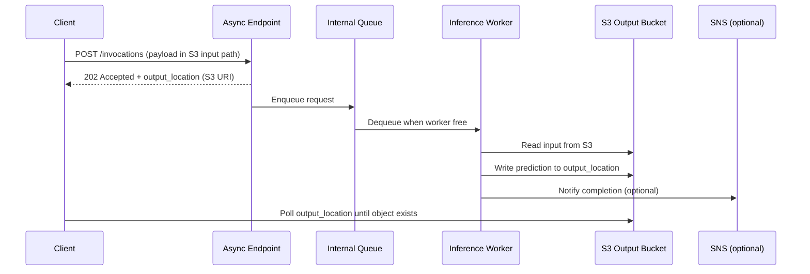
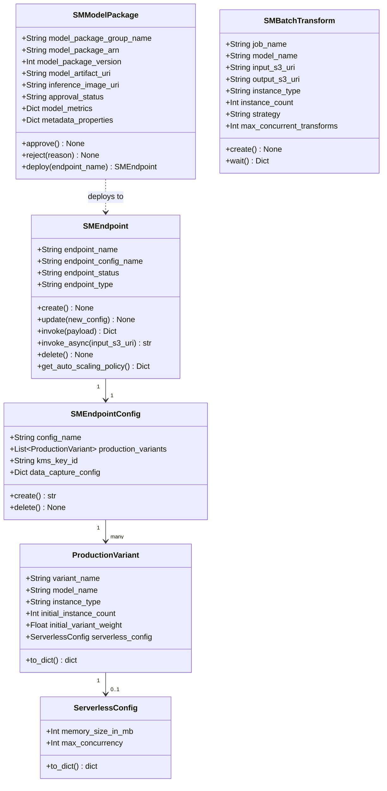
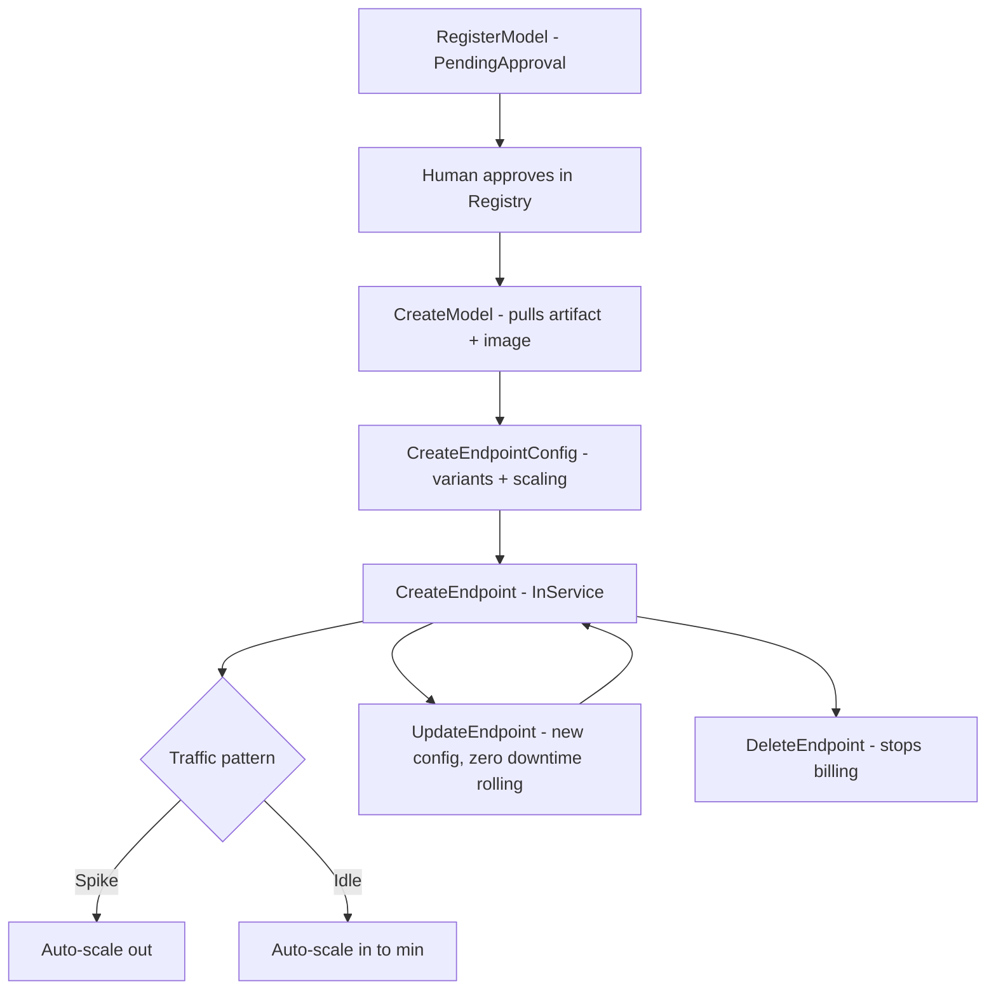
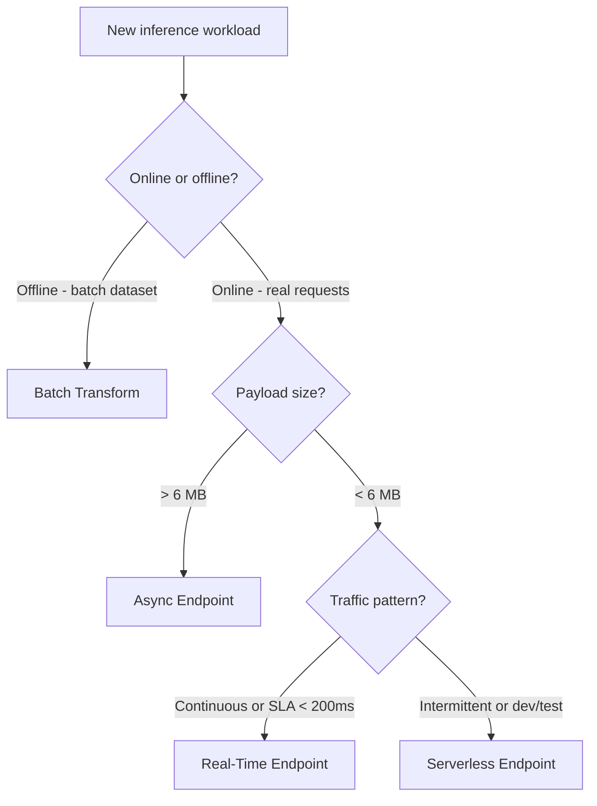

# Day 81 — SageMaker Registry + Endpoints

## WHY — Four Endpoint Types, Not One

Most teams discover SageMaker real-time endpoints and stop there. This is a costly
mistake: the four endpoint types exist because **latency vs throughput tradeoffs are
fundamentally different** for different use cases.

| Endpoint type | Latency | Throughput | Idle cost | Best for |
|---|---|---|---|---|
| **Real-time** | p99 < 100ms | High (auto-scale) | Always-on billing | Online serving, <6 MB payload |
| **Serverless** | p99 100–500ms (cold start) | Low | Pay-per-invocation | Intermittent traffic, dev/test |
| **Async** | Minutes (queue-based) | Very high (batch queue) | Minimal (queue only) | Long-running inference, >6 MB |
| **Batch Transform** | Hours (offline) | Massive | Zero (job-based billing) | Offline scoring, entire dataset |

> **Choosing wrong costs money or users:**
> - Real-time for batch scoring = paying 24/7 for a weekend job.
> - Serverless for real-time search = 400ms cold starts on every user query.
> - Real-time for 100 MB audio files = payload limit errors.

---

## HOW — SageMaker Model Registry

The **Model Registry** is a versioned catalog of approved model packages.
It separates **what** (the model artifact + inference image) from **where**
(which endpoint it is deployed to).

```
ModelPackageGroup: credit-risk-classifier
  ModelPackage v1  (PendingApproval -> Approved)
    ModelArtifacts: s3://artifacts/models/run-001/model.tar.gz
    InferenceSpec:  image=763104351884.../sklearn:1.2, instance=ml.c5.large
    MetadataProps:  auc=0.87, approval_date=2024-03-01
  ModelPackage v2  (PendingApproval)
    ModelArtifacts: s3://artifacts/models/run-002/model.tar.gz
    MetadataProps:  auc=0.89
```

### Registry approval flow



---

## HOW — Real-Time Endpoints

Real-time endpoints serve synchronous, low-latency predictions. The endpoint stays
warm at all times and scales instances based on invocation rate.

### Auto-scaling policy

```
Scale-out: InvocationsPerInstance > 500 req/s -> add instance
Scale-in:  InvocationsPerInstance < 100 req/s for 5 min -> remove instance
Min instances: 1 (always warm)
Max instances: 10
```

### Endpoint configuration and variants

Real-time endpoints support **production variants** for A/B testing:



---

## HOW — Serverless Endpoints

Serverless endpoints have **no always-on instances**. SageMaker provisions
compute on each invocation (cold start: 1–5 seconds for first request after idle).

Best pattern: use for development/staging or workloads with < 1 req/min average.

```
ServerlessConfig:
  MemorySizeInMB: 2048      (128 to 6144)
  MaxConcurrency: 5         (max parallel invocations)
```

Cost: `$0.0000600 per GB-second` — zero cost when idle for minutes.

---

## HOW — Async Endpoints

Async endpoints accept requests into an **SQS queue** and process them
asynchronously. The client polls S3 for the result.



Use cases: document parsing, audio transcription, large image scoring (> 6 MB).

---

## HOW — Batch Transform

Batch Transform has no endpoint — it is a **job** that scores an entire S3 prefix
and writes results back to S3. No idle cost.

```
Input:  s3://ml-data/score/2024-03-01/*.csv
Output: s3://ml-artifacts/predictions/2024-03-01/
Strategy: MultiRecord (batches rows for throughput)
MaxConcurrentTransforms: 4
```

Best for: nightly scoring of full customer base, offline model evaluation.

---

## Data Structures — Class Diagram



---

## HOW — Endpoint Lifecycle



---

## Choosing the Right Endpoint Type



---

## Key Takeaways

1. **Model Registry decouples training from deployment** — approve once, deploy many times to different endpoints without repackaging.
2. **Real-time = always-on cost** — only use it when you have continuous traffic or strict latency SLAs.
3. **Serverless = zero idle cost** — perfect for development, staging, or sporadic production traffic; accept the cold-start penalty.
4. **Async = the right answer for large payloads** — queue-based; the client polls S3; no 6 MB limit; workers auto-scale from zero.
5. **Batch Transform = cheapest for offline scoring** — job-based billing, no endpoint to manage, reads/writes entire S3 prefixes.
6. **Production variants enable A/B testing** — split traffic by weight; measure metrics per variant before full cutover.
7. **Data capture is one flag** — enable it on the EndpointConfig to log request/response pairs to S3 for model monitoring.
