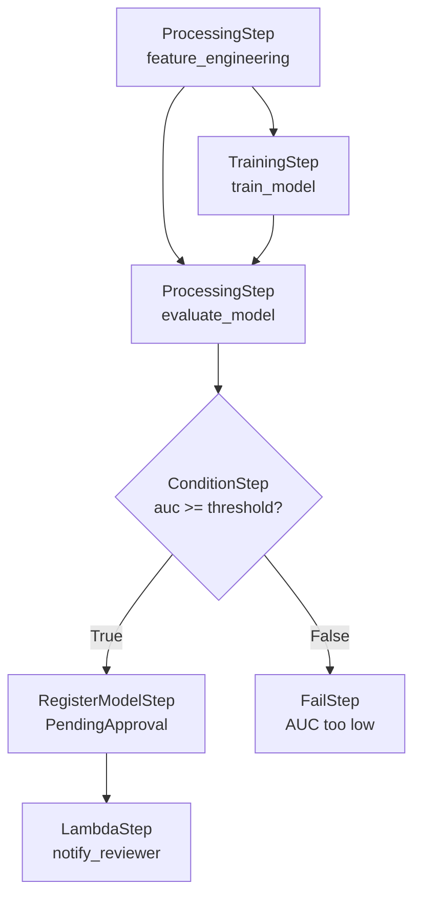
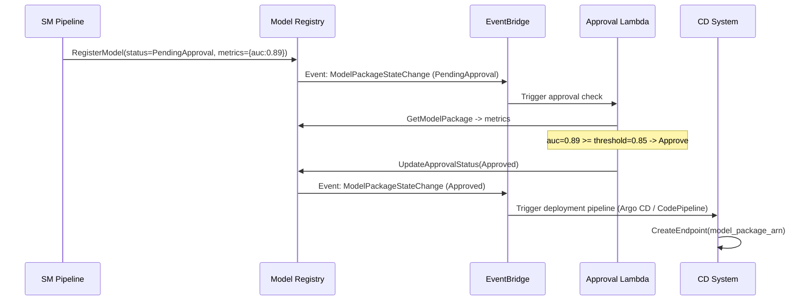
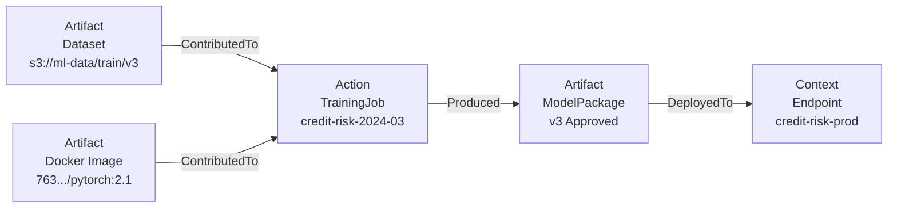
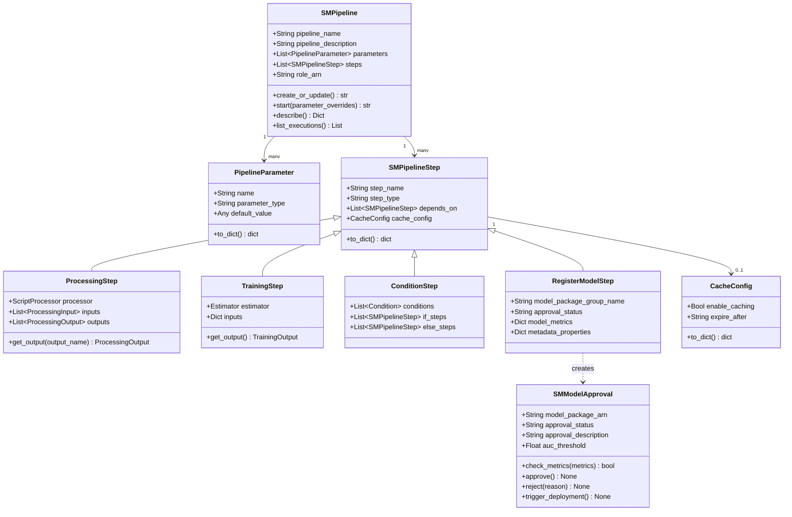
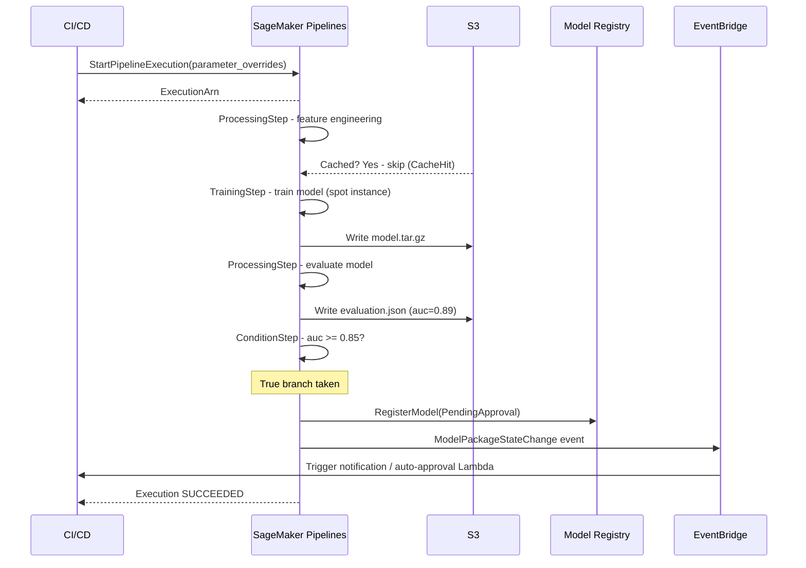

# Day 82 — SageMaker Pipelines, Model Approval & Lineage

## WHY — Pipelines Over Bare Argo CD

Argo Workflows is a capable orchestrator, but it knows nothing about SageMaker.
Every step that calls a SageMaker API requires a custom Argo task template, and
lineage tracking is entirely your responsibility.

SageMaker Pipelines removes this friction:

| Concern | Bare Argo | SageMaker Pipelines |
|---|---|---|
| Step integration | Custom HTTP task templates | Native step types (Training, Processing, etc.) |
| Lineage | DIY — write to external system | Automatic — every artifact, step, run tracked |
| Parameter propagation | Argo Workflow parameters | First-class Pipeline parameters with type checking |
| Model approval gate | Custom webhook/manual step | Built-in ConditionStep + RegisterModel + approval |
| Caching | Not built-in | Step-level cache with configurable TTL |
| UI | Argo UI (generic DAG) | Studio visual pipeline editor |
| IAM | K8s ServiceAccount | SM execution role, no extra RBAC |

> **Use SageMaker Pipelines when your orchestration is primarily SageMaker steps.**
> Use Argo/Airflow when your pipeline spans multiple systems (Spark, Snowflake, etc.)
> and SageMaker is just one participant.

---

## HOW — Pipeline Structure

A SageMaker Pipeline is a **DAG of steps** with typed parameters. Steps share
data via `ProcessingOutput` / `TrainingOutput` references — no manual S3 URI
string concatenation.

```
Pipeline: credit-risk-pipeline
  Parameters:
    training_instance_type: ml.m5.xlarge
    approval_threshold: 0.85
  Steps:
    1. ProcessingStep  (feature engineering)
    2. TrainingStep    (model training, depends on 1)
    3. ProcessingStep  (model evaluation, depends on 1 + 2)
    4. ConditionStep   (auc >= threshold? depends on 3)
       ├── True  -> RegisterModelStep (register as Approved)
       └── False -> FailStep (pipeline fails with message)
```

### Step dependency graph



---

## HOW — Step Caching

Step caching re-uses outputs from a previous execution if inputs and config are
identical. This avoids re-running expensive feature engineering on unchanged data.

```python
cache_config = CacheConfig(
    enable_caching=True,
    expire_after="30d"   # invalidate after 30 days
)

feature_step = ProcessingStep(
    name="feature-engineering",
    processor=processor,
    inputs=[...],
    outputs=[...],
    cache_config=cache_config
)
```

Cache hit conditions: same step name + same input S3 URIs + same container image
+ same arguments. Any change invalidates the cache for that step and all
downstream steps.

---

## HOW — Model Approval

The `RegisterModelStep` creates a `ModelPackage` in the Model Registry with status
`PendingApproval`. Approval can be:
- **Manual**: a human reviews metrics in SageMaker Studio and clicks Approve.
- **Automated**: a Lambda triggered by EventBridge checks metrics and calls
  `update_model_package(ApprovalStatus="Approved")` if thresholds are met.

### Automated approval flow



---

## HOW — Lineage Tracking

SageMaker ML Lineage automatically records:
- **Artifacts**: datasets, model packages, images
- **Contexts**: experiments, trials, pipelines
- **Actions**: training job runs, approval actions
- **Associations**: links between the above

You can query lineage to answer:
- "Which training data was used to produce this endpoint?"
- "Which pipeline run created this model package?"
- "What changed between v1 and v2 of this model?"



---

## Data Structures — Class Diagram



---

## HOW — End-to-End Pipeline Execution



---

## Key Takeaways

1. **SageMaker Pipelines = native SM orchestration** — step outputs wire directly to step inputs; no manual S3 URI management.
2. **Step caching cuts iteration time** — feature engineering cached for 30 days; changing only the model config skips the expensive preprocessing.
3. **ConditionStep is the quality gate** — pipeline fails fast if AUC is below threshold; no model gets registered unless it earns it.
4. **RegisterModel -> PendingApproval -> EventBridge** — the approval event triggers downstream CD automatically; humans (or Lambda) are the decision point.
5. **Lineage is automatic** — every training job, dataset, model artifact, and endpoint is connected in the lineage graph without extra code.
6. **Use Argo/Airflow when SM is not the only participant** — SageMaker Pipelines shines for SM-native workflows; multi-system pipelines need a generic orchestrator.
