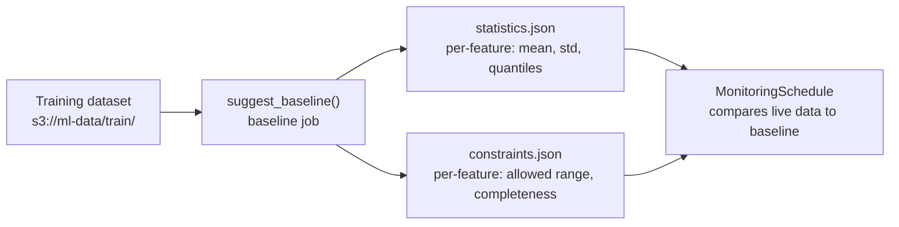
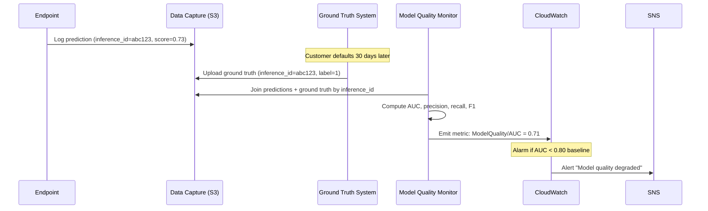
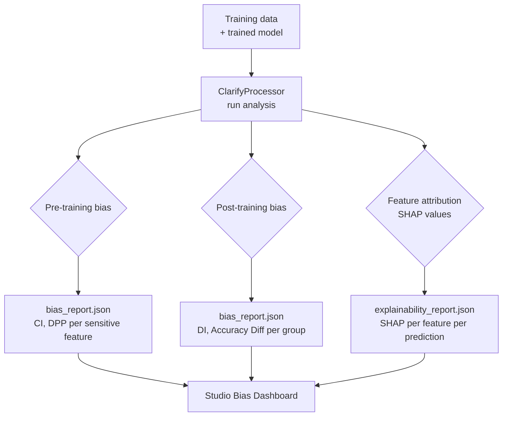
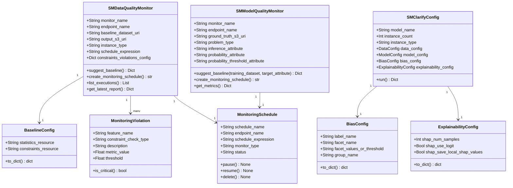
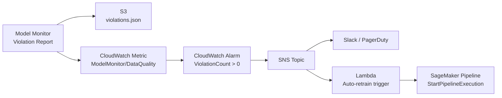

# Day 83 — SageMaker Model Monitor & Clarify

## WHY — Automated Drift Detection Without Custom Code

Most teams detect model degradation the hard way: a business metric drops, someone
notices, they trace it back to data drift weeks later. Building a custom monitoring
pipeline requires ingesting prediction logs, computing baseline statistics, writing
drift metrics, and alerting — hundreds of lines of plumbing before any ML work.

SageMaker Model Monitor eliminates this plumbing:

| Concern | Custom monitoring | SageMaker Model Monitor |
|---|---|---|
| Log collection | Configure data capture, ship logs | One flag: `DataCaptureConfig(enable=True)` |
| Baseline statistics | Write Spark/Pandas jobs | `suggest_baseline()` from reference dataset |
| Drift detection | Implement statistical tests | Built-in (KL divergence, PSI, chi-squared) |
| Scheduling | Cron job + Lambda | `MonitoringSchedule` — cron built-in |
| Reports | Custom S3 + dashboard | Violation report JSON written to S3 automatically |
| Bias detection | Implement SHAP / Aequitas | SageMaker Clarify — no custom code |

> **Model Monitor is worth the vendor lock-in** at small-to-medium scale. The
> operational cost of building equivalent infrastructure exceeds the flexibility
> gained until you have a dedicated MLOps team.

---

## HOW — Four Monitor Types

SageMaker Model Monitor has four specialised monitor types:

| Monitor type | What it checks | Data source |
|---|---|---|
| **Data Quality** | Feature distribution drift vs baseline | Endpoint input/output capture |
| **Model Quality** | Prediction accuracy vs ground truth | Capture + ground truth merge |
| **Bias (Clarify)** | Fairness metrics vs baseline | Capture + labels |
| **Explainability (Clarify)** | Feature attribution drift | Capture |

---

## HOW — Data Quality Monitor

### Step 1: Enable data capture on the endpoint

```python
DataCaptureConfig(
    enable_capture=True,
    sampling_percentage=100,        # capture every request (reduce for high traffic)
    destination_s3_uri="s3://ml-monitoring/captured/credit-risk/",
    capture_options=["REQUEST", "RESPONSE"]
)
```

Captured data is written to S3 as JSON lines:
```json
{"captureData": {"endpointInput": {...}, "endpointOutput": {...}}, "eventMetadata": {...}}
```

### Step 2: Create a baseline from training data



### Step 3: Schedule monitoring

The monitor runs as a Processing Job on a cron schedule, comparing captured
data to the baseline:

```
MonitoringSchedule:
  schedule_expression: "cron(0 * ? * * *)"   <- hourly
  monitoring_job_definition:
    baseline_config:
      statistics_resource: s3://.../statistics.json
      constraints_resource: s3://.../constraints.json
    monitoring_output: s3://ml-monitoring/reports/
    monitoring_resources: ml.m5.xlarge
```

### Violation report output

```json
{
  "violations": [
    {
      "feature_name": "credit_score",
      "constraint_check_type": "distribution_anchor_test",
      "description": "Inferred data type (Integral) does not match baseline (Fractional)"
    },
    {
      "feature_name": "annual_income",
      "constraint_check_type": "baseline_drift_check",
      "description": "p_value is 0.0003 <= threshold 0.05"
    }
  ]
}
```

---

## HOW — Model Quality Monitor

Model Quality monitoring compares **predictions against ground truth labels**.
This requires a merge step because ground truth arrives with a delay.



The `inference_id` is the critical link — it must be set consistently in both
the prediction capture and the ground truth upload.

---

## HOW — SageMaker Clarify

Clarify detects **bias** in training data and **model predictions**, and computes
**feature attributions** (SHAP values) for explainability.

### Bias metrics computed by Clarify

| Metric | What it measures |
|---|---|
| Class Imbalance (CI) | Over/under-representation of a group in training data |
| Difference in Positive Proportions (DPP) | Difference in positive prediction rate across groups |
| Disparate Impact (DI) | Ratio of positive prediction rates (DI < 0.8 = disparate impact) |
| Accuracy Difference | Accuracy gap between demographic groups |

### Clarify processing job flow



---

## Data Structures — Class Diagram



---

## HOW — Alerting on Violations

Model Monitor writes violation reports to S3 and emits CloudWatch metrics.
Connect these to operational alerts:



This pattern creates a **closed loop**: drift detected -> alert -> retrain ->
new model registered -> deployed -> monitoring continues.

---

## Key Takeaways

1. **Data capture is a one-flag prerequisite** — `DataCaptureConfig(enable_capture=True)` on the endpoint config; everything else builds on captured data.
2. **Baseline = statistical contract** — `suggest_baseline()` computes per-feature statistics and constraints from the training distribution; drift is measured against this contract.
3. **Model Quality requires ground truth** — use `inference_id` consistently in predictions and ground truth uploads; the monitor joins them by ID.
4. **Clarify quantifies fairness, not just accuracy** — run it on training data (pre-training) and production predictions (post-training) to detect disparate impact.
5. **SHAP via Clarify is operationally free** — no custom SHAP code; Clarify runs as a Processing Job with the same container as training.
6. **Wire violations to CloudWatch alarms** — connect Monitor -> CloudWatch -> SNS -> Lambda -> Pipeline for a fully automated drift-to-retrain loop.
