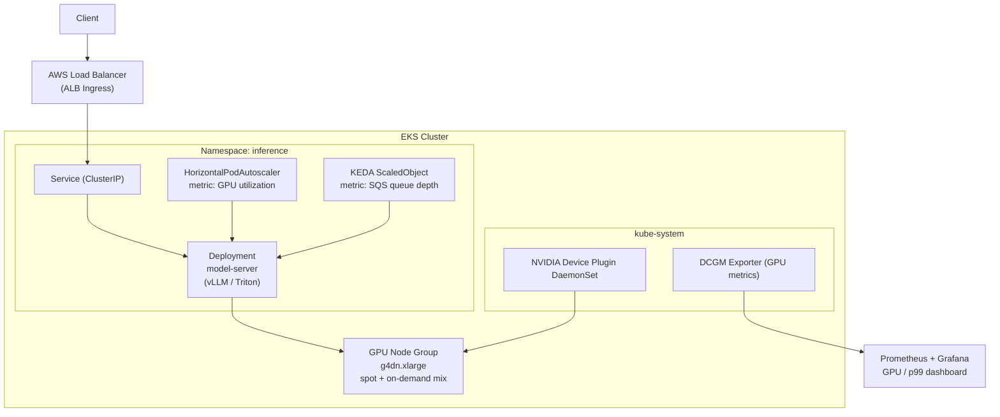
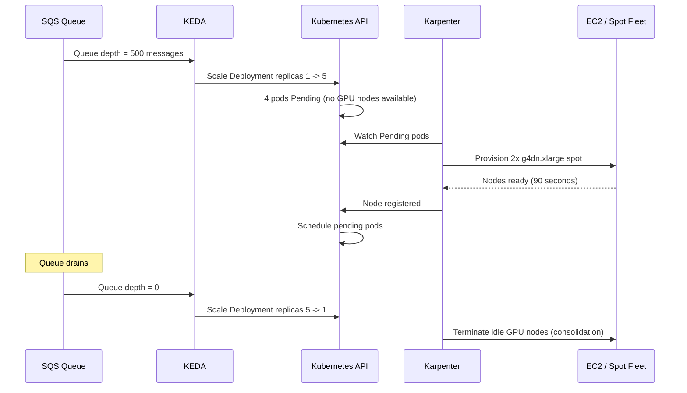
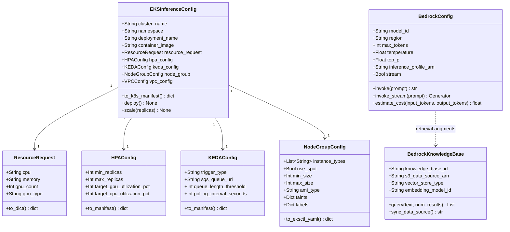
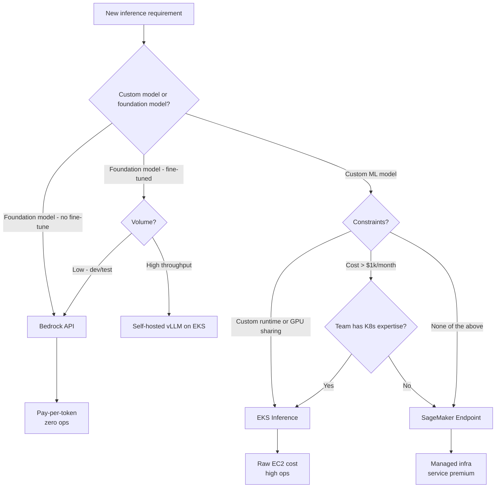
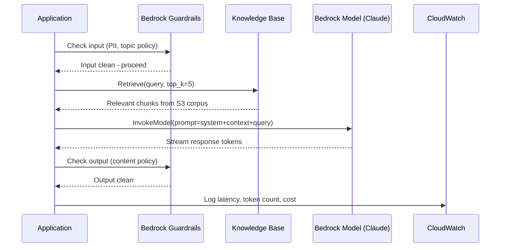

# Day 84 — AWS Serving on EKS + Bedrock Overview

## WHY — When EKS Beats SageMaker Endpoints

SageMaker endpoints are the right default. EKS becomes the better choice when one
or more of these conditions are true:

| Condition | SageMaker endpoint | EKS inference |
|---|---|---|
| **Custom runtime** (triton, vLLM, TensorRT) | Limited support | Full control |
| **GPU time-sharing** (MIG, MPS) | Not supported | Full support via device plugin |
| **Cost at high throughput** | 30–60% service premium | Closer to raw EC2 pricing |
| **Multi-model on one GPU** | Multi-model endpoint (same framework) | Any framework mix |
| **Side-car containers** (logging, proxy) | Not supported | K8s pod pattern |
| **Cross-AZ load balancing** | Managed (opaque) | NLB + Ingress (configurable) |
| **P99 tail latency tuning** | Limited knobs | Full kernel/driver access |
| **Team already runs K8s** | Second system to operate | Unified platform |

> **EKS inference is NOT simpler** — it requires managing node groups, GPU
> drivers, scaling, and rolling updates. Choose it only when the benefits above
> justify that operational cost.

---

## HOW — EKS Inference Architecture

### Core components



### GPU resource allocation

```yaml
# Container resource request for GPU inference
resources:
  requests:
    cpu: "4"
    memory: "16Gi"
    nvidia.com/gpu: "1"
  limits:
    nvidia.com/gpu: "1"
```

### MIG (Multi-Instance GPU) for GPU sharing

NVIDIA A100/H100 supports MIG — partitioning one physical GPU into up to 7
isolated GPU instances, each with dedicated memory and compute:

```
A100 80GB -> 7x MIG 1g.10gb instances
Each instance: ~10 GB VRAM, ~1/7 compute
```

Use case: 7 small models (e.g., embedding, NER, classification) on one A100
instead of 7 separate g4dn.xlarge instances.

---

## HOW — EKS GPU Autoscaling

Two autoscalers work together:

**1. KEDA (Kubernetes Event-Driven Autoscaling)**
- Scales pods based on external metrics: SQS queue depth, Prometheus GPU utilization
- Scales to zero (no idle cost for batch workloads)

**2. Karpenter (node-level autoscaler)**
- Provisions new GPU nodes in seconds (vs Cluster Autoscaler's minutes)
- Automatically picks cheapest instance type that fits the pod request
- Consolidates underutilised nodes



---

## HOW — Inference Cost Comparison (EKS vs SageMaker)

```
Workload: LLM inference, 10M tokens/day, p99 < 500ms

SageMaker Real-Time Endpoint:
  2x ml.g4dn.xlarge @ $0.736/hr each = $1.47/hr
  730 hr/month = $1,073/month

EKS (Spot + Karpenter):
  2x g4dn.xlarge spot @ $0.221/hr each = $0.44/hr
  730 hr/month = $323/month
  EKS control plane: $72/month
  Total: $395/month (~63% saving)

Break-even: EKS saves ~$678/month.
Engineering cost to set up EKS inference: ~2 weeks (one-time).
Break-even timeline: ~1 month.
```

At scale (> $1k/month compute), EKS almost always wins on pure cost.

---

## HOW — Bedrock Overview

Amazon Bedrock provides **managed foundation model inference via API** — no GPU
cluster to operate, no model weights to manage.

### What Bedrock provides

| Feature | Detail |
|---|---|
| Foundation models | Claude (Anthropic), Llama 3, Mistral, Titan, Jurassic, Stable Diffusion |
| API surface | `InvokeModel`, `InvokeModelWithResponseStream` (streaming) |
| Pricing model | Per input/output token — no idle cost |
| Fine-tuning | Custom model fine-tuning on your data (Continued Pre-Training, Fine-Tuning) |
| RAG integration | Knowledge Bases for Bedrock (S3 + vector store, managed) |
| Agents | Bedrock Agents — orchestrate tool calls without writing agent loop |
| Guardrails | Content filtering, PII detection, topic denial |
| VPC support | PrivateLink endpoint — no data leaves your VPC |

### Bedrock vs self-hosted vLLM

| Dimension | Bedrock | Self-hosted vLLM on EKS |
|---|---|---|
| Setup time | Minutes (API key) | Days (cluster, model weights, serving config) |
| Model weights | Managed by AWS/vendor | You download and store |
| Cost at low volume | Cheap (pay-per-token) | Expensive (always-on GPU) |
| Cost at high volume | Expensive ($0.003+/1k tokens) | Cheaper (amortised GPU) |
| Customisation | Fine-tune API only | Full model config, quantisation, batching |
| Data sovereignty | Stays in AWS region | Stays on your cluster |
| Latency | Shared infrastructure | Dedicated GPU — lower p99 |

---

## Data Structures — Class Diagram



---

## HOW — Decision Flow: SageMaker vs EKS vs Bedrock



---

## HOW — Bedrock Integration Pattern for ML Platform



---

## Key Takeaways

1. **EKS inference wins on cost at scale** — at > $500/month compute, the ~63% spot saving typically outweighs the ops burden; below that, SageMaker's managed overhead is worth it.
2. **Custom runtimes are the primary EKS trigger** — if you need vLLM, Triton, TensorRT, or custom CUDA code, EKS is the only option.
3. **GPU time-sharing (MIG) multiplies GPU value** — partition one A100 into 7 isolated instances for 7 small models; impossible on SageMaker endpoints.
4. **KEDA + Karpenter = scale-to-zero GPU** — KEDA scales pods from SQS/Prometheus metrics; Karpenter provisions and terminates GPU nodes automatically.
5. **Bedrock = fastest path to foundation models** — API key, pay-per-token, zero GPU ops; the right answer for low-volume or prototype LLM features.
6. **Bedrock Knowledge Bases manages RAG infra** — S3 data source + managed vector store + embedding + retrieval; no Pinecone/Weaviate to operate.
7. **Guardrails belong at the API boundary** — apply Bedrock Guardrails (content filtering, PII) before the model sees user input and after it returns output.
