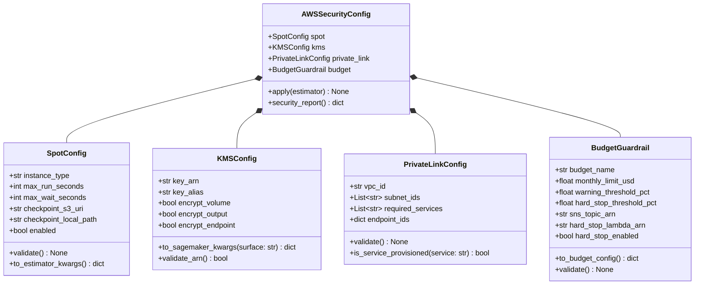
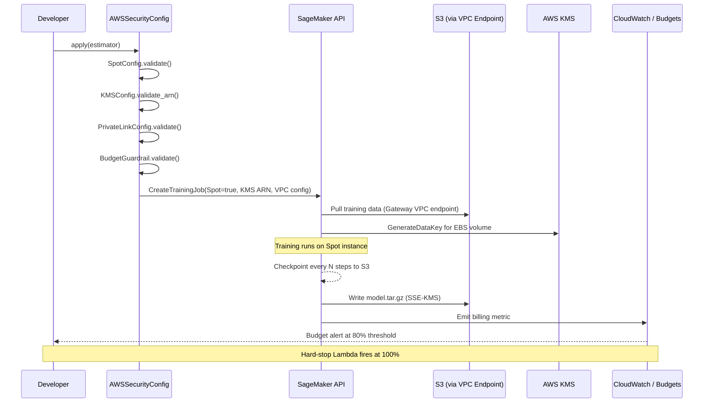
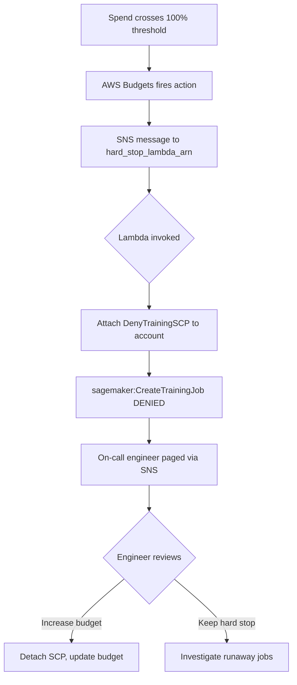

# Day 85 — AWS Cost & Security for ML Workloads

## WHY

Training large models on AWS can consume enormous compute budgets. Without
proactive cost controls and security hardening, two failure modes appear quickly:

- **Cost explosion** — a runaway training job or a forgotten endpoint burns
  thousands of dollars overnight.
- **Data breach** — model artifacts sitting in plaintext S3 buckets, or traffic
  routed through the public internet, expose IP and customer data.

The four tools in today's session address both dimensions:

| Problem | Solution |
|---|---|
| GPU/CPU training is expensive | Spot Instances — up to 70 % cheaper |
| Model artifacts leak at rest | KMS encryption on S3 + SageMaker |
| Network traffic crosses public internet | PrivateLink for S3 and ECR |
| No guardrails on spend | AWS Budgets + CloudWatch alarms |

> **Rule of thumb:** encrypt everything, route nothing through the internet,
> and let the budget alarm page someone before the bill does.

---

## HOW

### 1. Spot Training (70 % Savings)

Spot Instances use spare EC2 capacity at a fraction of the on-demand price.
AWS can reclaim them with a 2-minute warning, so training jobs must be
**checkpointing** continuously.

Key SageMaker knobs:

```python
estimator = PyTorch(
    use_spot_instances=True,           # request Spot
    max_run=3600,                      # wall-clock limit (seconds)
    max_wait=7200,                     # total wait including interruptions
    checkpoint_s3_uri="s3://bucket/ckpts/",
    checkpoint_local_path="/opt/ml/checkpoints",
)
```

SageMaker automatically resumes from the latest checkpoint when a Spot job
restarts after an interruption. `max_wait` must always be >= `max_run`;
`SpotConfig.validate()` enforces this.

---

### 2. KMS Encryption for Model Artifacts

Every artifact written to S3 by a SageMaker job should be encrypted with a
**Customer Managed Key (CMK)** — you control key rotation and revocation.

Three surfaces to encrypt:

| Surface | SageMaker API field |
|---|---|
| S3 output (model.tar.gz) | `output_data_config.kms_key_id` |
| EBS training volume | `resource_config.volume_kms_key` |
| Endpoint storage | `production_variants[*].volume_kms_key_id` |

**KMSConfig** stores the ARN and exposes `to_sagemaker_kwargs()` that injects
the correct keys per API call surface.

---

### 3. PrivateLink for S3 and ECR

By default, a SageMaker training instance pulls container images from ECR and
writes artifacts to S3 over the **public internet** — even inside a VPC.

VPC Endpoints (PrivateLink) keep all traffic on the AWS backbone:

```
VPC
 └─ Private subnet
     ├─ SageMaker training job
     ├─ com.amazonaws.<region>.s3          (Gateway endpoint — free)
     └─ com.amazonaws.<region>.ecr.dkr    (Interface endpoint — $0.01/hr)
```

**PrivateLinkConfig** records provisioned endpoint IDs and provides
`validate()` which raises if a required service endpoint is missing.

---

### 4. Budget Guardrails

AWS Budgets can send SNS notifications **and** trigger an IAM action that
denies `sagemaker:CreateTrainingJob` when spend exceeds a threshold.

Two layers:

1. **Warning alert** at 80 % of monthly budget — email or Slack via SNS.
2. **Hard stop** at 100 % — SNS triggers a Lambda that attaches a
   `DenyTrainingSCP` Service Control Policy.

**BudgetGuardrail** records the thresholds, notification ARN, and whether
the hard-stop Lambda is wired up. `validate()` raises if `hard_stop_enabled`
is True but `hard_stop_lambda_arn` is empty.

---

## Class Diagram



---

## Sequence: Secure Training Job Launch



---

## Flowchart: Budget Hard-Stop Path



---

## Key Takeaways

1. **Spot + checkpointing** is the single highest-leverage cost reduction for
   training — 70 % savings with near-zero reliability loss when checkpoints
   are frequent (every few minutes).
2. **KMS CMKs** give you control over model artifact access and satisfy most
   compliance frameworks (SOC 2, HIPAA, PCI-DSS).
3. **VPC Endpoints (PrivateLink)** eliminate public-internet exposure for
   S3 and ECR — a hard requirement in regulated industries.
4. **Budget guardrails** must be wired up before any auto-scaling or
   automated training pipeline goes live; a runaway job can exhaust a monthly
   budget in hours.
5. All four controls are expressed as validated Python dataclasses
   (`SpotConfig`, `KMSConfig`, `PrivateLinkConfig`, `BudgetGuardrail`) and
   run as pre-flight checks before a job launches — security as code, not
   an afterthought.
