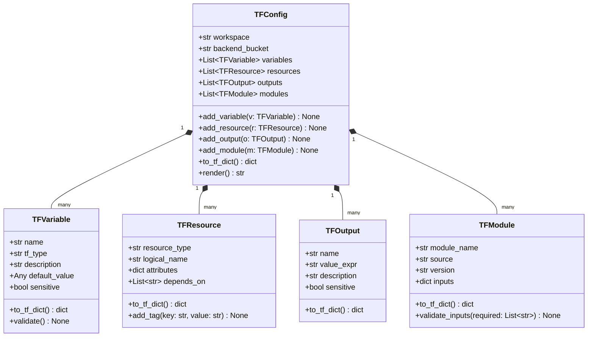
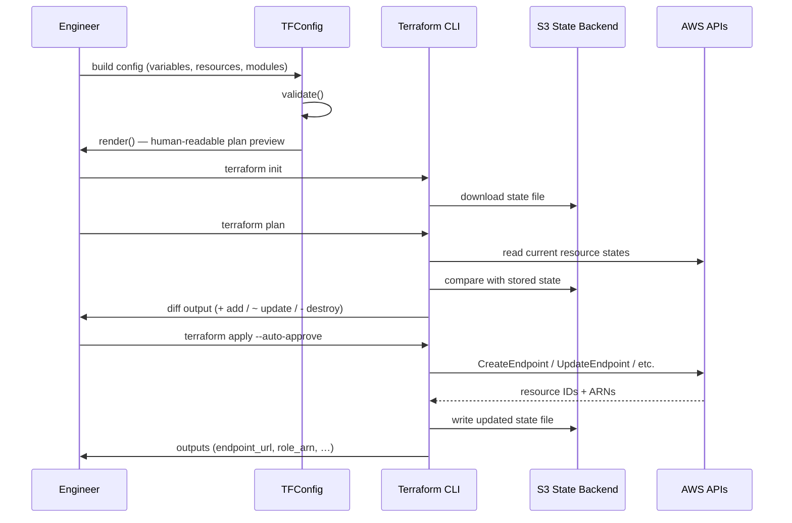
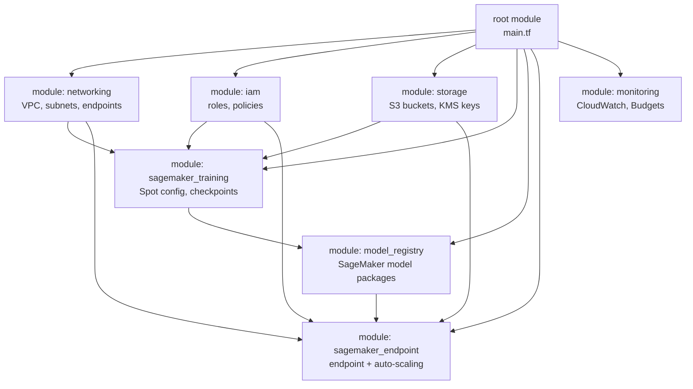

# Day 86 — Terraform for ML Infrastructure

## WHY

### Why Infrastructure as Code at All?

Clicking through the AWS console to provision a SageMaker endpoint or an EKS
cluster produces infrastructure that is:

- **Unreproducible** — no one can recreate it exactly.
- **Undocumented** — intent lives only in someone's memory.
- **Unauditable** — no change history, no peer review.

Infrastructure as Code (IaC) solves all three. Every resource is a file in
Git: reviewable, versioned, and redeployable.

### Why Terraform Over CloudFormation?

| Dimension | CloudFormation | Terraform |
|---|---|---|
| Provider coverage | AWS only | 1,500+ providers (AWS, GCP, Azure, Datadog…) |
| State management | Managed by AWS (opaque) | Explicit state file — local or S3 backend |
| Module system | Nested stacks (verbose) | First-class modules with input/output |
| Plan before apply | Change sets (limited) | `terraform plan` — full diff before apply |
| Drift detection | Drift detection (manual) | `terraform refresh` auto-reconciles |
| Rollback | Stack rollback (slow) | `git revert` + `terraform apply` |
| Community modules | AWS-only registry | Terraform Registry (thousands of modules) |

> **For ML platforms that span AWS + GCP or use Datadog/Snowflake, Terraform
> is the only practical choice.**

---

## HOW

### Core Terraform Concepts

```
terraform/
├── main.tf          # resources
├── variables.tf     # input declarations
├── outputs.tf       # exported values
├── terraform.tfvars # actual values (gitignored if secrets)
└── modules/
    └── sagemaker/   # reusable module
```

**Workflow:**

```bash
terraform init      # download providers + modules
terraform plan      # show diff — what will change?
terraform apply     # create / update resources
terraform destroy   # tear down (dev environments)
```

### Four Core Abstractions

#### TFVariable — Input Declaration

```hcl
variable "model_bucket" {
  type        = string
  description = "S3 bucket for model artifacts"
  default     = "ml-models-dev"
}
```

`TFVariable` in Python holds `name`, `type`, `description`, `default`, and
`sensitive` flag, and serialises to the HCL dict structure that
`to_tf_dict()` returns.

#### TFResource — Infrastructure Object

```hcl
resource "aws_sagemaker_endpoint" "inference" {
  name                 = var.endpoint_name
  endpoint_config_name = aws_sagemaker_endpoint_configuration.cfg.name
  tags                 = { Environment = "prod" }
}
```

`TFResource` holds `resource_type`, `logical_name`, and `attributes` dict.
`to_tf_dict()` nests these correctly for JSON serialisation.

#### TFOutput — Exported Value

```hcl
output "endpoint_url" {
  value       = aws_sagemaker_endpoint.inference.endpoint_url
  description = "SageMaker endpoint URL for downstream services"
}
```

`TFOutput` stores `name`, `value` (HCL expression string), `description`, and
`sensitive` flag.

#### TFModule — Reusable Unit

```hcl
module "sagemaker_endpoint" {
  source        = "./modules/sagemaker"
  endpoint_name = var.endpoint_name
  model_arn     = var.model_arn
  instance_type = "ml.g4dn.xlarge"
}
```

`TFModule` stores `source`, `version`, and `inputs` dict. `to_tf_dict()`
produces the correct nested structure.

#### TFConfig — Root Configuration

`TFConfig` is the top-level container that collects variables, resources,
outputs, and modules, and generates the equivalent Python dict that mirrors
what a `.tf` file encodes. A `render()` method produces a human-readable
summary for review.

---

## Class Diagram



---

## Sequence: Terraform Apply Lifecycle



---

## Flowchart: ML Platform Module Hierarchy



---

## Key Takeaways

1. **Terraform's multi-provider support** means a single codebase can
   provision AWS SageMaker endpoints, GCP Vertex AI jobs, and Datadog monitors
   in one `terraform apply`.
2. **Explicit state** (`terraform.tfstate`) makes drift detectable and
   recoverable — CloudFormation's opaque stack state makes this hard.
3. **Modules** enforce reuse: define `sagemaker_endpoint` once, consume it
   in dev/staging/prod with different variable values.
4. `TFConfig.to_tf_dict()` producing a Python dict equivalent of `.tf` files
   allows **programmatic generation** of Terraform configs — useful for
   on-demand experiment environments spun up by a CI pipeline.
5. Always store state in a **versioned, encrypted S3 bucket with DynamoDB
   locking** — never in the local filesystem for team projects.
