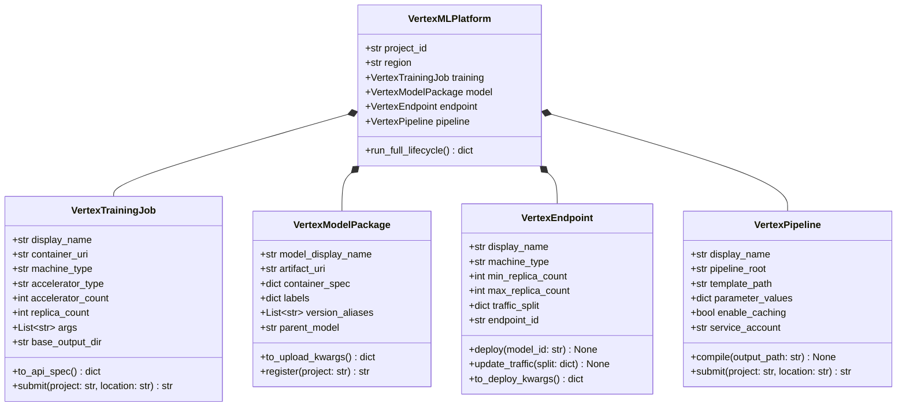
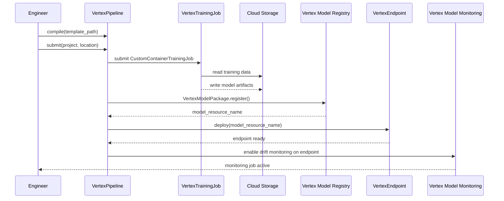
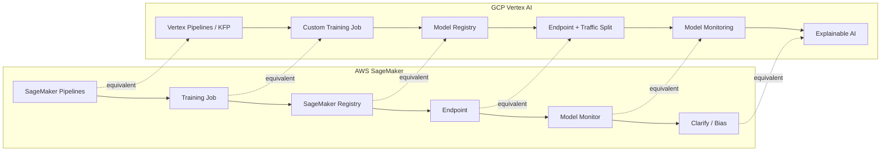

# Day 87 — GCP 1:1 Mapping to AWS ML Services

## WHY

ML engineers often work across cloud providers — an organisation may train on
AWS and serve on GCP, or a job change moves you from one ecosystem to the other.
Understanding the **conceptual equivalences** between AWS SageMaker and GCP
Vertex AI lets you:

- Transfer skills without starting from scratch.
- Make informed multi-cloud architecture decisions.
- Avoid re-learning the same concept under a different brand name.

> **Key insight:** the ML lifecycle (train → register → deploy → monitor →
> explain) is universal. Only the API names, IAM models, and network primitives
> differ.

---

## HOW

### Service-Level Mapping

| ML Lifecycle Stage | AWS Service | GCP Service |
|---|---|---|
| Managed training | SageMaker Training Job | Vertex AI Custom Training Job |
| Distributed training | SageMaker + Horovod/torch.distributed | Vertex AI Training (built-in distributed) |
| Hyperparameter tuning | SageMaker Automatic Model Tuning | Vertex AI Vizier |
| Model registry | SageMaker Model Registry | Vertex AI Model Registry |
| Batch inference | SageMaker Batch Transform | Vertex AI Batch Prediction |
| Real-time serving | SageMaker Endpoint | Vertex AI Endpoint |
| Pipeline orchestration | SageMaker Pipelines | Vertex AI Pipelines (KFP) |
| Drift / data monitoring | SageMaker Model Monitor | Vertex AI Model Monitoring |
| Explainability | SageMaker Clarify | Vertex Explainable AI |
| Feature store | SageMaker Feature Store | Vertex AI Feature Store |
| Notebooks | SageMaker Studio | Vertex AI Workbench |

### Key Structural Differences

| Dimension | AWS SageMaker | GCP Vertex AI |
|---|---|---|
| IAM model | IAM roles (assumed by job) | Service accounts (attached to job) |
| Container registry | ECR | Artifact Registry |
| Object storage | S3 | Cloud Storage (GCS) |
| Networking | VPC + PrivateLink | VPC + Private Service Connect |
| Pricing unit | Per-second, per instance type | Per-second, per instance type |
| Pipeline DSL | SageMaker Pipelines SDK (proprietary) | KFP v2 SDK (open-source) |

---

### VertexTrainingJob

Equivalent to `sagemaker.estimator.Estimator`. Key fields:

```python
job = VertexTrainingJob(
    display_name="credit-risk-v3",
    container_uri="us-central1-docker.pkg.dev/project/repo/trainer:latest",
    machine_type="n1-standard-8",
    accelerator_type="NVIDIA_TESLA_T4",
    accelerator_count=1,
    replica_count=1,
    args=["--epochs", "50", "--lr", "0.001"],
    base_output_dir="gs://bucket/outputs/",
)
```

The `to_api_spec()` method returns the dict for
`aiplatform.CustomContainerTrainingJob`.

---

### VertexModelPackage

Equivalent to `sagemaker.model.ModelPackage`. Holds:

- `model_display_name`, `artifact_uri` (GCS path to `model/`),
  `container_spec` (serving image URI), `labels` (dict of metadata),
  `version_aliases` (e.g. `["champion", "v3"]`).

The `to_upload_kwargs()` method produces kwargs for
`aiplatform.Model.upload()`.

---

### VertexEndpoint

Equivalent to `sagemaker.Endpoint`. Key distinction: in Vertex AI an
**Endpoint** is a durable resource; you **deploy** a Model to it with
traffic splits. Multiple model versions can serve simultaneously.

```python
endpoint = VertexEndpoint(
    display_name="credit-risk-prod",
    dedicated_resources_machine_type="n1-standard-4",
    min_replica_count=1,
    max_replica_count=5,
    traffic_split={"model_v3": 90, "model_v2": 10},
)
```

---

### VertexPipeline

Equivalent to a SageMaker Pipeline. GCP uses the open-source **KFP v2 SDK**
— the same SDK used by Kubeflow Pipelines on-prem — which gives better
portability than SageMaker's proprietary DSL.

```python
pipeline = VertexPipeline(
    display_name="credit-risk-retrain",
    pipeline_root="gs://bucket/pipeline-root/",
    parameter_values={"learning_rate": 0.001, "epochs": 50},
    enable_caching=True,
)
```

---

## Class Diagram



---

## Sequence: Full Vertex AI Lifecycle



---

## AWS ↔ GCP Side-by-Side Flowchart



---

## Key Takeaways

1. **The ML lifecycle maps 1:1** between SageMaker and Vertex AI — train,
   register, deploy, monitor, explain. Learn the concept once; translate the
   API names.
2. **Vertex AI uses KFP v2** (open-source) for pipelines; SageMaker uses a
   proprietary SDK. This makes Vertex pipelines more portable.
3. **Traffic splitting** is a first-class Vertex AI Endpoint concept — you
   can serve two model versions simultaneously. SageMaker achieves this
   via production variant weights.
4. **IAM model difference**: SageMaker assumes an IAM Role; Vertex AI
   attaches a Service Account to the job. Both can be locked down to
   least-privilege.
5. `VertexMLPlatform.run_full_lifecycle()` mirrors the
   `AWSDeploymentPlan.execute()` pattern from Day 89 — the same interface,
   different backend, demonstrating cloud-agnostic design.
