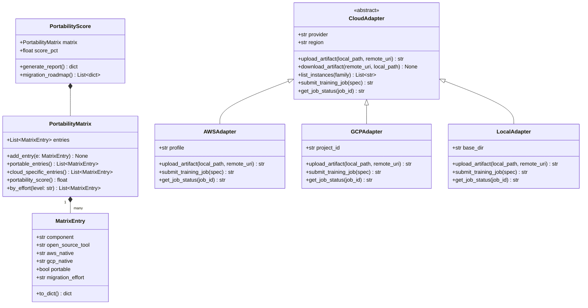
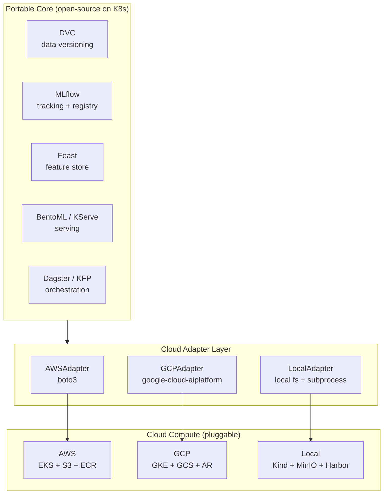
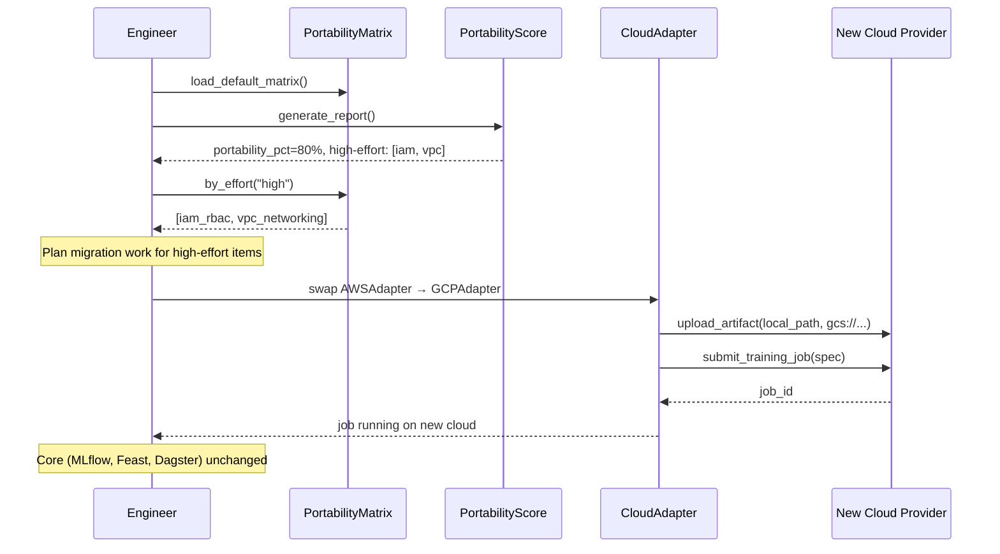

# Day 88 — Platform Portability: Cloud-Agnostic ML Core

## WHY

Every ML platform decision carries a hidden **portability tax**: the more
deeply you embed cloud-native APIs, the harder it becomes to:

- Move workloads when a cheaper cloud option appears.
- Run experiments locally before committing to cloud spend.
- Satisfy a customer requirement to deploy on their preferred cloud.
- Avoid lock-in during vendor negotiations.

The good news: the core of a mature ML platform — data versioning, experiment
tracking, feature store, model registry, serving framework, and pipeline
orchestration — can be assembled entirely from **open-source tools that run
anywhere Kubernetes runs**.

> **Portability principle:** separate the "what" (open-source core) from the
> "where" (cloud compute and storage primitives). The cloud is an adapter,
> not the foundation.

---

## HOW

### The Portability Matrix

| Layer | Tool / Standard | Portable? | Cloud-specific replacement |
|---|---|---|---|
| Data versioning | DVC + S3-compatible store | Yes — MinIO on-prem or any cloud | S3 / GCS / ABS |
| Experiment tracking | MLflow (OSS) | Yes — runs anywhere | SageMaker Experiments / Vertex ML Metadata |
| Feature store | Feast (OSS) | Yes — pluggable offline/online stores | SageMaker Feature Store / Vertex Feature Store |
| Model registry | MLflow Model Registry | Yes | SageMaker Registry / Vertex Registry |
| Serving | BentoML / KServe on K8s | Yes — standard K8s resources | SageMaker Endpoint / Vertex Endpoint |
| Pipeline orchestration | Dagster / KFP on K8s | Yes | SageMaker Pipelines / Vertex Pipelines |
| Container registry | OCI-compatible | Yes — Docker Hub, Harbor, GHCR | ECR / Artifact Registry |
| Object storage | S3-compatible API | Yes — MinIO shim | S3 / GCS (via compatibility layer) / ABS |
| Compute scheduling | Kubernetes | Yes | EKS / GKE / AKS |
| Secrets | Vault / K8s Secrets | Yes | AWS Secrets Manager / GCP Secret Manager |

**What stays cloud-specific:**

- GPUs (instance types, spot/preemptible availability, pricing).
- Managed K8s control plane (EKS, GKE, AKS).
- IAM / RBAC integration (IAM Roles, Workload Identity).
- VPC networking, PrivateLink, Private Service Connect.
- Managed databases (RDS, Cloud SQL) used as MLflow backend.

---

### PortabilityMatrix

Encodes the matrix above as a data structure. Each entry has:
- `component` — e.g. `"experiment_tracking"`.
- `open_source_tool` — e.g. `"mlflow"`.
- `aws_native` — e.g. `"SageMaker Experiments"`.
- `gcp_native` — e.g. `"Vertex ML Metadata"`.
- `portable` — bool.
- `migration_effort` — `"low"`, `"medium"`, `"high"`.

`portability_score()` returns `(portable_count / total_count) * 100`.

---

### CloudAdapter

A thin interface that maps generic operations to cloud-specific APIs:

```python
class CloudAdapter(ABC):
    @abstractmethod
    def upload_artifact(self, local_path: str, remote_uri: str) -> str: ...

    @abstractmethod
    def list_instances(self, instance_family: str) -> List[str]: ...

    @abstractmethod
    def submit_training_job(self, spec: dict) -> str: ...
```

Implementations: `AWSAdapter` (boto3), `GCPAdapter` (google-cloud-aiplatform),
`LocalAdapter` (local filesystem + subprocess). The core pipeline calls only
`CloudAdapter` methods — switching clouds is an adapter swap.

---

### PortabilityScore

Aggregates matrix entries and produces a scored report:

```python
score = PortabilityScore(matrix=matrix)
report = score.generate_report()
# {
#   "total_components": 10,
#   "portable_count": 8,
#   "portability_pct": 80.0,
#   "high_effort_migrations": ["iam_rbac", "vpc_networking"],
#   "low_effort_migrations": ["object_storage"]
# }
```

---

## Class Diagram



---

## Flowchart: Portable ML Platform Architecture



---

## Sequence: Switching Cloud Providers



---

## Key Takeaways

1. **80 % of the ML platform can be cloud-agnostic** by choosing open-source
   tools (MLflow, Feast, DVC, KServe, KFP) over managed cloud equivalents.
2. The **CloudAdapter pattern** is the key design: isolate all cloud API calls
   behind a single interface; the core pipeline never calls boto3 or
   google-cloud directly.
3. **High-effort migration items** are almost always networking and IAM —
   both are deeply cloud-specific. Plan for these explicitly in a migration.
4. `PortabilityScore.portability_pct` gives teams a concrete metric to track
   as they accumulate technical debt by adopting cloud-native services.
5. **Local development** is the first portability dividend — `LocalAdapter`
   lets engineers run the full pipeline on a laptop with MinIO and Kind,
   dramatically reducing iteration cycle time.
