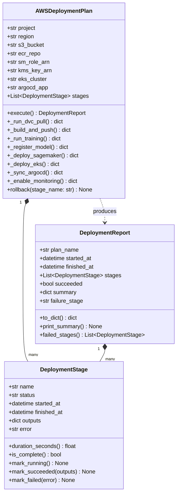
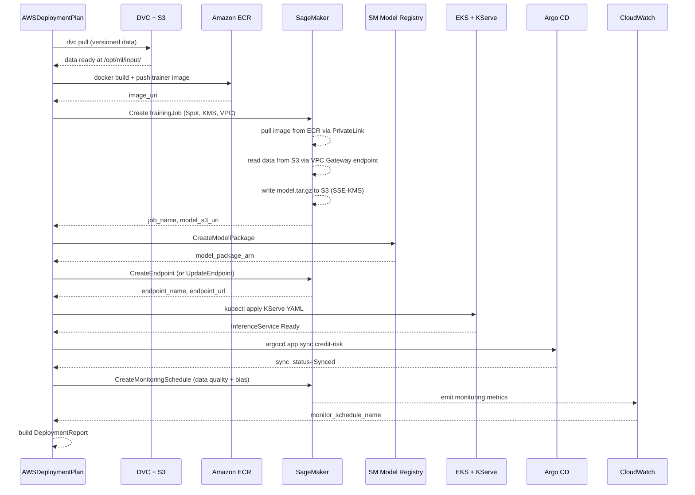

# Day 89 — End-to-End AWS Deployment

## WHY

Individual AWS services are well-understood in isolation — but the production
failure modes almost always appear **at the seams**: the DVC pointer that
references an S3 key that no longer exists, the ECR image that was built
without the KMS key the SageMaker execution role expects, the Argo CD sync
that succeeds but the KServe InferenceService never becomes Ready.

Day 89 wires the entire backbone together on AWS from raw data to a live,
monitored endpoint — and names the failure points at every seam.

> **Goal:** one `AWSDeploymentPlan.execute()` call orchestrates S3 → ECR →
> SageMaker Train → SageMaker Registry → SageMaker Endpoint (or EKS/KServe)
> → Argo CD sync → CloudWatch monitoring.

---

## HOW

### Full AWS Backbone Stack

```
Data Layer          DVC + S3 (versioned, KMS-encrypted)
│
├── Feature Store   Feast offline store → S3 / online → DynamoDB or Redis
│
├── Training        SageMaker Training Job (Spot, VPC, KMS)
│       └──────────► ECR (private, PrivateLink)
│
├── Registry        SageMaker Model Registry (model package group)
│
├── Serving         Option A: SageMaker Endpoint (managed)
│                   Option B: EKS + KServe InferenceService (portable)
│
├── GitOps / CD     Argo CD watches config repo → syncs K8s manifests
│
└── Monitoring      CloudWatch Metrics + SageMaker Model Monitor
                    + Budget alarms (Day 85)
```

### DeploymentStage

Each logical step in the deployment is a `DeploymentStage`:

```python
@dataclass
class DeploymentStage:
    name: str              # e.g. "train", "register", "deploy"
    status: str            # "pending" | "running" | "succeeded" | "failed"
    started_at: datetime | None
    finished_at: datetime | None
    outputs: dict          # stage-specific outputs (job_name, model_arn, …)
    error: str | None
```

### AWSDeploymentPlan

Orchestrates all stages in order. Each stage calls the appropriate AWS SDK
method and writes outputs consumed by the next stage.

```python
plan = AWSDeploymentPlan(
    project="credit-risk",
    region="us-east-1",
    s3_bucket="ml-artifacts",
    ecr_repo="credit-risk-trainer",
    sm_role_arn="arn:aws:iam::123456789:role/SageMakerRole",
    kms_key_arn="arn:aws:kms:us-east-1:123456789:key/abc",
    eks_cluster="ml-cluster",
    argocd_app="credit-risk",
)
report = plan.execute()
```

Stages (in order):

| # | Stage | Key action | Outputs |
|---|---|---|---|
| 1 | `dvc_pull` | `dvc pull` from S3 | `data_version` |
| 2 | `build_push` | `docker build` + `ecr push` | `image_uri` |
| 3 | `train` | SageMaker CreateTrainingJob (Spot) | `job_name`, `model_s3_uri` |
| 4 | `register` | SageMaker CreateModelPackage | `model_package_arn` |
| 5 | `deploy_sm` | SageMaker CreateEndpoint or UpdateEndpoint | `endpoint_name` |
| 6 | `deploy_eks` | `kubectl apply` KServe YAML (optional) | `inference_service_url` |
| 7 | `argocd_sync` | `argocd app sync` | `sync_status` |
| 8 | `monitor` | Enable SageMaker Model Monitor schedule | `monitor_schedule_name` |

### DeploymentReport

`AWSDeploymentPlan.execute()` returns a `DeploymentReport`:

```python
@dataclass
class DeploymentReport:
    plan_name: str
    started_at: datetime
    finished_at: datetime
    stages: List[DeploymentStage]
    succeeded: bool
    summary: dict          # high-level KPIs
    failure_stage: str | None
```

`summary` includes:
- `total_duration_minutes`
- `training_cost_usd` (from CloudWatch billing metric)
- `endpoint_url`
- `model_package_arn`
- `spot_savings_pct`

---

## Class Diagram



---

## Sequence: Full E2E AWS Deployment



---

## Flowchart: Failure & Rollback Path

```mermaid
flowchart TD
    A[execute() starts] --> B{dvc_pull}
    B -->|fail| Z1[DeploymentReport: failed_stage=dvc_pull]
    B -->|ok| C{build_push}
    C -->|fail| Z2[DeploymentReport: failed_stage=build_push]
    C -->|ok| D{train}
    D -->|fail| Z3[rollback: delete incomplete job]
    D -->|ok| E{register}
    E -->|ok| F{deploy_sagemaker}
    F -->|fail| Z4[rollback: revert to previous endpoint config]
    F -->|ok| G{argocd_sync}
    G -->|fail| Z5[rollback: argocd app rollback]
    G -->|ok| H{monitor}
    H -->|ok| I[DeploymentReport: succeeded=True]
```

---

## Key Takeaways

1. **Seam failures are the real risk** — each stage hand-off (S3 URI to
   training job, model ARN to endpoint, image URI to KServe) must be
   validated before the next stage starts.
2. **`DeploymentStage.outputs`** is the contract between stages: each stage
   writes a typed dict; the next stage reads from it — no implicit shared
   state.
3. **Rollback must be designed upfront**: a failed endpoint update should
   revert to the previous production variant, not leave the endpoint in
   an error state.
4. **Argo CD as the final sync gate** ensures the Git config repo is
   authoritative — the deployment is not complete until Argo reports `Synced`.
5. `DeploymentReport.summary` gives on-call engineers a single dict to
   paste into an incident ticket: endpoint URL, training cost, spot savings,
   and which stage failed.
