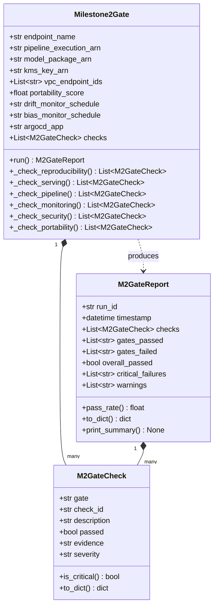
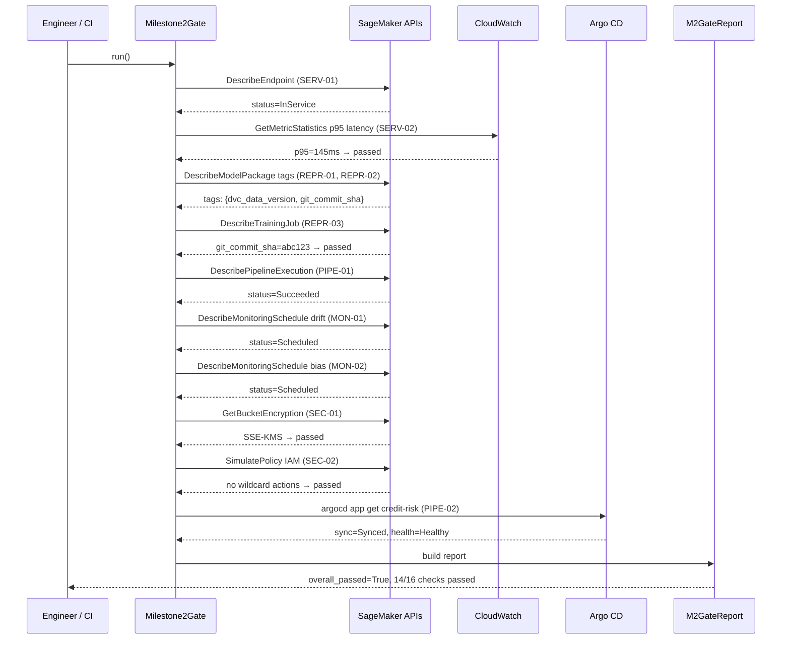
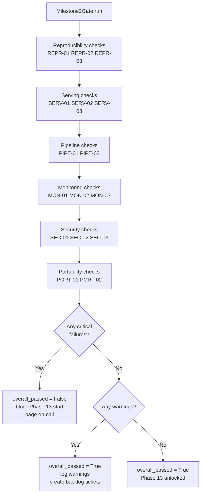

# Day 90 — Consolidation + Milestone 2 Gate

## WHY

Phase 12 has covered the full cloud deployment spectrum: AWS cost and security
controls (Day 85), Terraform for reproducible infra (Day 86), GCP mapping
(Day 87), platform portability (Day 88), and an end-to-end AWS deployment
(Day 89). Milestone 2 is the formal **production-readiness gate** that
certifies the platform before moving into LLMOps (Phase 13+).

Without a structured gate, teams ship "mostly done" platforms that pass happy-
path demos but fail in production on the exact scenarios the gate is designed
to catch: untraceable model lineage, insecure endpoints, undetected drift.

> **Milestone 2 answers one question:** _Can this platform run in production
> without constant human intervention?_

The six gate dimensions are identical to the Six Production Gates defined in
the curriculum — each is now checked with concrete, automated assertions.

---

## HOW

### The Six Gate Dimensions

| Gate | What it checks |
|---|---|
| **Reproducibility** | Trace endpoint → model → training job → data version → code commit |
| **Serving** | Endpoint health, latency SLO (p95 < 200 ms), rollback path |
| **Pipeline** | SM Pipeline or Argo Workflow completed successfully, retries logged |
| **Monitoring** | Drift monitor active, bias monitor active, alert routing wired |
| **Security** | KMS encryption on artifacts, IAM least-privilege, PrivateLink active |
| **Portability** | Core layer (MLflow, Feast, DVC, KServe) portable, score ≥ 80 % |

### M2GateCheck (one assertion)

Each individual check is a `M2GateCheck`:

```python
@dataclass
class M2GateCheck:
    gate: str           # "reproducibility" | "serving" | "pipeline" | ...
    check_id: str       # e.g. "REPR-01"
    description: str    # human-readable
    passed: bool
    evidence: str       # e.g. ARN, URL, commit SHA
    severity: str       # "critical" | "warning"
```

### Milestone2Gate

Runs all 12+ checks and aggregates results:

```python
gate = Milestone2Gate(
    endpoint_name="credit-risk-prod",
    pipeline_execution_arn="arn:aws:sagemaker:...",
    model_package_arn="arn:aws:sagemaker:...",
    kms_key_arn="arn:aws:kms:...",
    vpc_endpoint_ids=["vpce-...", "vpce-..."],
    portability_score=82.0,
    drift_monitor_schedule="credit-risk-monitor",
    bias_monitor_schedule="credit-risk-bias",
    argocd_app="credit-risk",
)
report = gate.run()
```

`run()` executes each check in order, populates `M2GateCheck.passed`, and
returns a `M2GateReport`.

### M2GateReport

```python
@dataclass
class M2GateReport:
    run_id: str
    timestamp: datetime
    checks: List[M2GateCheck]
    gates_passed: List[str]
    gates_failed: List[str]
    overall_passed: bool         # True only if ALL critical checks pass
    critical_failures: List[str]
    warnings: List[str]
    to_dict() -> dict
    print_summary() -> None
```

`overall_passed` is `True` only when every `severity="critical"` check
passes. Warnings are reported but do not block the gate.

---

### The 12 Gate Checks

| Check ID | Gate | Description | Severity |
|---|---|---|---|
| REPR-01 | Reproducibility | Endpoint has a model ARN tag | critical |
| REPR-02 | Reproducibility | Model ARN links to a training job with `dvc_data_version` tag | critical |
| REPR-03 | Reproducibility | Training job has `git_commit_sha` tag | critical |
| SERV-01 | Serving | Endpoint status is `InService` | critical |
| SERV-02 | Serving | p95 latency < 200 ms (last 1 h CloudWatch) | critical |
| SERV-03 | Serving | Previous endpoint config exists (rollback target) | warning |
| PIPE-01 | Pipeline | Latest pipeline execution status is `Succeeded` | critical |
| PIPE-02 | Pipeline | At least one retry step present in execution graph | warning |
| MON-01 | Monitoring | Data quality monitor schedule is `Scheduled` | critical |
| MON-02 | Monitoring | Bias monitor schedule is `Scheduled` | critical |
| MON-03 | Monitoring | CloudWatch alert on drift metric routes to SNS | warning |
| SEC-01 | Security | Model S3 output is SSE-KMS encrypted | critical |
| SEC-02 | Security | SageMaker execution role has no `*` actions | critical |
| SEC-03 | Security | S3 and ECR VPC endpoints are active | critical |
| PORT-01 | Portability | PortabilityScore >= 80 % | warning |
| PORT-02 | Portability | MLflow, Feast, DVC accessible without cloud SDK | warning |

> The table above lists 16 checks across 6 gates — implementations may
> expand or contract based on environment. The minimum is 12 passing critical
> checks for gate approval.

---

## Class Diagram



---

## Sequence: Gate Execution



---

## Flowchart: Gate Decision Tree



---

## Phase 12 Consolidation Summary

| Day | Topic | Key Output |
|---|---|---|
| 85 | AWS Cost & Security | `AWSSecurityConfig` — Spot + KMS + PrivateLink + Budget |
| 86 | Terraform for ML | `TFConfig` — programmatic `.tf` generation |
| 87 | GCP Mapping | `VertexMLPlatform` — 1:1 AWS ↔ GCP lifecycle |
| 88 | Portability | `PortabilityMatrix` + `CloudAdapter` pattern |
| 89 | E2E AWS Deployment | `AWSDeploymentPlan` — 8-stage orchestrator |
| 90 | Milestone 2 Gate | `Milestone2Gate` — 16 checks across 6 gates |

---

## Key Takeaways

1. **The Milestone 2 Gate is a runnable program**, not a checklist in a
   doc. Every check either passes or fails with machine-readable evidence
   — no human judgement required for the critical path.
2. **Critical vs. warning** distinction prevents gate theatre: warnings
   are tracked but do not block the programme; only critical failures stop
   Phase 13 from starting.
3. **Reproducibility is the hardest gate** to pass: it requires tags to
   be written at training time (git SHA, DVC version) and propagated through
   the registry to the endpoint. Retrofitting this is painful.
4. **Security checks use AWS APIs directly** (`SimulatePolicy`, `GetBucketEncryption`,
   `DescribeVpcEndpoints`) — no human inspection of policies needed.
5. **Portability score >= 80 %** is a warning, not a critical check, because
   some cloud-native coupling is acceptable; the goal is awareness, not
   zero lock-in.
6. Passing Milestone 2 means the classical MLOps platform is production-ready
   and the team can move into **LLMOps (Phase 13)** with confidence that the
   foundation is solid.
