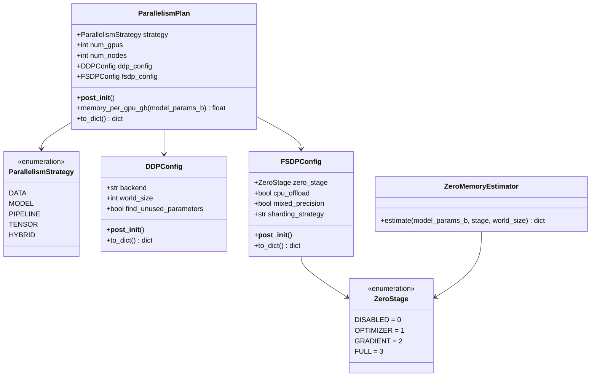
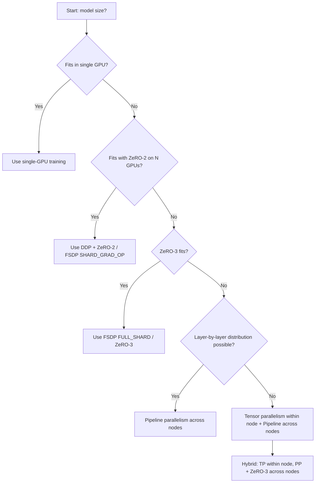

# Day 91 — Distributed Training Parallelism

## WHY

Single GPU memory is the #1 bottleneck for large model training. A 7B parameter model in FP32 requires ~28 GB of parameter memory alone — before gradients (another 28 GB) or Adam optimizer states (another 84 GB). Most GPUs top out at 40–80 GB. Without parallelism strategies, models above a certain size simply cannot be trained.

Understanding which strategy to use determines whether training is *possible at all*, and whether it completes in hours vs. weeks.

---

## HOW

### Data Parallelism (DDP)

The simplest strategy: replicate the full model on each GPU, split the data batch. After each forward+backward pass, all-reduce gradients across workers so every replica stays in sync.

- **Pro:** No model code changes; linear throughput scaling.
- **Con:** Each GPU must hold the entire model — doesn't help with memory.

### Fully Sharded Data Parallel (FSDP / ZeRO)

DeepSpeed ZeRO and PyTorch FSDP shard different parts of the model state across GPUs:

| ZeRO Stage | What is sharded |
|-----------|----------------|
| 0 (disabled) | Nothing — each GPU has full copy |
| 1 | Optimizer states only |
| 2 | Gradients + optimizer states |
| 3 (FULL) | Parameters + gradients + optimizer states |

ZeRO-3 eliminates all redundancy: a 7B model on 8 GPUs uses ~1.75 GB/GPU for params instead of 14 GB.

### Pipeline Parallelism

Split *layers* across GPUs. GPU 0 runs layers 0–7, GPU 1 runs layers 8–15, etc. Uses micro-batches to keep the pipeline full (GPipe / 1F1B schedule).

### Tensor Parallelism

Split individual *weight matrices* across GPUs — e.g., each GPU holds 1/N columns of the attention projection. Requires intra-layer communication (all-reduce per layer).

---

## Memory Estimation

```
ZeRO-0  per-GPU = params(2B) + grads(2B) + optimizer(12B) = 16 bytes/param
ZeRO-1  per-GPU = params(2B) + grads(2B) + optimizer(12B/N)
ZeRO-2  per-GPU = params(2B) + grads(2B/N) + optimizer(12B/N)
ZeRO-3  per-GPU = params(2B/N) + grads(2B/N) + optimizer(12B/N)
```

Where `N` = world size (number of GPUs). Memory scales down linearly with N for ZeRO-3.

---

## Class Diagram



---

## Sequence Diagram — ZeRO-3 Forward/Backward Pass

```mermaid
sequenceDiagram
    participant G0 as GPU 0
    participant G1 as GPU 1
    participant G2 as GPU 2
    participant G3 as GPU 3

    Note over G0,G3: Each GPU holds 1/4 of all params

    G0->>G0: Forward layer 0 (all-gather params from G1,G2,G3)
    G0->>G1: All-gather shard
    G0->>G2: All-gather shard
    G0->>G3: All-gather shard
    Note over G0,G3: Layer 0 forward completes; discard gathered params

    G0->>G0: Forward layer 1 (all-gather again)
    Note over G0,G3: ... repeat for all layers ...

    Note over G0,G3: Backward pass begins
    G0->>G0: Backward layer N (all-gather params, compute grads)
    G0->>G1: Reduce-scatter gradients
    G0->>G2: Reduce-scatter gradients
    G0->>G3: Reduce-scatter gradients
    Note over G0,G3: Each GPU gets 1/4 of gradient shards
    Note over G0,G3: Each GPU updates its own param shard
```

---

## Flow Diagram — Choosing a Parallelism Strategy



---

## Key Takeaways

1. **DDP** = best throughput when model fits in GPU.
2. **ZeRO-3 (FSDP FULL_SHARD)** = eliminates all memory redundancy; 8 GPUs → 8x memory reduction.
3. **Pipeline parallelism** = good for very deep models across many nodes.
4. **Tensor parallelism** = requires high-bandwidth NVLink; worth it for attention layers.
5. **Hybrid** = TP within node (NVLink), PP across nodes (Ethernet/InfiniBand).
