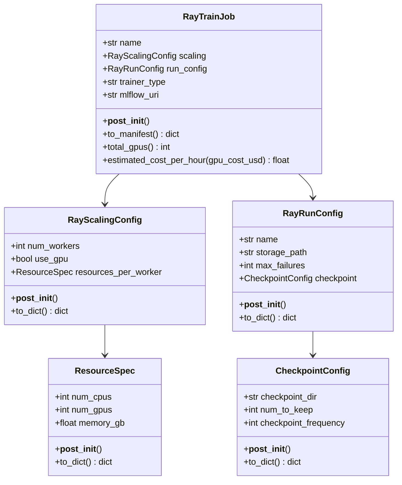
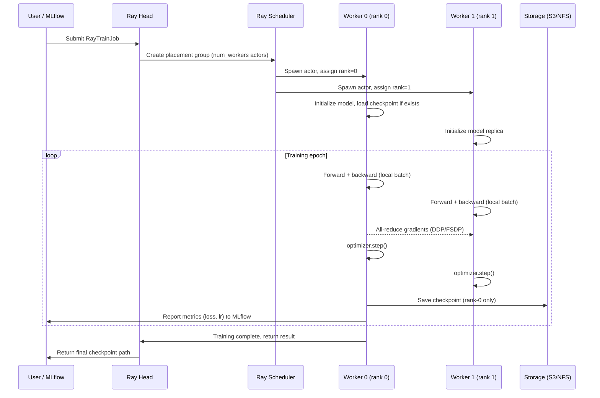

# Day 92 — Ray Train Multi-GPU Job

## WHY

Writing distributed training from scratch means manually handling process spawning, rank assignment, error recovery, checkpoint coordination, and metric aggregation. Ray Train abstracts all of this. A single `ScalingConfig(num_workers=8)` change scales from a laptop to a 64-GPU cluster. It integrates natively with MLflow for experiment tracking, and supports both PyTorch DDP and HuggingFace Trainer under the same API.

---

## HOW

### Core concepts

| Concept | Ray Train equivalent | What it controls |
|---------|---------------------|-----------------|
| Workers | `ScalingConfig.num_workers` | Number of parallel training processes |
| Resources | `ResourceSpec` | CPUs, GPUs, memory per worker |
| Failure tolerance | `RunConfig.max_failures` | Auto-retry on worker crash |
| Checkpointing | `CheckpointConfig` | Where/how often to save model state |
| Trainer | `TorchTrainer` / `HuggingFaceTrainer` | Training loop wrapper |

### Execution model

1. Ray head node receives `RayTrainJob`.
2. Ray scheduler creates a placement group with `num_workers` actors.
3. Each actor runs `training_loop_per_worker(config)` in isolation.
4. After each step, workers sync gradients via PyTorch DDP or FSDP.
5. Rank-0 worker writes checkpoint to `storage_path`.
6. On failure: Ray kills the actor, restores from last checkpoint, retries up to `max_failures` times.

---

## Class Diagram



---

## Sequence Diagram — Ray Train Job Lifecycle



---

## Cost Formula

```
total_gpus = num_workers × num_gpus_per_worker
hourly_cost = total_gpus × gpu_cost_per_hour_usd
```

**Example:** 4 workers × 2 A100 GPUs/worker × $3/hr = **$24/hr**

---

## Key Takeaways

1. Ray Train abstracts rank management, DDP/FSDP setup, and checkpoint coordination.
2. `max_failures` + checkpointing = fault-tolerant training on spot instances.
3. `TorchTrainer` wraps any PyTorch training loop; `HuggingFaceTrainer` wraps `transformers.Trainer`.
4. `storage_path` can be S3 — checkpoints are immediately available on worker replacement.
5. Cost is linear: doubling workers doubles cost but halves wall-clock time.
