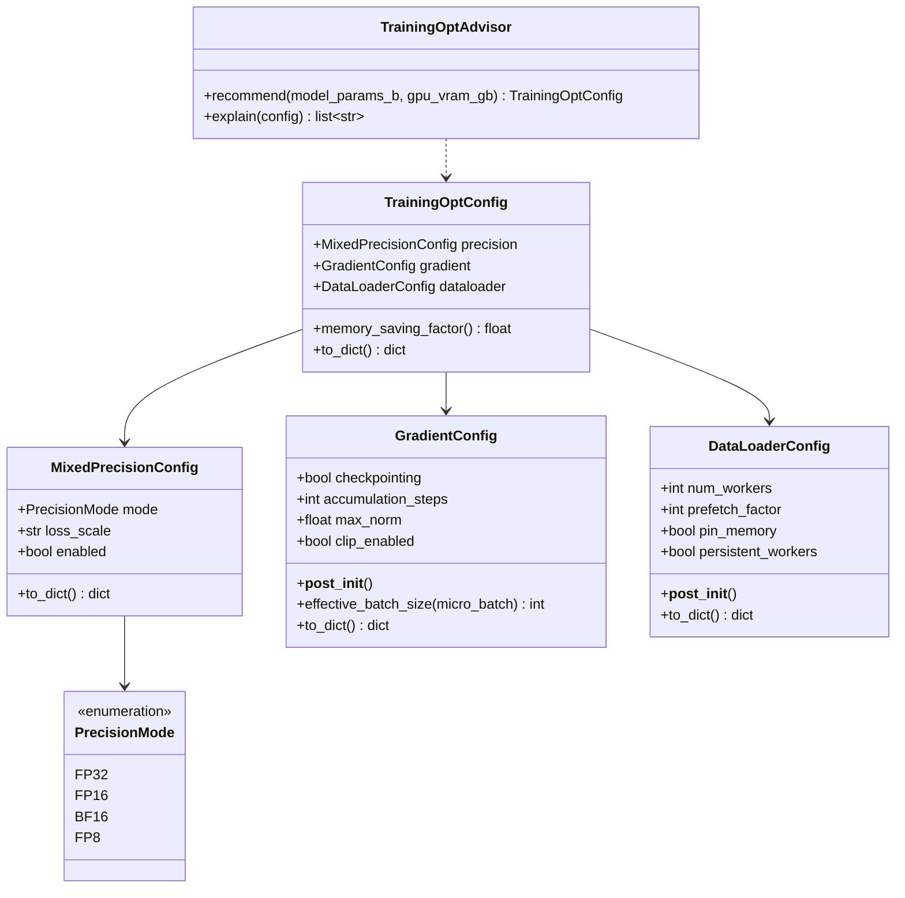
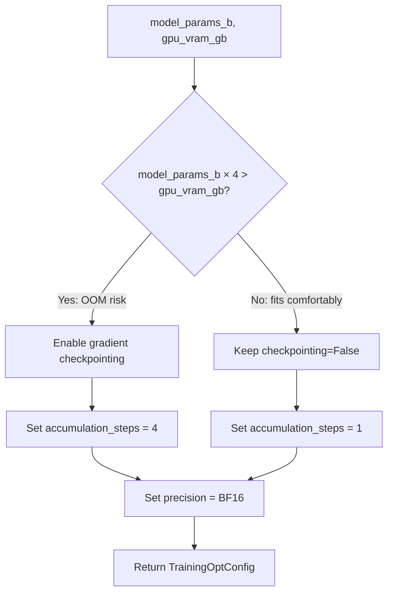

# Day 93 — Training Optimization

## WHY

GPU utilization during training is often well below 50% because of three bottlenecks:

1. **Memory** — model doesn't fit, OOM kills the run.
2. **Precision** — FP32 uses 2x memory and runs at half speed vs FP16/BF16 on Ampere+.
3. **I/O** — CPU data loading can't keep the GPU fed, leading to idle cycles.

Addressing all three together is what separates a 10-hour training run from a 3-hour one.

---

## HOW

### Mixed Precision (AMP)

PyTorch Automatic Mixed Precision wraps the forward pass in `torch.autocast()`. Operations that benefit from lower precision (matmuls, convolutions) run in FP16/BF16; numerically sensitive ops (loss, softmax) stay in FP32.

- **FP16:** 2x speed on Ampere, but can overflow for large logits. Requires loss scaling.
- **BF16:** Same range as FP32, no overflow risk. Preferred on A100/H100.
- **FP8:** H100-native; 4x FP32 throughput. Early ecosystem.

### Gradient Checkpointing

Instead of storing all intermediate activations during forward (which grows with sequence length), recompute them during backward. Trades **memory for compute**:

- Activation memory: O(√N) instead of O(N) layers
- Compute overhead: ~30% slower backward pass
- Enable for models where activations dominate memory (transformers with long contexts)

### Gradient Accumulation

Run N micro-steps before calling `optimizer.step()`. Effective batch size = `micro_batch * accumulation_steps` without OOM risk.

```python
for i, batch in enumerate(dataloader):
    loss = model(batch) / accumulation_steps
    loss.backward()
    if (i + 1) % accumulation_steps == 0:
        optimizer.step()
        optimizer.zero_grad()
```

### Optimized DataLoader

```python
DataLoader(
    dataset,
    num_workers=4,       # parallel CPU prefetch workers
    pin_memory=True,     # DMA-friendly host memory → faster GPU transfer
    prefetch_factor=2,   # batches to prefetch per worker
    persistent_workers=True,  # don't respawn workers each epoch
)
```

---

## Class Diagram



---

## Flow Diagram — Advisor Decision Logic



---

## Memory Saving Factor

```
factor = 1.0
      + 0.50  if gradient checkpointing enabled
      + 0.25  if precision != FP32
```

| Config | Factor |
|--------|--------|
| FP32, no ckpt | 1.00x |
| BF16, no ckpt | 1.25x |
| FP32, ckpt | 1.50x |
| BF16, ckpt | 1.75x |

---

## Key Takeaways

1. **BF16** is the default for Ampere+ — same numerical range as FP32, no overflow.
2. **Gradient checkpointing** enables training models 3–4× larger at ~30% compute cost.
3. **Gradient accumulation** simulates large batches without OOM — critical for LLM fine-tuning.
4. **DataLoader tuning** (num_workers, pin_memory) eliminates I/O as the training bottleneck.
5. Combine all three for maximum efficiency.
