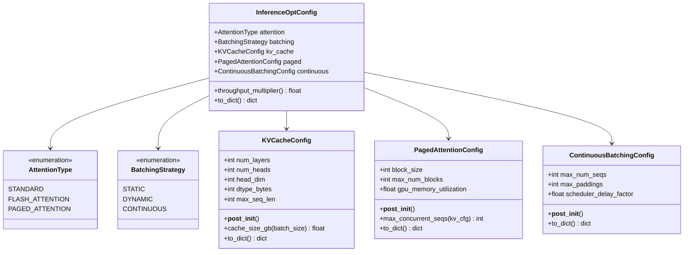
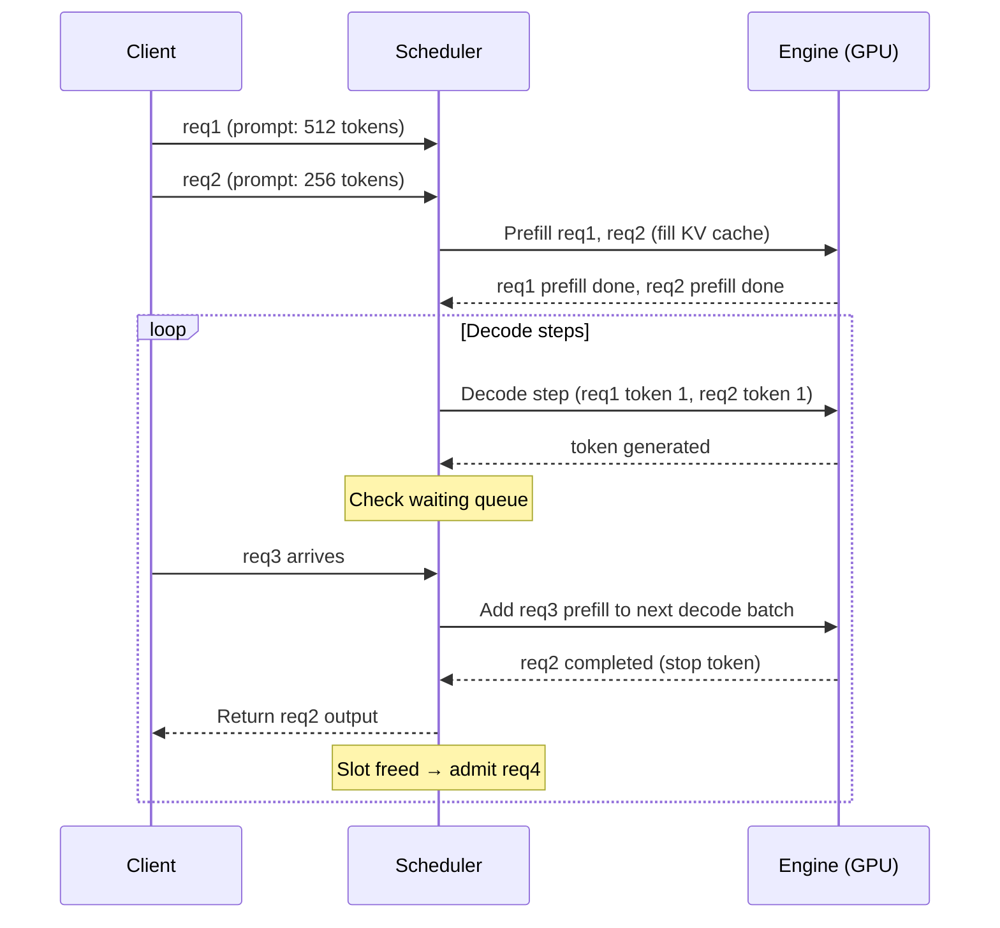

# Day 94 — Inference Optimization: KV Cache, PagedAttention, Continuous Batching

## WHY

Naive LLM serving is wildly inefficient:
- **1 request at a time** → GPU sits 90% idle between token generations.
- **Static batching** → all requests must arrive before batch starts; late arrivals wait.
- **Standard KV cache** → fixed pre-allocation wastes memory; limits batch size.

The combined effect of PagedAttention + continuous batching (as implemented in vLLM) achieves **10–24× higher throughput** than HuggingFace `generate()` at the same hardware cost.

---

## HOW

### KV Cache

During autoregressive generation, each new token attends to all previous tokens. Computing those key/value vectors from scratch every step is O(N²). The KV cache stores past K/V tensors so only the new token's attention needs to be computed.

**Cache size formula:**
```
cache_bytes = 2 × num_layers × num_heads × head_dim × max_seq_len × batch_size × dtype_bytes
```

For Llama-2-7B (32 layers, 32 heads, 128 head_dim, FP16) at batch=1, seq=4096:
```
2 × 32 × 32 × 128 × 4096 × 1 × 2 ≈ 2.1 GB
```

At batch=32: **68 GB** — more than an A100!

### PagedAttention

Inspired by OS virtual memory paging. Instead of a contiguous KV cache per request, allocate **fixed-size blocks** (e.g., 16 tokens/block) on demand. A logical→physical block table maps request tokens to physical GPU memory blocks.

**Benefits:**
- No internal fragmentation (requests only use blocks they need)
- Blocks can be shared across requests (prefix caching)
- Enables 24× more concurrent requests vs naive allocation

### Continuous Batching

Classic static batching: wait until batch is full, run all together, wait again.

Continuous batching (iteration-level scheduling): after each decode step, check if any completed requests can be replaced by waiting requests. GPU never idles.

```
STATIC:     [req1 req2 req3]  →  wait  →  [req4 req5 req6]
CONTINUOUS: [req1 req2 req3] → [done→req4] → [done→req5] ...
```

---

## Class Diagram



---

## Sequence Diagram — Continuous Batching Scheduler



---

## Throughput Multiplier Reference

| Strategy | Multiplier | Why |
|----------|-----------|-----|
| STATIC | 1× | Baseline — waits for full batch |
| DYNAMIC | 5× | Adapts batch size, less waiting |
| CONTINUOUS | 15× | Zero idle time; immediate slot reuse |

---

## Key Takeaways

1. **KV cache** is the memory bottleneck — scales as O(batch × seq_len).
2. **PagedAttention** treats KV cache like virtual memory pages: no waste, sharing possible.
3. **Continuous batching** eliminates inter-request gaps → GPU stays saturated.
4. Combining PagedAttention + continuous batching (vLLM) = 10–24× vs HuggingFace generate().
5. Flash Attention reduces memory bandwidth usage but doesn't change the batching model.
