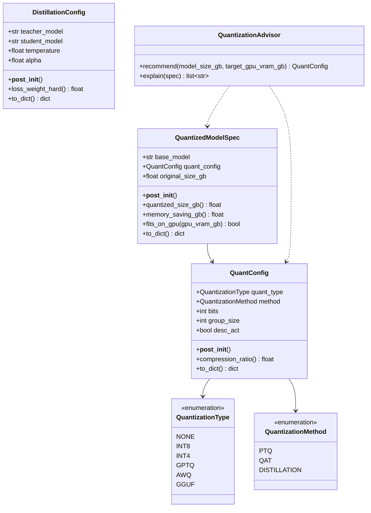
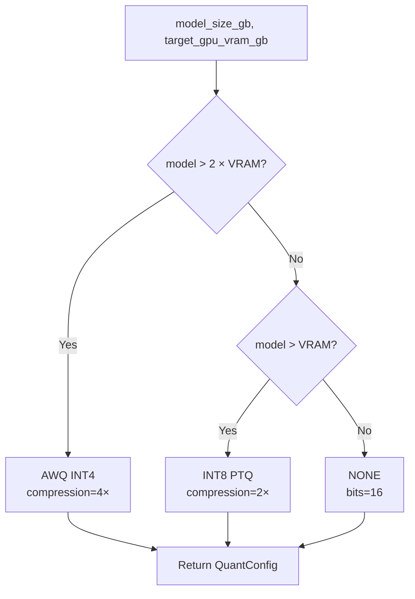

# Day 95 — Quantization for Serving: PTQ/QAT, GPTQ/AWQ, Distillation

## WHY

A 7B parameter model in FP16 = **14 GB**. In INT4 = **3.5 GB** — fits on a consumer 4090 GPU or even a Mac M2 Pro. Quantization enables:

- Serving larger models on cheaper hardware
- 4× memory reduction → 4× more concurrent requests
- 1.5–3× throughput improvement (smaller memory = faster memory bandwidth access)

State-of-the-art methods (GPTQ, AWQ) achieve this with **< 1% accuracy loss** on most benchmarks.

---

## HOW

### Post-Training Quantization (PTQ)

Quantize a trained FP16 model without any retraining. Fast, but may lose accuracy for very low bit-widths (INT4) on some tasks.

**Naive INT8:** Round weights to nearest INT8 value. Simple but suboptimal.

### GPTQ (Generative Pre-trained Transformer Quantization)

Layer-wise quantization using second-order information (Hessian). Minimizes the reconstruction error for each layer independently:

```
argmin_Q ||W - Q||²_H   (H = Hessian of layer output w.r.t. weights)
```

Quantizes weights in a specific order (by Hessian column) to minimize accumulated error. Achieves near-FP16 quality at INT4.

### AWQ (Activation-Aware Weight Quantization)

Key insight: **only 0.1–1% of weights** (those with high activation magnitude) are critical to model quality. AWQ:

1. Identifies salient weights by looking at input activations.
2. Keeps salient weights in FP16 (or scales them to be robust to INT4 rounding).
3. Quantizes the rest to INT4.

Result: better accuracy than GPTQ at same bit-width, faster inference (no FP16 mixed path).

### Quantization-Aware Training (QAT)

Insert fake-quantization nodes during training to simulate INT4/INT8 arithmetic. The model learns to be robust to quantization noise. Better accuracy than PTQ but requires retraining (expensive).

### Knowledge Distillation

Train a small **student** model to mimic a large **teacher**:

```
Loss = α × KL(teacher_logits, student_logits) / T² + (1-α) × CE(true_labels, student)
```

Where T = temperature (softens probability distributions for richer signal).

---

## Class Diagram



---

## Flow Diagram — Advisor Decision



---

## Compression Reference

| Method | Bits | Compression | Size 7B FP16 | Accuracy Loss |
|--------|------|-------------|--------------|---------------|
| FP16 baseline | 16 | 1× | 14 GB | 0% |
| INT8 PTQ | 8 | 2× | 7 GB | < 0.5% |
| GPTQ INT4 | 4 | 4× | 3.5 GB | < 1% |
| AWQ INT4 | 4 | 4× | 3.5 GB | < 0.5% |
| GGUF Q4_K_M | ~4.5 | ~3.5× | ~4 GB | < 1% |

---

## Key Takeaways

1. **AWQ** is the preferred INT4 method — better accuracy than GPTQ, faster serving.
2. **INT8** is a safe choice when model is slightly too large for GPU VRAM.
3. **GPTQ** requires calibration dataset; AWQ only needs activation statistics.
4. **QAT** gives best accuracy but requires retraining — only justified for production deployments.
5. **Knowledge distillation** is complementary: smaller model + quantization = maximum efficiency.
