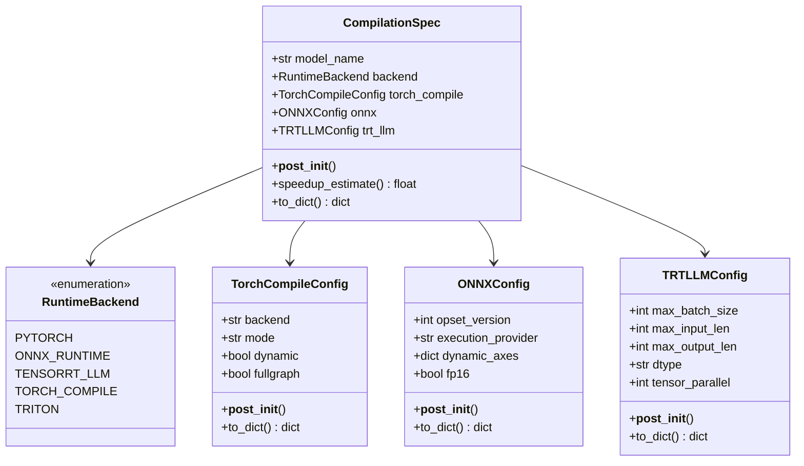
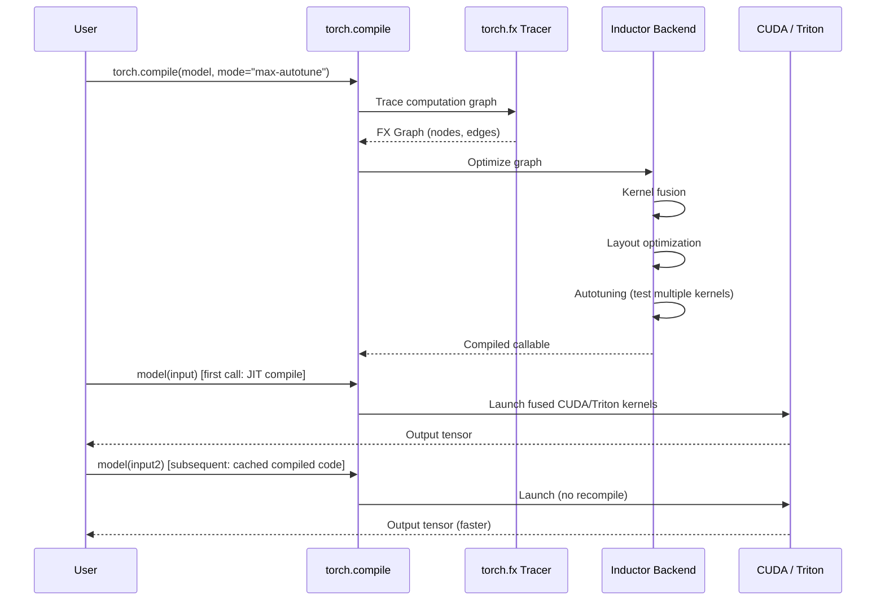

# Day 96 — Compilation & Runtimes: ONNX, TensorRT-LLM, torch.compile

## WHY

PyTorch's eager execution mode is flexible but leaves performance on the table:
- Each operation launches a separate CUDA kernel → kernel launch overhead adds up.
- Adjacent operations that could share memory aren't fused.
- No hardware-specific optimizations (e.g., H100 FP8 tensor cores).

Model compilation converts the PyTorch compute graph into optimized machine code:
- **torch.compile:** 1.5–3× speedup with zero model code changes.
- **TensorRT-LLM:** 5–10× vs vanilla PyTorch on NVIDIA GPUs.
- **ONNX Runtime:** cross-hardware deployment (ARM, Intel NPU, AMD).

---

## HOW

### torch.compile

```python
model = torch.compile(model, backend="inductor", mode="max-autotune")
```

1. **Tracing:** Captures the computation graph via `torch.fx`.
2. **Optimization:** Inductor backend applies kernel fusion, layout optimization.
3. **Code generation:** Emits optimized CUDA C++ or Triton kernels.

Modes:
- `default` — balanced compile time vs runtime speedup (~1.3×)
- `reduce-overhead` — minimizes CUDA kernel launch overhead (~1.5×)
- `max-autotune` — exhaustive autotuning; slow compile, fastest runtime (~2×)

### TensorRT-LLM

NVIDIA's purpose-built LLM inference engine:
- Custom CUDA kernels for multi-head attention (Flash MHA, Paged MHA)
- In-flight batching (equivalent to continuous batching)
- FP8 quantization on H100 via `dtype="float8"`
- Tensor parallelism built-in

Build workflow:
1. Convert HuggingFace weights → TensorRT-LLM format
2. Build engine with `trtllm-build` (takes 10–60 min)
3. Serve with `tritonserver` or Python API

### ONNX Runtime

ONNX = Open Neural Network Exchange — portable model format.

```python
# Export
torch.onnx.export(model, dummy_input, "model.onnx", opset_version=17)
# Run
session = ort.InferenceSession("model.onnx", providers=["CUDAExecutionProvider"])
```

Execution providers: CUDAExecutionProvider, TensorrtExecutionProvider, CoreMLExecutionProvider (Apple), DirectMLExecutionProvider (Windows).

---

## Class Diagram



---

## Sequence Diagram — torch.compile Workflow



---

## Speedup Reference

| Backend | Speedup | Notes |
|---------|---------|-------|
| PyTorch eager | 1.0× | Baseline |
| torch.compile default | 1.3× | Minimal compile time |
| torch.compile max-autotune | 2.0× | Slow compile, fastest runtime |
| ONNX Runtime + CUDA | 1.5× | Good for cross-platform |
| TensorRT-LLM | 5.0× | NVIDIA-only, best for LLM serving |
| Triton custom kernels | 1.2× | Manual but flexible |

---

## Key Takeaways

1. **torch.compile** is the easiest win — one line, no model changes, 1.3–2× speedup.
2. **TensorRT-LLM** is the best choice for production LLM serving on NVIDIA hardware.
3. **ONNX Runtime** enables deployment to non-NVIDIA hardware (Apple Silicon, Intel Arc, ARM).
4. `max-autotune` mode is worth the compile time for long-running inference services.
5. Compilation is orthogonal to quantization — combine both for maximum efficiency.
