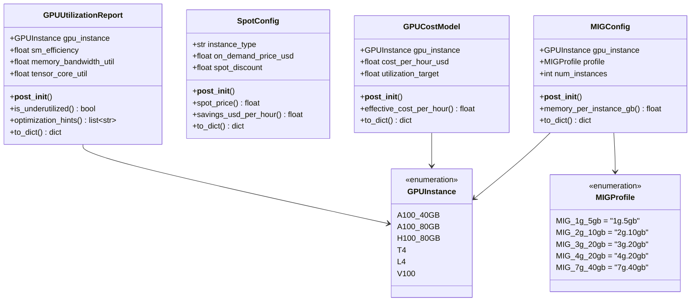
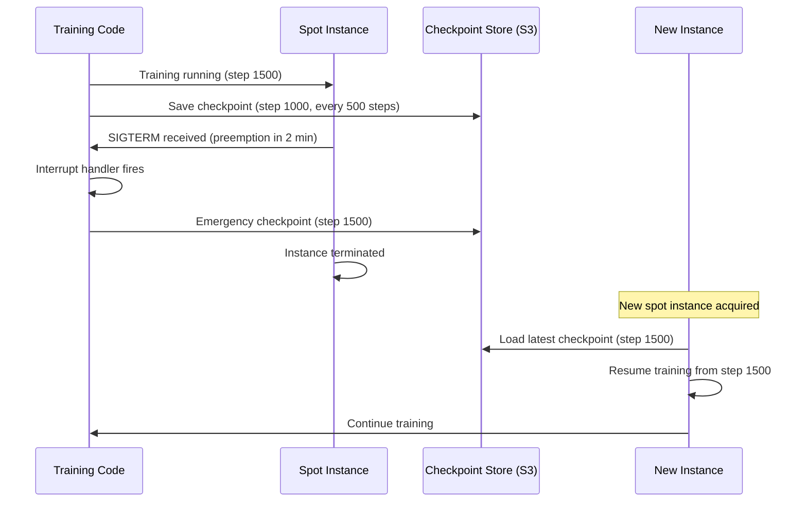

# Day 97 — GPU Utilization & Cost: MIG, Fractional GPUs, Spot, Cost Optimization

## WHY

A single A100-80GB costs ~$3/hr on AWS. Most inference workloads use only 10–30% of a GPU. Without optimization:

- **$3/hr × 10% utilization = $30 effective cost per GPU-hour of useful work**
- A 7B model serving 1 req/s uses < 5% of an A100

MIG, fractional GPU techniques, and spot instances can cut costs by **60–85%** while maintaining the same throughput.

---

## HOW

### MIG (Multi-Instance GPU)

Available on A100 and H100 GPUs. Partitions the physical GPU into up to 7 isolated GPU instances, each with:
- Dedicated SM partition (guaranteed compute)
- Dedicated HBM memory slice
- Dedicated L2 cache bandwidth
- Hardware-level isolation (no interference between instances)

```
A100-40GB partitioned as 7 × MIG_1g.5gb:
  Each instance: ~6.2 GPC SMs + 5 GB HBM
  Cost: $3/hr ÷ 7 ≈ $0.43/hr per model
```

### CUDA MPS (Software Multiplexing)

Multiple processes share the GPU via CUDA Multi-Process Service. Less isolation than MIG (shared L2 cache, no memory guarantees) but works on older GPUs (T4, V100).

### Spot / Preemptible GPUs

Cloud providers offer unused GPU capacity at 60–80% discount. Interruption risk managed by:
1. Checkpoint every N steps
2. Handle SIGTERM → save state immediately
3. Resume from last checkpoint on restart

```
Spot savings: on_demand × spot_discount = 70% discount
$3.00/hr → $0.90/hr for identical hardware
```

### GPU Utilization Metrics

| Metric | Healthy | Under-utilized | Fix |
|--------|---------|---------------|-----|
| SM Efficiency | > 70% | < 50% | Increase batch size |
| Memory BW | > 60% | < 40% | Larger model or FP16 |
| Tensor Core | > 50% | < 30% | Enable TF32 / BF16 |

---

## Class Diagram



---

## Sequence Diagram — Spot Instance Checkpoint-Resume



---

## Cost Optimization Matrix

| Workload | Recommended Approach | Savings |
|----------|---------------------|---------|
| Small models (< 5GB) inference | MIG 1g.5gb × 7 | 7× density |
| Development / experiments | Spot + checkpointing | 70% |
| Latency-sensitive production | On-demand + utilization monitoring | 0% |
| Batch inference (flexible SLA) | Spot + queue depth autoscaling | 70% |
| Fine-tuning | Spot + ZeRO-3 + checkpointing | 70% |

---

## Key Takeaways

1. **MIG** is the best tool for multi-tenant inference — hardware-level isolation, guaranteed memory.
2. **Spot instances** save 70% for fault-tolerant workloads (training, batch inference).
3. **Effective cost = nominal cost / utilization** — 20% utilization means 5× higher effective cost.
4. SM efficiency < 50% → increase batch size; tensor core < 30% → enable BF16/TF32.
5. Combine MIG + AWQ quantization for maximum model density per dollar.
