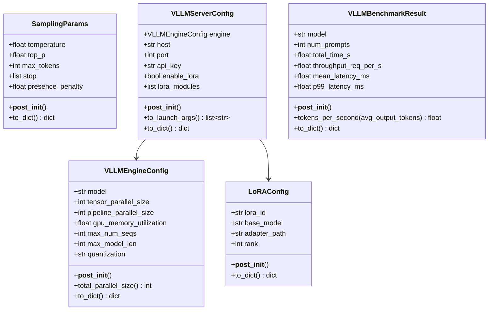
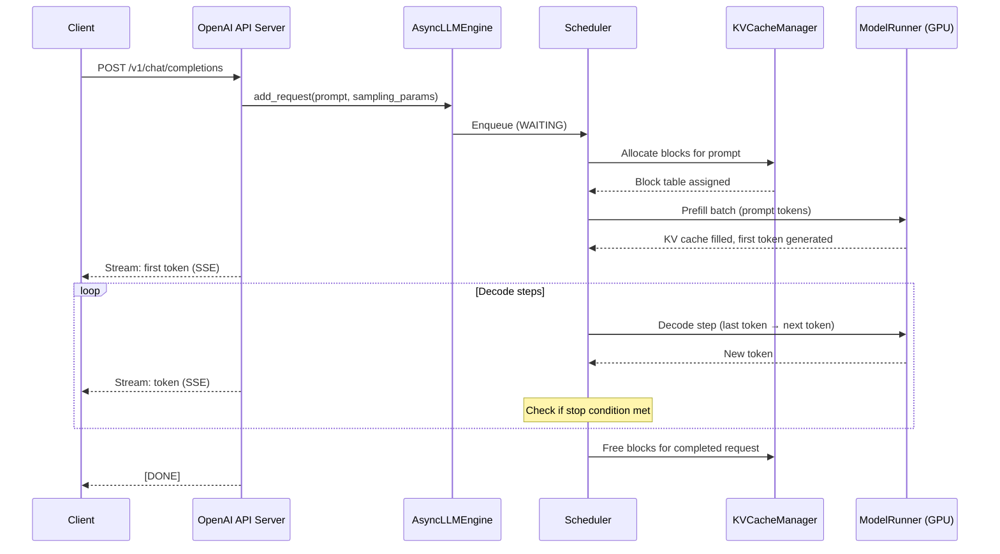

# Day 98 — vLLM Single-Node Deep Dive

## WHY

HuggingFace `model.generate()` is the naive baseline: one request at a time, static KV cache allocation, no batching. At 10 req/s load, the GPU sits 95% idle.

vLLM achieves **10–24× higher throughput** by combining:
- PagedAttention (no KV cache memory waste)
- Continuous batching (iteration-level scheduling)
- Async engine (non-blocking token generation)
- Multi-LoRA serving (multiple fine-tuned adapters, one base model)

It's the de-facto production LLM serving engine — used by Anyscale, Mistral AI, Together AI, and most ML platforms.

---

## HOW

### Architecture Overview

```
Client (HTTP) → AsyncLLMEngine
                    ├── Scheduler (prefill + decode queues)
                    ├── ModelRunner (GPU inference)
                    ├── KVCacheManager (PagedAttention)
                    └── TokenizerPool (async tokenization)
```

### Prefill vs Decode

- **Prefill phase:** Process the entire prompt in one forward pass, fill KV cache for all prompt tokens. Compute-bound.
- **Decode phase:** Generate one token at a time, reading KV cache for context. Memory-bandwidth-bound.

The scheduler interleaves prefill and decode requests to keep both compute and memory bandwidth saturated.

### LoRA Multi-Adapter Serving

Instead of loading one fine-tuned model per deployment, vLLM loads one base model + multiple LoRA adapters:

```
Request: {"model": "sql-lora", "messages": [...]}
  → Scheduler looks up lora_id → loads LoRA weights → merges at inference time
```

Adapter weights are small (rank 16 = 2 matrices × 4096 × 16 × 2 = ~500 KB) and can be swapped per-request.

### OpenAI-Compatible API

vLLM exposes `POST /v1/completions` and `POST /v1/chat/completions` with the same schema as OpenAI API — drop-in replacement.

---

## Class Diagram



---

## Sequence Diagram — Request Lifecycle in vLLM



---

## Launch Args Reference

`to_launch_args()` generates:

```bash
python -m vllm.entrypoints.openai.api_server \
  --model meta-llama/Llama-2-7b-chat-hf \
  --tensor-parallel-size 1 \
  --pipeline-parallel-size 1 \
  --gpu-memory-utilization 0.9 \
  --max-num-seqs 256 \
  --max-model-len 4096 \
  --host 0.0.0.0 \
  --port 8000 \
  --quantization awq \
  --enable-lora \
  --lora-modules sql-lora=/adapters/sql
```

---

## Key Takeaways

1. vLLM's PagedAttention + continuous batching = 10–24× throughput vs HuggingFace generate().
2. **Prefill** is compute-bound; **decode** is memory-bandwidth-bound — the scheduler balances both.
3. **Multi-LoRA** enables serving dozens of fine-tuned models at near-zero overhead vs base model.
4. `gpu_memory_utilization=0.9` reserves 10% GPU VRAM for CUDA overhead — never set to 1.0.
5. The OpenAI-compatible API means zero client code changes when switching from OpenAI to self-hosted vLLM.
