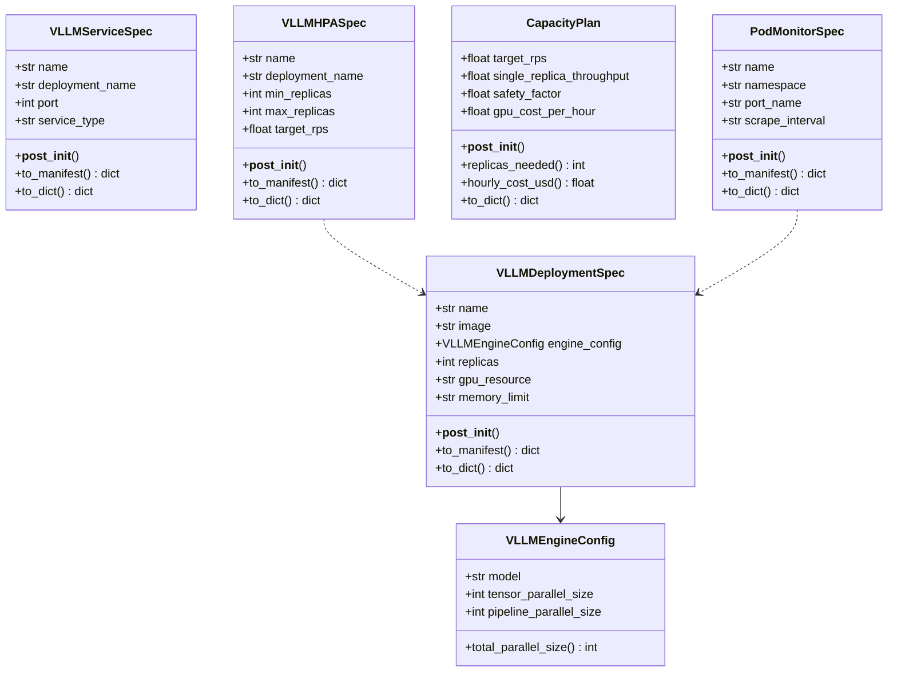
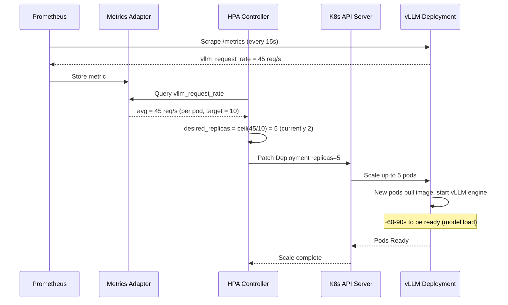
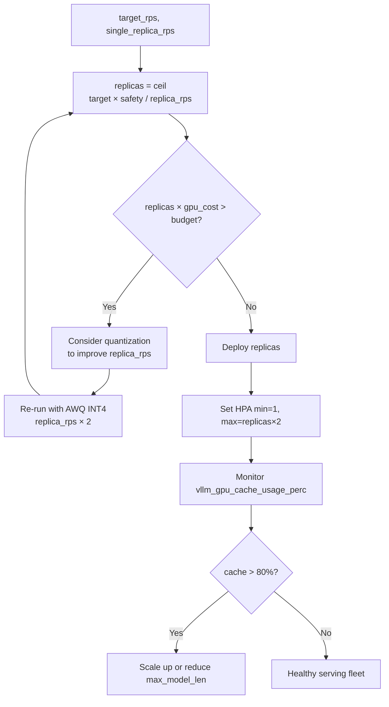

# Day 99 — vLLM on Kubernetes + GPU Metrics + Capacity Planning

## WHY

Single-node vLLM can handle ~50–200 req/s depending on model size and hardware. Production LLM APIs often need 1,000+ req/s and must handle:

- **Traffic spikes:** Autoscale replicas within seconds, not minutes.
- **Rolling updates:** Zero-downtime model upgrades.
- **Resource quotas:** Prevent one team's workload from starving another's GPU pool.
- **Observability:** Know exactly how many tokens/second each replica produces.

Kubernetes provides all of this — but LLM workloads need GPU-aware HPA metrics (queue depth, decode throughput) not CPU-based defaults.

---

## HOW

### Deployment with GPU Limits

```yaml
resources:
  requests:
    nvidia.com/gpu: "4"     # tensor_parallel_size × pipeline_parallel_size
    memory: "24Gi"
  limits:
    nvidia.com/gpu: "4"
```

GPU scheduling: `nvidia.com/gpu` is an extended resource. K8s will only schedule the pod on a node with available GPU slots.

**Node tolerations:** GPU nodes typically have taints; pods must tolerate:
```yaml
tolerations:
  - key: nvidia.com/gpu
    operator: Exists
    effect: NoSchedule
```

### HPA with Custom Metrics

CPU-based HPA is useless for LLM workloads (GPU is the bottleneck, CPU is idle). vLLM exposes Prometheus metrics including:

- `vllm:request_success_total` — completed requests
- `vllm:num_requests_running` — decode queue depth
- `vllm:gpu_cache_usage_perc` — KV cache utilization

KEDA or custom metrics adapter exposes these to HPA as `vllm_request_rate`.

### Capacity Planning Formula

```
replicas_needed = ceil(target_rps × safety_factor / single_replica_throughput)
```

**Example:** 100 req/s target, 20 req/s per replica, 1.2 safety factor:
```
ceil(100 × 1.2 / 20) = ceil(6.0) = 6 replicas
hourly_cost = 6 × $3/hr = $18/hr
```

### PodMonitor (Prometheus Operator)

```yaml
apiVersion: monitoring.coreos.com/v1
kind: PodMonitor
spec:
  podMetricsEndpoints:
    - port: metrics
      interval: 15s
      path: /metrics
```

vLLM exposes `/metrics` (Prometheus format) out of the box. PodMonitor tells the Prometheus Operator to scrape all pods with matching labels every 15s.

---

## Class Diagram



---

## Sequence Diagram — HPA Scale-Up Event



---

## Flow Diagram — Capacity Planning Decision



---

## Kubernetes Manifest Summary

| Resource | Kind | Purpose |
|----------|------|---------|
| `VLLMDeploymentSpec` | `apps/v1/Deployment` | Pod template with GPU limits + health probes |
| `VLLMServiceSpec` | `v1/Service` | ClusterIP/LoadBalancer for routing |
| `VLLMHPASpec` | `autoscaling/v2/HorizontalPodAutoscaler` | Custom metric scale-up/down |
| `PodMonitorSpec` | `monitoring.coreos.com/v1/PodMonitor` | Prometheus scraping |

---

## Key Takeaways

1. **GPU limits** must match `engine.total_parallel_size()` — tensor_parallel × pipeline_parallel.
2. **CPU-based HPA is wrong for LLMs** — always use `vllm_request_rate` or `num_requests_running`.
3. **Safety factor 1.2** = 20% headroom for traffic spikes before new replicas come online.
4. **PodMonitor** auto-discovers new replicas as they scale — no manual Prometheus config.
5. **Model load time** (~60–90s) limits HPA reaction speed; over-provision min_replicas for latency-critical services.
