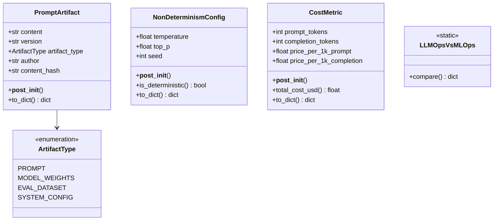
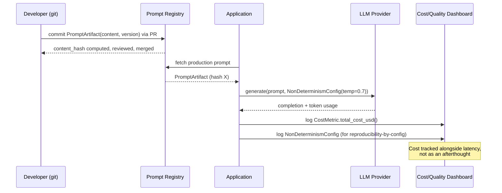

# Day 100 — LLMOps vs MLOps

## WHY

Classical MLOps was built around a stable contract: a model maps input features to a single deterministic output, and quality is measured against a frozen accuracy/AUC/F1 metric on a labeled holdout set. LLMOps breaks that contract in three ways:

1. **Prompts are code.** A prompt change is a behavior change with the same blast radius as a code change — it needs version control, PR review, and rollback, exactly like model weights.
2. **Non-determinism is the default.** The same input does not guarantee the same output. Sampling temperature, top-p, and seed all affect the result, so "reproducibility" means reproducible-by-config, not reproducible-by-input.
3. **Cost is a per-request, first-class metric.** A single bad prompt (verbose system prompt, runaway loop, oversized context) can 10x the bill in an afternoon. Classical MLOps amortizes training cost once; LLMOps pays a marginal cost on every single request.

If you only bring classical MLOps tooling to an LLM system, you will version the model but not the prompt, you will alert on latency but not cost, and you will have no way to explain why a customer got two different answers to the same question.

---

## HOW

- **Prompts as artifacts:** every prompt gets a `PromptArtifact` with a `content_hash` (sha256 of content, truncated) computed at construction time. Two prompts with identical text always hash identically — this is what lets you diff/compare/rollback prompts the same way you diff model checksums.
- **Non-determinism tracking:** every generation call records a `NonDeterminismConfig` (temperature, top_p, seed). A config is only "deterministic" when `temperature == 0` AND a `seed` is set — without a seed, even greedy decoding across different hardware/batches can vary slightly.
- **Cost as a metric:** every call's `CostMetric` (prompt/completion tokens × price per 1k) is computed and can be aggregated into dashboards exactly like latency — `total_cost_usd()` is the single number that should appear next to p95 latency on every dashboard.

---

## Class Diagram

---

## Sequence Diagram — A Single LLM Request, LLMOps-Instrumented

---

## Key Takeaways

1. Prompts get a `content_hash` the same way model artifacts get a checksum — this is the basis for diffing, rollback, and audit trails.
2. `is_deterministic()` is `True` only when `temperature == 0 and seed is not None` — temperature alone is not enough.
3. `CostMetric.total_cost_usd()` should be logged on every request, not sampled after the fact — cost spikes are often caused by a single bad prompt and need per-request granularity to diagnose.
4. `LLMOpsVsMLOps.compare()` gives a five-dimension comparison (artifact versioning, determinism, cost driver, eval method, failure mode) — useful as an onboarding doc for engineers coming from classical ML.
