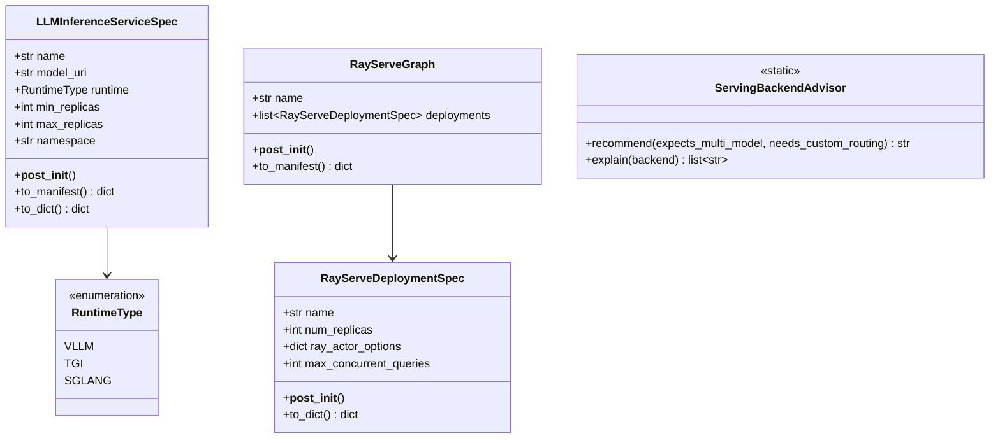
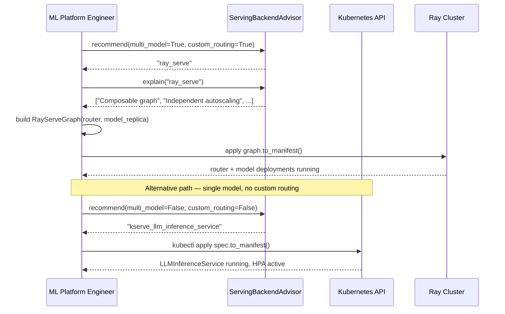

# Day 101 — Serving LLMs: KServe LLMInferenceService / Ray Serve

## WHY

A generic Kubernetes `Deployment` (or even a generic KServe `InferenceService`) understands CPU/memory utilization and request-per-second autoscaling signals. It does not understand LLM-specific signals: token throughput, queue depth, KV-cache pressure, or per-replica model-parallelism topology. Scaling an LLM deployment on CPU% alone either under-provisions (GPU is the bottleneck, not CPU) or over-provisions (CPU spikes during tokenization, not generation).

Two purpose-built primitives solve this:

- **KServe `LLMInferenceService`** — a CRD specifically modeled around an LLM runtime (vLLM/TGI/SGLANG), with autoscaling tuned to the runtime's own load signals.
- **Ray Serve** — a composable deployment graph where each node (router, model replica, post-processor) scales independently, useful when you need custom routing logic that a generic CRD can't express.

---

## HOW

`LLMInferenceServiceSpec.to_manifest()` emits a `serving.kserve.io/v1alpha1` `LLMInferenceService` CRD wrapping a `model.uri` + `runtime` + min/max replica bounds. `RayServeGraph.to_manifest()` emits a Ray Serve `applications` config — a named application composed of one or more `RayServeDeploymentSpec` nodes, each with independent `num_replicas` and `ray_actor_options` (e.g. `num_gpus`).

The choice between them is a simple decision: do you need custom routing logic (e.g., a router deployment that picks between model variants per-request)? If yes, Ray Serve's graph composability wins. If you just need a single model served with K8s-native autoscaling, the LLMInferenceService CRD is simpler and stays inside the K8s control plane you already operate.

---

## Class Diagram

---

## Sequence Diagram — Backend Selection and Deployment

---

## Key Takeaways

1. `LLMInferenceService` is purpose-built for the common case: one model, K8s-native autoscaling, no custom routing.
2. `RayServeGraph` composes multiple deployments (router → model) with **independent** autoscaling per node — necessary for multi-model or custom-routing topologies.
3. `ServingBackendAdvisor.recommend()` returns `"ray_serve"` whenever `needs_custom_routing=True`, otherwise defaults to the simpler KServe CRD.
4. Validation guards (`max_replicas >= min_replicas`, non-empty `deployments`) catch malformed specs before they ever reach the cluster.
