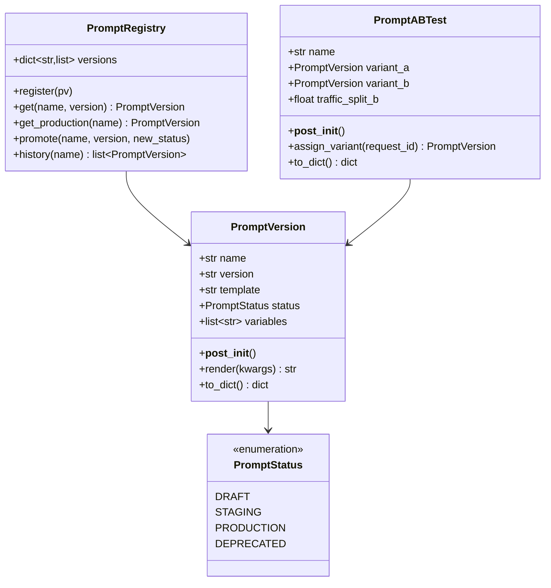
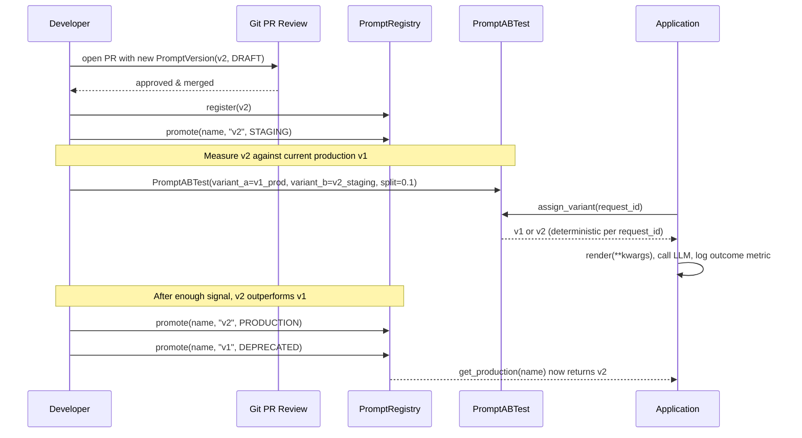

# Day 102 — Prompt Management & Versioning

## WHY

A prompt change is a behavior change. Editing the system prompt of a production assistant can shift tone, accuracy, refusal rate, and cost just as much as swapping the underlying model. Treating prompts as throwaway strings hardcoded in application code means no review, no rollback, and no measurement of impact before 100% of traffic sees the new behavior.

Prompts-as-code fixes this by storing prompts in git (reviewed via PR, like any other code change) and centralizing them in a registry with explicit version history and lifecycle status (`draft → staging → production → deprecated`). A/B testing lets you measure a prompt change's impact on a fraction of traffic before committing to a full rollout.

---

## HOW

`PromptVersion` is a single named, versioned template with a list of required `variables`; `render(**kwargs)` raises `KeyError` listing exactly which variables are missing, so a malformed call fails loudly instead of silently rendering with a literal `{var}` placeholder.

`PromptRegistry` stores all versions of a prompt under its name. `get_production()` returns the highest-version `PRODUCTION`-status entry — only one path to "what's live right now." `promote()` is the only way to move a version through its lifecycle, mirroring how a model registry moves a model from staging to production via an explicit, auditable action.

`PromptABTest` allocates traffic deterministically: `hash(request_id) % 100 < traffic_split_b * 100` ensures the same `request_id` always gets the same variant (sticky assignment), which is essential for measuring per-user effects without contaminating the comparison.

---

## Class Diagram

---

## Sequence Diagram — Prompt Lifecycle and A/B Rollout

---

## Key Takeaways

1. `PromptVersion.render()` fails loudly with a `KeyError` listing missing variables — never silently emits a broken prompt.
2. `PromptRegistry.get_production()` is the single source of truth for "what prompt is live" — only `promote()` can change it, giving you an audit trail.
3. `PromptABTest.assign_variant()` is deterministic per `request_id` — sticky bucketing avoids mixing variants within a single user's session.
4. Promote prompts the same way you promote models: draft → staging (measure) → production (ship) → deprecated (retire), never skip the measurement step.
