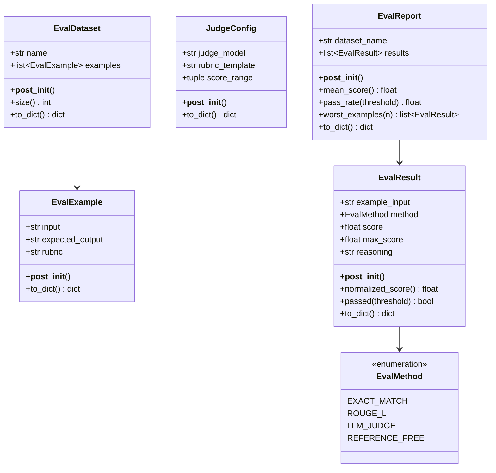
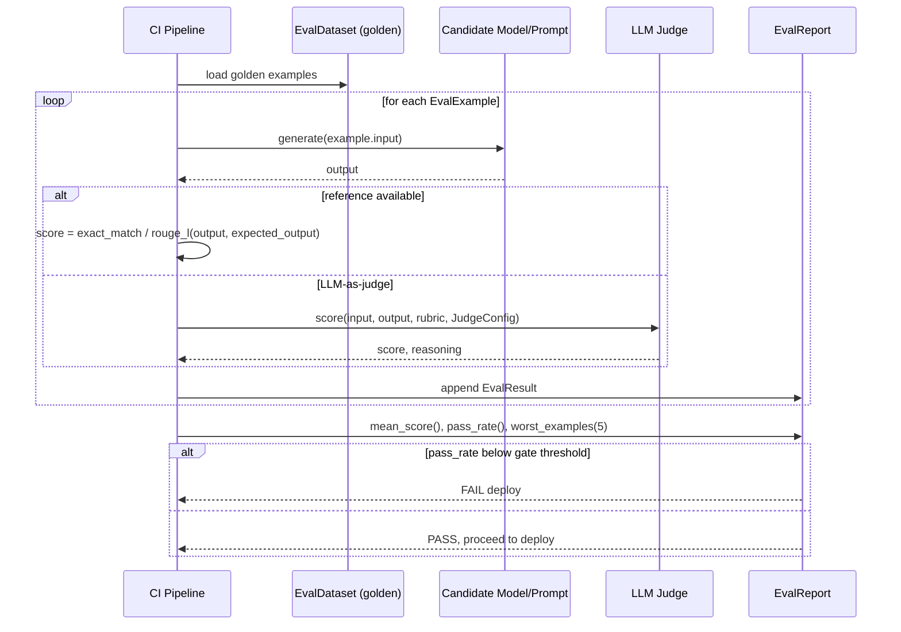

# Day 103 — LLM Eval I: Offline, Reference-Based/Free, LLM-as-Judge

## WHY

Free-text generation cannot be unit-tested with `assert output == expected`. Two paraphrases of the same correct answer are both "right" but will fail an exact-match check. This forces a layered evaluation strategy:

- **Reference-based metrics** (exact-match, ROUGE-L): cheap, fast, deterministic — but brittle, penalizing valid paraphrases and rewarding superficial overlap.
- **Reference-free metrics**: score properties like coherence or toxicity without needing a "correct" answer — useful when there's no single ground truth.
- **LLM-as-judge**: use a stronger model to score outputs against a rubric. Correlates better with human judgment than n-gram overlap, but costs money per evaluation and inherits its own bias/variance (a judge model can be inconsistent or have blind spots).

None of these alone is sufficient — production eval harnesses run all three and look for agreement/disagreement patterns.

---

## HOW

`EvalDataset` is a fixed, versioned set of `EvalExample`s (input + optional expected_output + optional rubric) — the "golden set" run before every deploy. A `JudgeConfig` configures which model judges, what rubric it's given, and the score range it should emit. Each evaluation produces an `EvalResult` (raw score + max_score, normalized via `normalized_score()`), and a full run aggregates into an `EvalReport` with `mean_score()`, `pass_rate()`, and `worst_examples()` — the three numbers you check before shipping: did average quality move, did failure rate move, and what does the worst output actually look like.

---

## Class Diagram

---

## Sequence Diagram — Offline Eval Run Before Deploy

---

## Key Takeaways

1. No single eval method is sufficient — reference-based, reference-free, and LLM-as-judge each catch different failure modes.
2. `EvalResult.normalized_score()` puts every method on a common `[0,1]` scale so reports can mix methods.
3. `EvalReport.worst_examples()` is often more actionable than `mean_score()` alone — it shows you exactly what's breaking.
4. Golden datasets must be versioned and fixed — an eval set that silently changes invalidates score comparisons across deploys.
