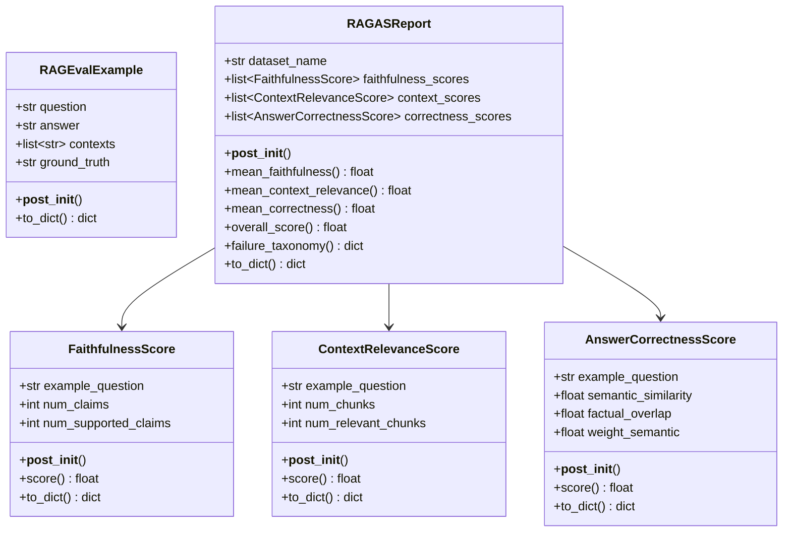
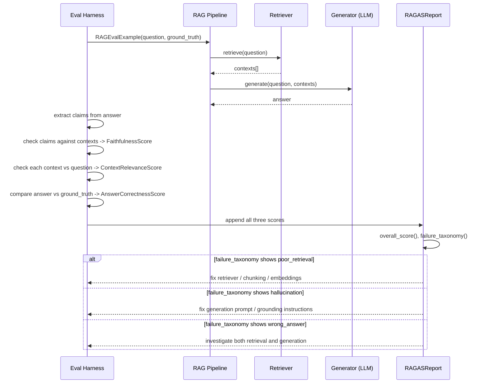

# Day 104 — LLM Eval II: RAGAS (Faithfulness, Context Relevance, Answer Correctness)

## WHY

A RAG (Retrieval-Augmented Generation) pipeline has two independent failure surfaces: **bad retrieval** (the wrong chunks come back) and **bad generation** (the model hallucinates even given perfect context, or generates a plausible-sounding answer from irrelevant context). A single end-to-end "is this answer correct" score conflates these — you can't tell which half of the pipeline to fix. RAGAS-style metrics separate them:

- **Faithfulness** — is every claim in the answer actually supported by the retrieved context? A low score means the model is hallucinating regardless of how good retrieval was.
- **Context relevance** — are the retrieved chunks actually relevant to the question? A low score means retrieval is failing, even if the model is faithful to the (bad) context it got.
- **Answer correctness** — does the answer semantically and factually match a known ground truth? This is the end-to-end check, but only meaningful once you know whether faithfulness/relevance are healthy.

---

## HOW

`FaithfulnessScore` and `ContextRelevanceScore` both follow the same pattern: count total units (claims / chunks) and supported/relevant units, with `score()` returning the supported fraction (defaulting to `1.0` when there are zero units — vacuously faithful/relevant). `AnswerCorrectnessScore` blends `semantic_similarity` and `factual_overlap` via a configurable `weight_semantic`.

`RAGASReport` aggregates all three across a dataset and computes `overall_score()` as the mean of the three means. `failure_taxonomy()` buckets failures by type using fixed thresholds (faithfulness < 0.7 → hallucination, context relevance < 0.5 → poor retrieval, correctness < 0.6 → wrong answer) — this is what tells an engineer *which* part of the pipeline to debug first.

---

## Class Diagram

---

## Sequence Diagram — RAGAS Evaluation of a RAG Pipeline

---

## Key Takeaways

1. RAGAS separates retrieval failures from generation failures — `failure_taxonomy()` tells you exactly which subsystem to fix.
2. `score()` for `FaithfulnessScore`/`ContextRelevanceScore` defaults to `1.0` with zero units — avoid divide-by-zero while staying conservative (no claims means nothing unsupported).
3. `AnswerCorrectnessScore.weight_semantic` lets you tune how much you trust embedding similarity vs literal factual overlap — useful when ground truths are short factual statements vs long narrative answers.
4. A model can be perfectly faithful to irrelevant context and still be wrong — faithfulness alone is not sufficient, you need all three metrics together.
