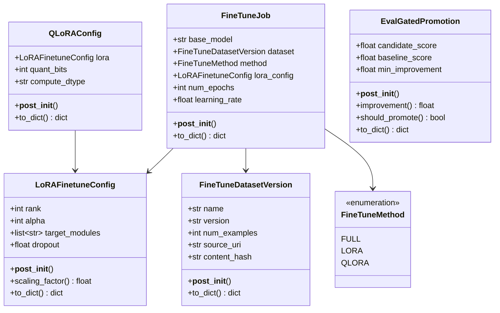
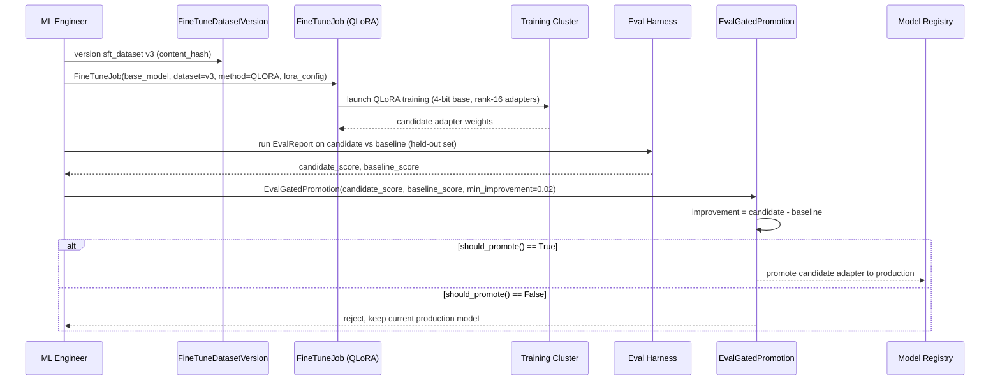

# Day 105 — Fine-Tuning Ops: LoRA/QLoRA, Dataset Versioning, Eval-Gated Promotion

## WHY

Full fine-tuning of a 7B+ parameter model requires updating every weight, which needs 100+ GB of VRAM (model + gradients + optimizer states) and risks catastrophic forgetting of the base model's general capability. LoRA (Low-Rank Adaptation) sidesteps this by freezing the base model and training only small low-rank "delta" matrices injected into attention layers — under 1% of total parameters, with quality comparable to full fine-tuning for most tasks. QLoRA goes further: it additionally quantizes the frozen base model to 4-bit (NF4), making it possible to fine-tune a 70B model on a single 24GB consumer GPU.

None of this matters if you ship a regressed model. Eval-gated promotion ensures a fine-tuned candidate only replaces the current production model if it demonstrably beats baseline on a held-out eval set — fine-tuning without a gate is how silent regressions reach production.

---

## HOW

`LoRAFinetuneConfig` holds `rank` (must be a power of 2 — hardware-friendly tile sizes) and `alpha`; `scaling_factor()` (`alpha/rank`) controls how strongly the adapter's output is weighted against the frozen base output. `QLoRAConfig` wraps a `LoRAFinetuneConfig` plus `quant_bits` (4 or 8) and `compute_dtype` for the dequantized matmul precision.

`FineTuneDatasetVersion` versions the training data exactly like a model artifact — name, version, example count, source URI, content hash — so a fine-tune run can always be traced back to the exact data it was trained on. `FineTuneJob` ties base model + dataset + method together, validating that `LORA`/`QLORA` methods always carry a `lora_config` (you cannot specify a LoRA method without specifying the LoRA hyperparameters).

`EvalGatedPromotion` is the final gate: `improvement() = candidate_score - baseline_score`, and `should_promote()` only returns `True` when that improvement meets or exceeds `min_improvement` — a configurable tolerance band that prevents shipping marginal/noisy "improvements."

> **Naming note:** this module's LoRA dataclass is named `LoRAFinetuneConfig`, not `LoRAConfig` — `vllm_config.py` (Phase 13) already defines `LoRAConfig` for multi-adapter *serving*, a different concern from fine-tuning hyperparameters.

---

## Class Diagram

---

## Sequence Diagram — Fine-Tuning Run with Eval-Gated Promotion

---

## Key Takeaways

1. LoRA trains <1% of parameters; QLoRA additionally quantizes the frozen base to 4-bit NF4, enabling 70B fine-tuning on a single 24GB GPU.
2. `LoRAFinetuneConfig.rank` must be a power of 2 — this is both a hardware-tiling convention and enforced by validation.
3. `FineTuneJob` enforces that `LORA`/`QLORA` methods always carry a non-null `lora_config` — you cannot create an inconsistent job spec.
4. `EvalGatedPromotion.should_promote()` only returns `True` past a configurable `min_improvement` tolerance — protects against shipping noise as a "win."
5. Fine-tuning datasets are versioned (name + version + content_hash) so every model can be traced back to its exact training data.
